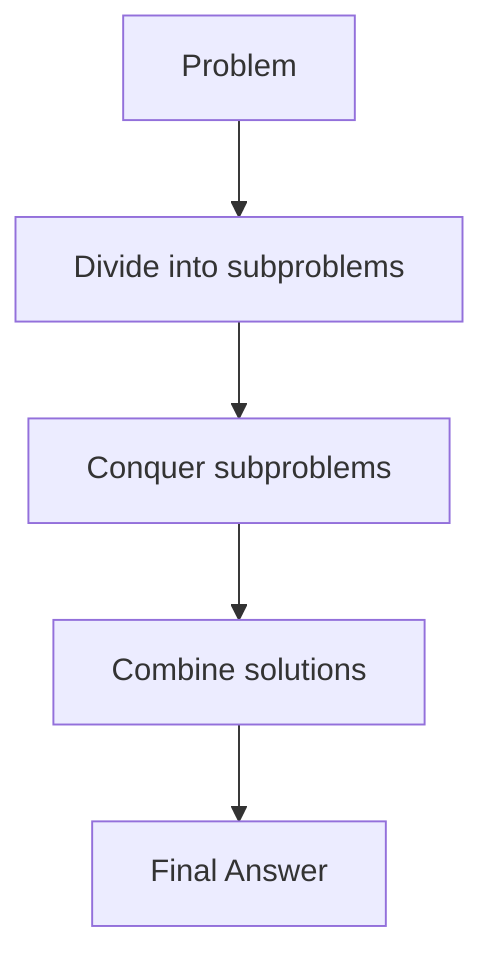

# Overview

Divide and Conquer is a algorithmic paradigm that solves problems by breaking them into smaller subproblems, solving each recursively, and combining solutions. It reduces complexity by leveraging the principle that smaller problems are easier to handle. Classic examples include sorting algorithms like Merge Sort and Quick Sort, and geometric problems like Closest Pair.

# Detailed Explanation

The process involves three steps:
1. **Divide**: Split the problem into smaller, independent subproblems.
2. **Conquer**: Solve subproblems recursively.
3. **Combine**: Merge solutions to form the final answer.

Advantages: Often achieves optimal time complexities (e.g., O(n log n) for sorting).
Disadvantages: Recursion depth can cause stack overflow for large inputs.

Common algorithms:
- **Merge Sort**: Divide array into halves, sort recursively, merge sorted halves.
- **Quick Sort**: Partition around a pivot, sort subarrays recursively.
- **Closest Pair**: Divide points into halves, find min distance in each, check across halves.



# Real-world Examples & Use Cases

- **Sorting Large Datasets**: Merge Sort for stable sorting in databases.
- **Geometric Computations**: Closest Pair for collision detection in games.
- **Parallel Processing**: Divide tasks for multi-core CPUs.
- **Image Processing**: Divide images for efficient filtering.

# Code Examples

## Merge Sort (Java)

```java
public class MergeSort {
    public void sort(int[] arr) {
        if (arr.length < 2) return;
        int mid = arr.length / 2;
        int[] left = Arrays.copyOfRange(arr, 0, mid);
        int[] right = Arrays.copyOfRange(arr, mid, arr.length);
        sort(left);
        sort(right);
        merge(arr, left, right);
    }

    private void merge(int[] arr, int[] left, int[] right) {
        int i = 0, j = 0, k = 0;
        while (i < left.length && j < right.length) {
            if (left[i] <= right[j]) arr[k++] = left[i++];
            else arr[k++] = right[j++];
        }
        while (i < left.length) arr[k++] = left[i++];
        while (j < right.length) arr[k++] = right[j++];
    }
}
```

## Quick Sort (Java)

```java
public class QuickSort {
    public void sort(int[] arr, int low, int high) {
        if (low < high) {
            int pi = partition(arr, low, high);
            sort(arr, low, pi - 1);
            sort(arr, pi + 1, high);
        }
    }

    private int partition(int[] arr, int low, int high) {
        int pivot = arr[high];
        int i = low - 1;
        for (int j = low; j < high; j++) {
            if (arr[j] < pivot) {
                i++;
                int temp = arr[i];
                arr[i] = arr[j];
                arr[j] = temp;
            }
        }
        int temp = arr[i + 1];
        arr[i + 1] = arr[high];
        arr[high] = temp;
        return i + 1;
    }
}
```

## Closest Pair (Java)

```java
import java.util.*;

public class ClosestPair {
    public double closest(Point[] points) {
        Arrays.sort(points, Comparator.comparingDouble(p -> p.x));
        return closestUtil(points, 0, points.length - 1);
    }

    private double closestUtil(Point[] points, int l, int r) {
        if (r - l <= 3) return bruteForce(points, l, r);
        int mid = (l + r) / 2;
        Point midPoint = points[mid];
        double dl = closestUtil(points, l, mid);
        double dr = closestUtil(points, mid + 1, r);
        double d = Math.min(dl, dr);
        return Math.min(d, stripClosest(points, mid, d, l, r));
    }

    private double stripClosest(Point[] points, int mid, double d, int l, int r) {
        List<Point> strip = new ArrayList<>();
        for (int i = l; i <= r; i++) {
            if (Math.abs(points[i].x - points[mid].x) < d) strip.add(points[i]);
        }
        strip.sort(Comparator.comparingDouble(p -> p.y));
        for (int i = 0; i < strip.size(); i++) {
            for (int j = i + 1; j < strip.size() && (strip.get(j).y - strip.get(i).y) < d; j++) {
                double dist = distance(strip.get(i), strip.get(j));
                if (dist < d) d = dist;
            }
        }
        return d;
    }

    private double bruteForce(Point[] points, int l, int r) {
        double min = Double.MAX_VALUE;
        for (int i = l; i <= r; i++) {
            for (int j = i + 1; j <= r; j++) {
                double dist = distance(points[i], points[j]);
                if (dist < min) min = dist;
            }
        }
        return min;
    }

    private double distance(Point a, Point b) {
        return Math.sqrt((a.x - b.x) * (a.x - b.x) + (a.y - b.y) * (a.y - b.y));
    }

    static class Point {
        double x, y;
        Point(double x, double y) { this.x = x; this.y = y; }
    }
}
```

# References

- [Divide and Conquer - Wikipedia](https://en.wikipedia.org/wiki/Divide-and-conquer_algorithm)
- [Introduction to Algorithms - Cormen](https://mitpress.mit.edu/9780262033848/introduction-to-algorithms/)

# Github-README Links & Related Topics

- [Sorting Algorithms](../sorting-algorithms/README.md)
- [Dynamic Programming and Greedy](../dynamic-programming-and-greedy/README.md)