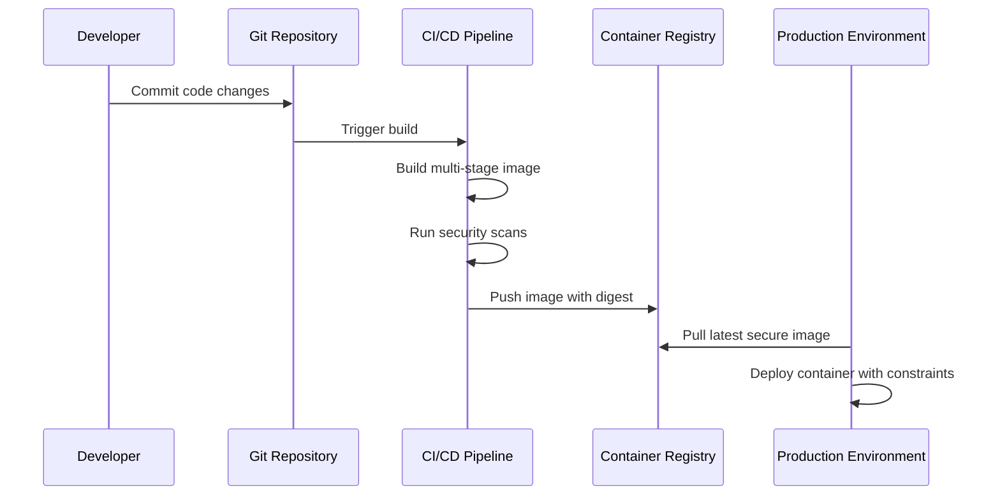

## Overview

Docker Best Practices encompass guidelines for building, deploying, and managing containerized applications efficiently, securely, and scalably. Key principles include using multi-stage builds for smaller images, selecting appropriate base images, ensuring security through minimal privileges, and optimizing performance via caching and resource constraints. These practices help reduce attack surfaces, improve build times, and enhance maintainability in production environments.

## Detailed Explanation

### Image Best Practices
- **Use Multi-Stage Builds**: Separate build and runtime environments to reduce final image size and exclude unnecessary build tools.
- **Choose Minimal Base Images**: Opt for official, small images like Alpine Linux to minimize vulnerabilities and download times.
- **Pin Base Image Versions**: Use specific tags or digests to ensure reproducible builds and avoid unexpected updates.
- **Rebuild Images Frequently**: Regularly update images to incorporate security patches and dependency updates.
- **Exclude Unnecessary Files**: Use `.dockerignore` to prevent irrelevant files from being included in the build context.

### Container Best Practices
- **Create Ephemeral Containers**: Design containers to be stateless and easily replaceable, following the twelve-factor app methodology.
- **Decouple Applications**: Run one process per container and use orchestration tools like Docker Compose or Kubernetes for multi-service apps.
- **Avoid Installing Unnecessary Packages**: Minimize dependencies to reduce image size and potential security risks.
- **Use Non-Root Users**: Run containers as non-privileged users to limit damage from exploits.
- **Leverage Build Cache**: Order Dockerfile instructions to maximize cache reuse, placing less-changing instructions first.

### Security Best Practices
- **Scan Images for Vulnerabilities**: Use tools like Docker Scout or Trivy to identify and remediate security issues.
- **Limit Container Capabilities**: Drop unnecessary Linux capabilities and use seccomp profiles.
- **Secure Secrets Management**: Avoid hardcoding secrets; use Docker secrets or external secret managers.
- **Enable Content Trust**: Use Docker Content Trust to verify image integrity and authenticity.
- **Regularly Update Dependencies**: Keep base images and libraries up-to-date to patch known vulnerabilities.

### Performance Best Practices
- **Optimize Layer Caching**: Combine RUN commands and use multi-line arguments to improve build efficiency.
- **Resource Constraints**: Set CPU and memory limits to prevent resource exhaustion.
- **Use Volumes for Persistent Data**: Separate application code from data to enable faster updates and better scalability.
- **Monitor and Log**: Implement logging drivers and monitoring tools to track container performance and issues.

## Real-world Examples & Use Cases

1. **Web Application Deployment**: A Node.js app uses multi-stage builds to compile assets in one stage and run the app in a slim runtime stage, reducing image size by 70% and improving startup times.
2. **Microservices Architecture**: Each service runs in its own container with minimal base images, decoupled via Docker Compose, allowing independent scaling and updates.
3. **CI/CD Pipelines**: Automated builds in GitHub Actions use pinned base images and security scanning, ensuring consistent and secure deployments.
4. **Database Containers**: PostgreSQL images run as non-root users with persistent volumes, enabling easy backups and migrations without data loss.
5. **Machine Learning Models**: TensorFlow apps use GPU-enabled containers with optimized caching, accelerating model training and inference.

## Code Examples

### Optimized Dockerfile for a Node.js App
```dockerfile
# syntax=docker/dockerfile:1

# Build stage
FROM node:18-alpine AS builder
WORKDIR /app
COPY package*.json ./
RUN npm ci --only=production

# Runtime stage
FROM node:18-alpine
RUN addgroup -g 1001 -S nodejs && adduser -S nextjs -u 1001
WORKDIR /app
COPY --from=builder --chown=nextjs:nodejs /app/node_modules ./node_modules
COPY --chown=nextjs:nodejs . .
USER nextjs
EXPOSE 3000
CMD ["npm", "start"]
```

### Docker Compose for Multi-Service App
```yaml
version: '3.8'
services:
  web:
    build: .
    ports:
      - "3000:3000"
    depends_on:
      - db
  db:
    image: postgres:15-alpine
    environment:
      POSTGRES_DB: mydb
      POSTGRES_USER: user
      POSTGRES_PASSWORD: pass
    volumes:
      - db_data:/var/lib/postgresql/data
volumes:
  db_data:
```

### .dockerignore File
```
node_modules
npm-debug.log
.git
.env
README.md
```

## Journey / Sequence



## Common Pitfalls & Edge Cases

| Pitfall | Description | Solution |
|---------|-------------|----------|
| Large Images | Including unnecessary files leads to bloated images. | Use .dockerignore and multi-stage builds. |
| Root User | Running as root increases security risks. | Switch to non-root user with USER instruction. |
| Unpinned Versions | Mutable tags cause inconsistent builds. | Pin to specific digests or immutable tags. |
| No Resource Limits | Containers can exhaust host resources. | Set CPU/memory limits in Docker Compose or Kubernetes. |
| Ignoring Cache | Poorly ordered Dockerfiles slow builds. | Place stable instructions (e.g., COPY package.json) before volatile ones. |
| Edge Case: Multi-Platform Builds | Building for different architectures. | Use buildx for cross-platform images. |
| Edge Case: Secrets in Images | Hardcoded secrets exposed in layers. | Use build-time secrets or external mounts. |

## Tools & Libraries

- **Docker Scout**: For vulnerability scanning and policy enforcement.
- **Trivy**: Open-source security scanner for containers.
- **Hadolint**: Dockerfile linter for best practices.
- **Docker Buildx**: For advanced build features like multi-platform images.
- **Docker Compose**: For defining and running multi-container applications.
- **Kubernetes**: For orchestration and scaling containerized apps.

## References

- [Docker Build Best Practices](https://docs.docker.com/develop/dev-best-practices/)
- [Dockerfile Best Practices](https://docs.docker.com/develop/dockerfile_best-practices/)
- [Docker Security Best Practices](https://docs.docker.com/engine/security/)
- [Docker Official Images](https://hub.docker.com/search?image_filter=official)

## Github-README Links & Related Topics

- [Docker Containerization](../docker-containerization/README.md)
- [Kubernetes Basics](../kubernetes-basics/README.md)
- [Microservices Architecture](../microservices-architecture/README.md)
- [CI/CD with Docker](../build-automation/README.md)
- [Security Best Practices in Java](../java-security-basics/README.md)