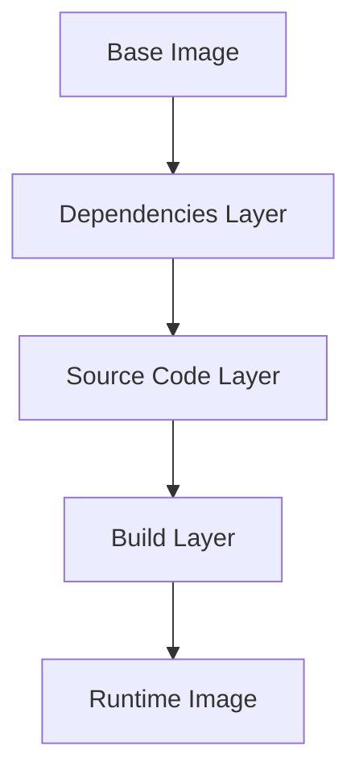

# Docker Best Practices

## Overview

Docker best practices are essential guidelines for building efficient, secure, and maintainable containerized applications. They help optimize image size, improve security, and ensure consistent deployments across environments.

## Detailed Explanation

### Multi-Stage Builds

Use multi-stage builds to separate build-time dependencies from runtime, reducing final image size.

### Layer Optimization

Minimize the number of layers by combining commands and using .dockerignore to exclude unnecessary files.

### Security Practices

Run containers as non-root users, regularly update base images, and scan for vulnerabilities.

### Tagging and Versioning

Use descriptive tags and semantic versioning for better management.

### Networking and Volumes

Properly configure networking and use volumes for persistent data.

## Real-world Examples & Use Cases

- CI/CD Pipelines: Use Docker for isolated build environments.
- Microservices Deployment: Containerize services for scalability.
- Local Development: Consistent environments across teams.

## Code Examples

```dockerfile
# Example Dockerfile with best practices
FROM node:16-alpine as builder
WORKDIR /app
COPY package*.json ./
RUN npm ci --only=production
COPY . .
RUN npm run build

FROM nginx:alpine
COPY --from=builder /app/dist /usr/share/nginx/html
EXPOSE 80
CMD ["nginx", "-g", "daemon off;"]
```

```bash
# .dockerignore
node_modules
.git
*.log
```

## References

- [Docker Best Practices Official Docs](https://docs.docker.com/develop/dev-best-practices/)
- [Docker Security Best Practices](https://docs.docker.com/engine/security/)

## Github-README Links & Related Topics

- [Docker Containerization](./docker-containerization/README.md)
- [Docker Security](./docker-security/README.md)
- [Kubernetes Basics](./kubernetes-basics/README.md)
- [CI CD Pipelines](./ci-cd-pipelines/README.md)

