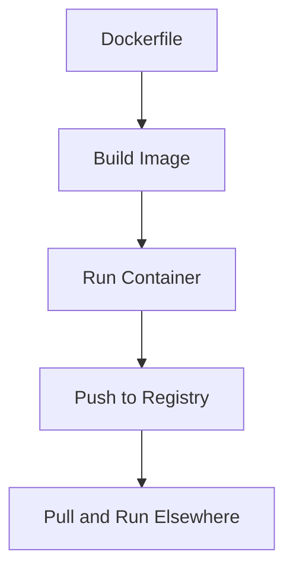

## Overview

Docker is a platform for developing, shipping, and running applications in containers. Containers package software with dependencies, ensuring consistency across environments.

## Detailed Explanation

Key components:

- **Images**: Read-only templates for containers.
- **Containers**: Runnable instances of images.
- **Dockerfile**: Script to build images.
- **Docker Compose**: Tool for multi-container apps.

Benefits: Isolation, portability, efficiency. Docker uses namespaces and cgroups for isolation.



## Real-world Examples & Use Cases

- **Development Environments**: Consistent setups for teams.
- **Microservices Deployment**: Isolate services in containers.
- **CI/CD**: Build and test in isolated environments.

## Code Examples

### Simple Dockerfile

```dockerfile
FROM openjdk:11
COPY . /app
WORKDIR /app
RUN javac Main.java
CMD ["java", "Main"]
```

### Docker Compose for Multi-Container

```yaml
version: '3'
services:
  app:
    build: .
    ports:
      - "8080:8080"
  db:
    image: mysql:5.7
    environment:
      MYSQL_ROOT_PASSWORD: password
```

## Common Pitfalls & Edge Cases

- **Layer Caching**: Large images due to inefficient Dockerfile ordering.
- **Security Vulnerabilities**: Using outdated base images or not scanning for vulnerabilities.
- **Orchestration Gaps**: Docker alone lacks scaling; needs Kubernetes for production.
- **Volume Management**: Data persistence issues if volumes are not handled correctly.
- **Networking**: Container isolation can complicate inter-container communication.

## References

- [Docker Documentation](https://docs.docker.com/)
- [Docker Best Practices](https://docs.docker.com/develop/dev-best-practices/)

## Github-README Links & Related Topics

- [Container Orchestration K8s](../system-design/container-orchestration-k8s/README.md)
- [DevOps & Infrastructure as Code](../devops-infrastructure-as-code/README.md)
- [Microservices Architecture](../microservices-architecture/README.md)