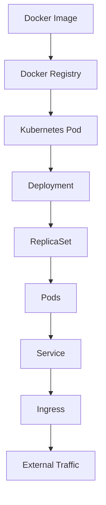
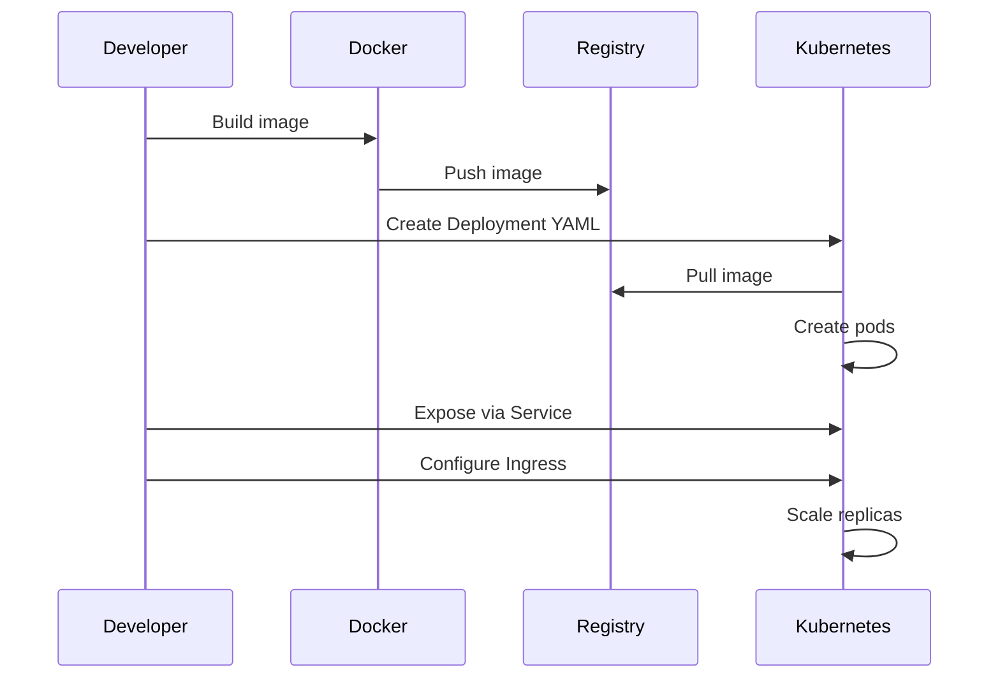

# Docker Kubernetes Integration

## Overview

Kubernetes orchestrates Docker containers at scale, providing deployment, scaling, and management capabilities for containerized applications.

## Detailed Explanation

Kubernetes provides orchestration for Docker containers through various abstractions:

| Kubernetes Object | Purpose | Docker Equivalent |
|-------------------|---------|-------------------|
| Pod | Group of containers | Container |
| Service | Networking abstraction | None direct |
| Deployment | Manages replicas | docker-compose scale |
| ConfigMap | Configuration data | Environment variables |
| Secret | Sensitive data | Secure env vars |
| Ingress | External access | Reverse proxy |
| PersistentVolume | Storage | Volumes |

### Container Deployment Flow



Key integration points:
- **Container Runtime**: Kubernetes uses containerd or Docker as CRI.
- **Image Management**: Pull images from registries like Docker Hub.
- **Networking**: Services provide stable IPs for pods.
- **Scaling**: Deployments handle horizontal scaling.
- **Updates**: Rolling updates for zero-downtime deployments.

## Real-world Examples & Use Cases

- **Web Applications**: Deploying frontend, backend, and database tiers with scaling.
- **Microservices**: Managing service mesh with Istio and Kubernetes.
- **CI/CD Pipelines**: Automated deployments with Jenkins/Kubernetes.
- **Big Data**: Running Spark jobs on Kubernetes clusters.
- **Machine Learning**: Deploying ML models as containerized services.

## Code Examples

### Deployment YAML

```yaml
apiVersion: apps/v1
kind: Deployment
metadata:
  name: nginx-deployment
spec:
  replicas: 3
  selector:
    matchLabels:
      app: nginx
  template:
    metadata:
      labels:
        app: nginx
    spec:
      containers:
      - name: nginx
        image: nginx:1.21
        ports:
        - containerPort: 80
```

### Service YAML

```yaml
apiVersion: v1
kind: Service
metadata:
  name: nginx-service
spec:
  selector:
    app: nginx
  ports:
    - protocol: TCP
      port: 80
      targetPort: 80
  type: LoadBalancer
```

### ConfigMap for Configuration

```yaml
apiVersion: v1
kind: ConfigMap
metadata:
  name: app-config
data:
  APP_NAME: "My App"
  DATABASE_URL: "postgres://db:5432/mydb"
```

### Ingress for Routing

```yaml
apiVersion: networking.k8s.io/v1
kind: Ingress
metadata:
  name: app-ingress
spec:
  rules:
  - host: myapp.example.com
    http:
      paths:
      - path: /
        pathType: Prefix
        backend:
          service:
            name: app-service
            port:
              number: 80
```

### Multi-Container Pod

```yaml
apiVersion: v1
kind: Pod
metadata:
  name: multi-container-pod
spec:
  containers:
  - name: app
    image: myapp:latest
    ports:
    - containerPort: 8080
  - name: sidecar
    image: logging-sidecar:latest
    ports:
    - containerPort: 8081
```

## Journey / Sequence

Deploying a Docker container to Kubernetes:



## Common Pitfalls & Edge Cases

- Resource limits not set, leading to node exhaustion.
- Not using liveness/readiness probes, causing unhealthy pods.
- Hardcoded IPs instead of service names.
- Ignoring persistent volumes for stateful apps.
- Network policies not configured for security.

## Tools & Libraries

- **kubectl**: Command-line tool for Kubernetes
- **Docker Desktop**: Local development with Kubernetes
- **Helm**: Package manager for Kubernetes
- **Kustomize**: Configuration management
- **Lens**: GUI for Kubernetes clusters
- **Prometheus**: Monitoring with Kubernetes metrics

## References

- [Kubernetes Documentation](https://kubernetes.io/docs/)
- [Docker Documentation](https://docs.docker.com/)
- [Kubernetes Concepts](https://kubernetes.io/docs/concepts/)
- [Docker Kubernetes Integration Guide](https://docs.docker.com/desktop/kubernetes/)

## Github-README Links & Related Topics

- [Docker Containerization](./docker-containerization/README.md)
- [Kubernetes Basics](./kubernetes-basics/README.md)
