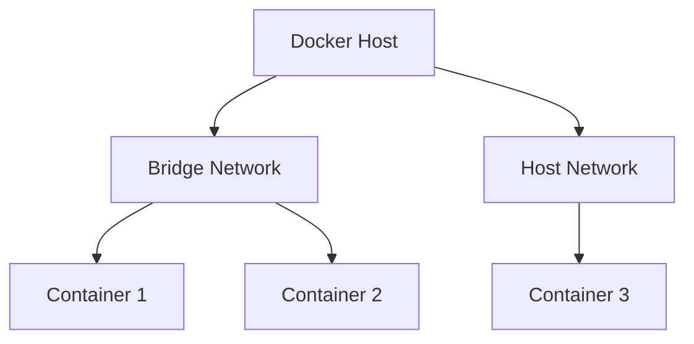

# Overview

Docker Networking enables communication between containers, hosts, and external networks. It provides isolated networks for secure and efficient container interactions.

# Detailed Explanation

Docker supports multiple network drivers: bridge (default), host, overlay, macvlan, none. Bridge creates a private network on the host. Overlay enables multi-host networking.

Key concepts:
- **Containers**: Isolated processes with their own network stack.
- **Networks**: Virtual networks connecting containers.
- **Ports**: Exposed for external access.



# Real-world Examples & Use Cases

- Running a web app with database in separate containers.
- Microservices communication in a swarm.
- Connecting containers to external databases securely.

# Code Examples

Create a custom bridge network:

```bash
docker network create my-network
```

Run containers on the network:

```bash
docker run -d --name web --network my-network nginx
docker run -d --name db --network my-network mysql
```

Docker Compose example:

```yaml
version: '3.8'
services:
  web:
    image: nginx
    networks:
      - mynet
  db:
    image: mysql
    networks:
      - mynet
networks:
  mynet:
    driver: bridge
```

# References

- [Docker Networking Overview](https://docs.docker.com/network/)
- [Docker Compose Networking](https://docs.docker.com/compose/networking/)

# Github-README Links & Related Topics

- [Docker Containerization](./docker-containerization/README.md)
- [Docker Compose Best Practices](./docker-compose-best-practices/README.md)
- [Networking](./networking/README.md)