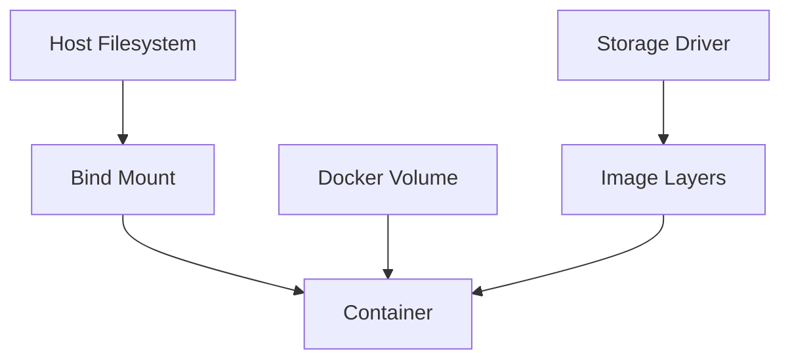

# Docker Volumes and Storage

## Overview

Docker provides mechanisms for persistent data storage beyond container lifecycles. Volumes allow data to persist across container restarts and removals, while bind mounts link host directories. Storage drivers manage image layers and writable layers.

## Detailed Explanation

### Volume Types
- **Named Volumes**: Managed by Docker, stored in /var/lib/docker/volumes.
- **Anonymous Volumes**: Created without a name, harder to manage.
- **Bind Mounts**: Direct host directory mounting, not managed by Docker.

### Volume Lifecycle
- Created with `docker volume create` or automatically.
- Attached to containers via `-v` or `--mount`.
- Persist until explicitly removed.

### Storage Drivers
- Overlay2, AUFS, etc., for layered filesystem.
- Choose based on host OS.



## Real-world Examples & Use Cases

- **Database Persistence**: Store DB data in volumes.
- **Logs**: Persistent log storage.
- **Shared Config**: Bind mount config files.
- **CI/CD**: Cache dependencies in volumes.

## Code Examples

### Create and Use Volume
```bash
docker volume create myvol
docker run -d -v myvol:/app/data myimage
```

### Bind Mount
```bash
docker run -v /host/path:/container/path myimage
```

### Docker Compose
```yaml
version: '3.8'
services:
  db:
    image: postgres
    volumes:
      - db_data:/var/lib/postgresql/data
volumes:
  db_data:
```

### Volume Inspection
```bash
docker volume ls
docker volume inspect myvol
```

## Data Models / Message Formats

- **Volume JSON**: Metadata from `docker volume inspect`.
- **Mount Config**: JSON for --mount flag.

## Common Pitfalls & Edge Cases

- **Permissions**: UID/GID mismatches between host and container.
- **Performance**: Bind mounts faster than volumes on some systems.
- **Cleanup**: Anonymous volumes accumulate if not managed.
- **Backup**: Volumes not included in images.

## Tools & Libraries

- **docker CLI**: Volume management commands.
- **docker-compose**: Declarative volume definitions.
- **Volume Plugins**: For cloud storage (e.g., AWS EBS).

## References

- [Docker Volumes Documentation](https://docs.docker.com/storage/volumes/)
- [Bind Mounts](https://docs.docker.com/storage/bind-mounts/)
- [Storage Drivers](https://docs.docker.com/storage/storagedriver/)

## Github-README Links & Related Topics

- [docker-containerization](../docker-containerization/README.md)
- [docker-best-practices](../docker-best-practices/README.md)
- [kubernetes-orchestration](../kubernetes-orchestration/README.md)