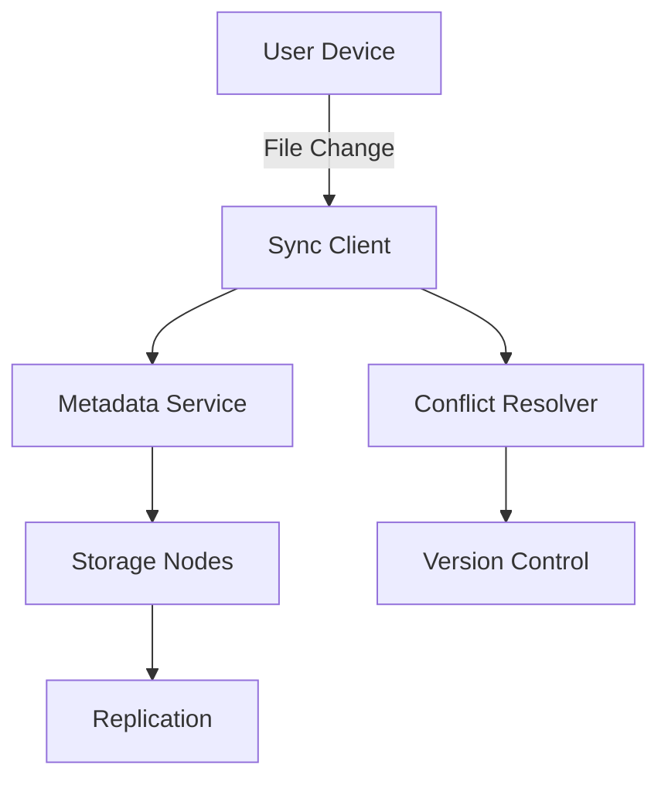

# Dropbox File Storage

## Overview
Dropbox provides cloud-based file storage with automatic synchronization across devices. This design covers scalable file storage, versioning, and cross-device sync.

## Detailed Explanation
Architecture includes:
- **Client Applications**: Desktop/mobile apps for file access
- **Sync Engine**: Detects changes and syncs files
- **Storage Backend**: Distributed file system with replication
- **Metadata Service**: Tracks file versions and permissions
- **CDN**: Fast file delivery globally

Key features:
- Block-level synchronization
- File versioning and conflict resolution
- Selective sync
- Sharing and collaboration



## Real-world Examples & Use Cases
- **Personal File Backup**: Automatic backup of documents, photos
- **Team Collaboration**: Shared folders with version history
- **Cross-Platform Sync**: Seamless access from desktop, mobile, web
- **Large File Sharing**: Send large files via links

## Code Examples
### File Sync Logic
```java
public class FileSyncManager {
    public void syncFile(File localFile) {
        // Calculate hash
        String hash = calculateHash(localFile);
        
        // Check if changed
        if (!hash.equals(getRemoteHash(localFile.getPath()))) {
            // Upload blocks
            uploadBlocks(localFile, hash);
            // Update metadata
            updateMetadata(localFile.getPath(), hash);
        }
    }
}
```

### Version Control
```java
public class VersionManager {
    public void createVersion(File file) {
        Version newVersion = new Version(file.getContent(), Instant.now());
        versions.put(file.getId(), newVersion);
    }
    
    public File restoreVersion(String fileId, int versionNumber) {
        return versions.get(fileId).get(versionNumber);
    }
}
```

## References
- [Dropbox Technical Blog](https://dropbox.tech/)
- [Distributed File Systems](https://en.wikipedia.org/wiki/Distributed_file_system)
- [Block-Level Sync](https://en.wikipedia.org/wiki/Block-level_backup)

## Common Pitfalls & Edge Cases

- **Sync Conflicts**: Multiple edits to same file; resolve with versioning.
- **Network Interruptions**: Resume sync, handle partial uploads.
- **Large Files**: Chunking and resumable uploads.
- **Security**: Encrypt data at rest and in transit.
- **Storage Limits**: Quota management and notifications.

## Tools & Libraries

- **Amazon S3**: Scalable storage.
- **Redis**: Caching metadata.
- **Kafka**: Event-driven sync.
- **Docker/Kubernetes**: Deployment.

## Github-README Links & Related Topics
- [Distributed File Systems](../system-design/database-design-and-indexing/README.md)
- [Caching Strategies](../system-design/caching-strategies/README.md)
- [Partitioning and Sharding](../system-design/partitioning-and-sharding/README.md)
- [Consistency Models](../system-design/consistency-models/README.md)