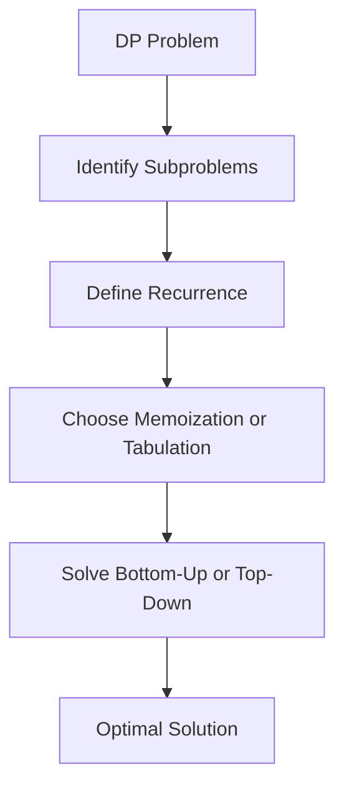

# Overview

Dynamic programming is both a mathematical optimization method and a computer programming method. The method was developed by Richard Bellman in the 1950s and has found applications in numerous fields, from aerospace engineering to economics. It refers to simplifying a complicated problem by breaking it down into simpler sub-problems in a recursive manner, with optimal substructure and overlapping subproblems.

# Detailed Explanation

Dynamic programming is applicable when the problem has overlapping subproblems and optimal substructure.

- **Overlapping Subproblems**: Subproblems are solved multiple times; DP stores solutions to avoid recomputation.
- **Optimal Substructure**: Optimal solution constructed from optimal subproblem solutions.

Implementations: Memoization (top-down) or Tabulation (bottom-up).

Examples include Fibonacci, Knapsack, LCS, Matrix Chain Multiplication.



| Category | Example | Complexity |
|----------|---------|------------|
| Sequence | Fibonacci | O(n) |
| Optimization | 0/1 Knapsack | O(nW) |
| String | LCS | O(mn) |
| Path | Grid Paths | O(mn) |

# Real-world Examples & Use Cases

- **Bioinformatics**: Sequence alignment (LCS, edit distance).
- **Operations Research**: Resource allocation (Knapsack).
- **Computer Science**: Shortest paths (Floyd-Warshall), parsing.
- **Economics**: Optimal control, Ramsey's saving problem.
- **AI**: Reinforcement learning value functions.

# Code Examples

## Fibonacci (Memoization - Python)
```python
memo = {}
def fib(n):
    if n in memo: return memo[n]
    if n <= 1: return n
    memo[n] = fib(n-1) + fib(n-2)
    return memo[n]
```

## 0/1 Knapsack (Tabulation - Java)
```java
int knapsack(int[] w, int[] v, int W) {
    int n = w.length;
    int[][] dp = new int[n+1][W+1];
    for (int i = 1; i <= n; i++) {
        for (int j = 1; j <= W; j++) {
            if (w[i-1] <= j) {
                dp[i][j] = Math.max(dp[i-1][j], v[i-1] + dp[i-1][j - w[i-1]]);
            } else {
                dp[i][j] = dp[i-1][j];
            }
        }
    }
    return dp[n][W];
}
```

## LCS (Python)
```python
def lcs(X, Y):
    m, n = len(X), len(Y)
    dp = [[0]*(n+1) for _ in range(m+1)]
    for i in range(1, m+1):
        for j in range(1, n+1):
            if X[i-1] == Y[j-1]:
                dp[i][j] = dp[i-1][j-1] + 1
            else:
                dp[i][j] = max(dp[i-1][j], dp[i][j-1])
    return dp[m][n]
```

# References

- [Wikipedia: Dynamic Programming](https://en.wikipedia.org/wiki/Dynamic_programming)
- [GeeksforGeeks: Dynamic Programming](https://www.geeksforgeeks.org/dynamic-programming/)
- Bellman, R. (1957). Dynamic Programming. Princeton University Press.

# Github-README Links & Related Topics

- [Algorithms](../algorithms/)
- [Divide and Conquer](../divide-and-conquer/)
- [Greedy Algorithms](../greedy-algorithms/)
- [Recursion](../recursion/)