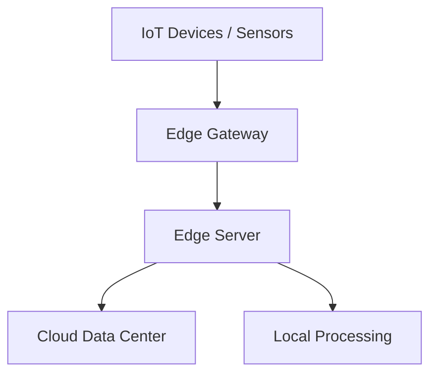

# Edge Computing

## Overview

Edge computing brings computation and data storage closer to the location where it is needed, reducing latency and bandwidth use by processing data at the edge of the network rather than in a centralized cloud.

## Detailed Explanation

Edge computing distributes processing, storage, and applications across a wide range of devices and data centers. It addresses the limitations of cloud computing for applications requiring real-time processing or operating in low-connectivity environments.

Key concepts:
- **Edge Devices**: Sensors, IoT devices, smartphones.
- **Edge Servers**: Local data centers or gateways.
- **Fog Computing**: Extension of edge, involving more processing layers.

Benefits:
- Reduced latency
- Bandwidth savings
- Improved reliability
- Enhanced privacy

### Architecture Diagram



## Real-world Examples & Use Cases

- **Autonomous Vehicles**: Real-time decision-making for self-driving cars.
- **Smart Cities**: Traffic management and surveillance with low latency.
- **Industrial IoT**: Predictive maintenance in manufacturing.
- **Retail**: Personalized shopping experiences with AR/VR.

## Code Examples

### Simple Edge Function (Python with Edge Runtime Simulation)

```python
import time

def process_sensor_data(data):
    # Simulate edge processing
    if data['temperature'] > 30:
        alert = "High temperature detected"
        # Send to cloud or act locally
        return alert
    return "Normal"

# Simulate sensor input
sensor_data = {'temperature': 35, 'humidity': 60}
result = process_sensor_data(sensor_data)
print(result)
```

### AWS IoT Greengrass Example (Simplified)

```javascript
// AWS IoT Greengrass function
exports.handler = async (event) => {
    const sensorData = event.sensorData;
    // Process at edge
    const processedData = analyzeData(sensorData);
    // Optionally send to cloud
    return processedData;
};

function analyzeData(data) {
    // Edge analytics logic
    return { status: 'analyzed', data: data };
}
```

## References

- [Edge Computing on Wikipedia](https://en.wikipedia.org/wiki/Edge_computing)
- [AWS IoT Greengrass](https://aws.amazon.com/greengrass/)
- [Azure IoT Edge](https://azure.microsoft.com/en-us/services/iot-edge/)
- [Google Cloud IoT](https://cloud.google.com/iot)

## Github-README Links & Related Topics

- [IoT System Design](iot-system-design/README.md)
- [Real-time Analytics](real-time-analytics/README.md)
- [Distributed Systems](cap-theorem-and-distributed-systems/README.md)
- [Latency and Throughput](latency-and-throughput/README.md)