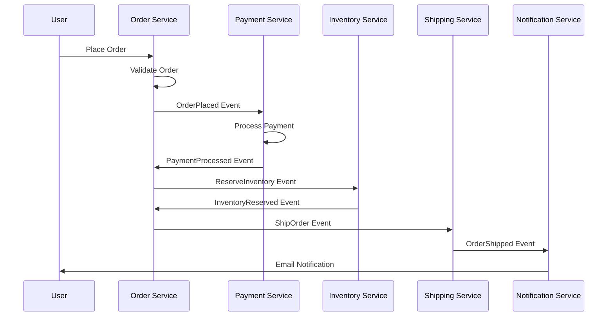

# Event-Driven Architecture

## Overview

Event-Driven Architecture (EDA) is a design paradigm where system components communicate through events - significant changes in state. This approach enables loose coupling, scalability, and real-time responsiveness in distributed systems.

## Detailed Explanation

### Core Concepts

1. **Events**: Immutable records of state changes (e.g., "OrderPlaced", "UserRegistered")
2. **Event Producers**: Components that generate and publish events
3. **Event Consumers**: Components that react to events asynchronously
4. **Event Bus/Message Broker**: Infrastructure for event routing and delivery
5. **Event Sourcing**: Storing state as a sequence of events

### Patterns

- **Event Notification**: Simple publish-subscribe model
- **Event-Carried State Transfer**: Events contain all necessary data
- **Event Sourcing**: Rebuilding state from event history
- **CQRS**: Separating read and write models

### Benefits

- Loose coupling between components
- Scalability through asynchronous processing
- Real-time capabilities
- Audit trails and temporal queries
- Fault tolerance and resilience

## Real-world Examples & Use Cases

### E-commerce Order Processing


### IoT Sensor Network
- Sensors publish temperature readings as events
- Analytics service processes events in real-time
- Alert system triggers based on event patterns
- Historical data stored for trend analysis

### Financial Trading Platform
- Trade execution generates events
- Risk management systems react to trades
- Compliance systems audit all events
- Reporting systems aggregate trade data

## Code Examples

### Event Definition
```java
public class OrderPlacedEvent {
    private final String orderId;
    private final String customerId;
    private final BigDecimal amount;
    private final Instant timestamp;
    
    // Constructor, getters
}

public class PaymentProcessedEvent {
    private final String orderId;
    private final String paymentId;
    private final PaymentStatus status;
    
    // Constructor, getters
}
```

### Event Publisher
```java
@Service
public class OrderService {
    
    @Autowired
    private EventPublisher eventPublisher;
    
    @Transactional
    public Order placeOrder(OrderRequest request) {
        Order order = createOrder(request);
        orderRepository.save(order);
        
        OrderPlacedEvent event = new OrderPlacedEvent(
            order.getId(),
            order.getCustomerId(),
            order.getTotalAmount()
        );
        
        eventPublisher.publish("orders", event);
        return order;
    }
}
```

### Event Consumer
```java
@Component
public class PaymentProcessor {
    
    @EventListener
    public void handleOrderPlaced(OrderPlacedEvent event) {
        // Process payment asynchronously
        Payment payment = processPayment(event);
        
        PaymentProcessedEvent paymentEvent = new PaymentProcessedEvent(
            event.getOrderId(),
            payment.getId(),
            payment.getStatus()
        );
        
        eventPublisher.publish("payments", paymentEvent);
    }
}
```

### Event Sourcing Example
```java
public class Account {
    private String accountId;
    private BigDecimal balance;
    private List<AccountEvent> events;
    
    public void deposit(BigDecimal amount) {
        DepositEvent event = new DepositEvent(accountId, amount);
        apply(event);
        events.add(event);
    }
    
    public void withdraw(BigDecimal amount) {
        if (balance.compareTo(amount) < 0) {
            throw new InsufficientFundsException();
        }
        WithdrawalEvent event = new WithdrawalEvent(accountId, amount);
        apply(event);
        events.add(event);
    }
    
    private void apply(AccountEvent event) {
        if (event instanceof DepositEvent) {
            balance = balance.add(((DepositEvent) event).getAmount());
        } else if (event instanceof WithdrawalEvent) {
            balance = balance.subtract(((WithdrawalEvent) event).getAmount());
        }
    }
}
```

## Common Pitfalls & Edge Cases

- Event ordering issues in distributed systems
- Duplicate event processing
- Event schema evolution
- Handling event failures and retries
- Managing event storage and retention
- Complex debugging of event flows

## Tools & Libraries

- **Apache Kafka**: Distributed event streaming platform
- **RabbitMQ**: Message broker for event routing
- **AWS EventBridge**: Managed event bus
- **Spring Events**: Framework for in-application events
- **Axon Framework**: CQRS and Event Sourcing framework

## References

- [Event-Driven Architecture - Martin Fowler](https://martinfowler.com/articles/201701-event-driven.html)
- [Event Sourcing - Greg Young](https://www.eventstore.com/blog/what-is-event-sourcing)
- [CQRS Pattern](https://docs.microsoft.com/en-us/azure/architecture/patterns/cqrs)

## Github-README Links & Related Topics

- [Event Sourcing](../event-sourcing/README.md)
- [Event Sourcing and CQRS](../event-sourcing-and-cqrs/README.md)
- [Message Queues and Brokers](../message-queues-and-brokers/README.md)
- [CQRS Pattern](../cqrs-pattern/README.md)