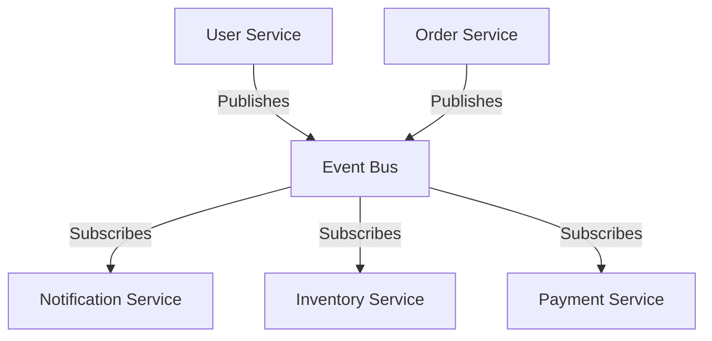

# Event-Driven Microservices

## Overview

Event-Driven Microservices architecture decouples services by using events as the primary means of communication. Services publish events when something happens, and other services subscribe to those events to react accordingly. This promotes loose coupling, scalability, and resilience.

## Detailed Explanation

In event-driven systems, events are immutable records of state changes. Services communicate asynchronously via message brokers like Kafka or RabbitMQ. This allows for better fault tolerance, as services can process events at their own pace.

### Key Concepts

- **Event Producers**: Services that generate events.
- **Event Consumers**: Services that react to events.
- **Event Bus/Message Broker**: Middleware for event routing.
- **Event Sourcing**: Storing state as a sequence of events.
- **CQRS**: Separating read and write models.

### Architecture Diagram



## Real-world Examples & Use Cases

- **E-commerce**: Order placed event triggers inventory update, payment processing, and email notifications.
- **IoT Systems**: Sensor data events drive analytics and alerts.
- **Financial Systems**: Transaction events update ledgers and trigger compliance checks.

## Code Examples

### Publishing an Event with Spring Boot

```java
@Service
public class OrderService {
    @Autowired
    private ApplicationEventPublisher publisher;

    public void placeOrder(Order order) {
        // Save order
        orderRepository.save(order);
        // Publish event
        publisher.publishEvent(new OrderPlacedEvent(order));
    }
}
```

### Consuming Events with Kafka

```java
@Component
public class OrderEventConsumer {
    @KafkaListener(topics = "order-events", groupId = "order-group")
    public void consume(OrderEvent event) {
        // Process event
        System.out.println("Received event: " + event);
    }
}
```

## References

- [Event-Driven Architecture](https://martinfowler.com/articles/201701-event-driven.html)
- [Apache Kafka](https://kafka.apache.org/)
- [Spring Event Handling](https://docs.spring.io/spring-framework/docs/current/reference/html/core.html#context-functionality-events)

## Github-README Links & Related Topics

- [Event-Driven Architecture](event-driven-architecture/README.md)
- [Event-Driven Systems](event-driven-systems/README.md)
- [Event Streaming with Apache Kafka](event-streaming-with-apache-kafka/README.md)
- [CQRS Pattern](cqrs-pattern/README.md)