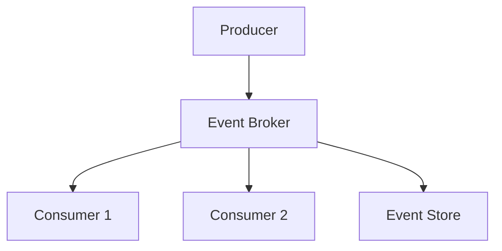

## Overview

Event-driven systems are architectures where components communicate through events, enabling loose coupling, scalability, and real-time processing. Events represent state changes or actions, processed asynchronously by event handlers.

## Detailed Explanation

In event-driven architecture (EDA), producers generate events, which are published to a message broker or bus. Consumers subscribe to relevant events and react accordingly. Key components include:

- **Event Producers**: Generate events (e.g., user actions, sensor data).
- **Event Consumers**: Process events reactively.
- **Event Brokers**: Middleware like Apache Kafka or RabbitMQ for routing and queuing.
- **Event Stores**: Persistent storage for event sourcing.

Benefits: Decoupling, scalability, fault tolerance. Challenges: Eventual consistency, debugging complexity.



## Real-world Examples & Use Cases

- **E-commerce**: Order placed event triggers inventory update, shipping notification.
- **IoT**: Sensor data events processed for real-time analytics.
- **Financial Systems**: Transaction events for fraud detection and ledger updates.

## Code Examples

### Simple Event Producer in Java

```java
import org.apache.kafka.clients.producer.KafkaProducer;
import org.apache.kafka.clients.producer.ProducerRecord;

public class EventProducer {
    public static void main(String[] args) {
        KafkaProducer<String, String> producer = new KafkaProducer<>(config);
        producer.send(new ProducerRecord<>("events", "user_login", "user123"));
        producer.close();
    }
}
```

### Event Consumer

```java
import org.apache.kafka.clients.consumer.KafkaConsumer;
import org.apache.kafka.clients.consumer.ConsumerRecords;

public class EventConsumer {
    public static void main(String[] args) {
        KafkaConsumer<String, String> consumer = new KafkaConsumer<>(config);
        consumer.subscribe(Arrays.asList("events"));
        while (true) {
            ConsumerRecords<String, String> records = consumer.poll(100);
            for (ConsumerRecord<String, String> record : records) {
                System.out.println(record.value());
            }
        }
    }
}
```

## References

- [Event-Driven Architecture on Martin Fowler](https://martinfowler.com/articles/201701-event-driven.html)
- [Apache Kafka Documentation](https://kafka.apache.org/documentation/)

## Github-README Links & Related Topics

- [Kafka Internals](../kafka-internals/README.md)
- [Async Logging](../async-logging/README.md)
- [Microservices Architecture](../microservices-architecture/README.md)