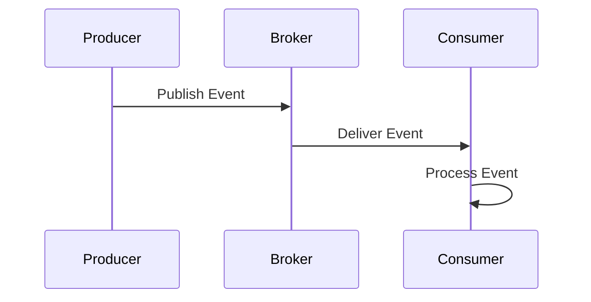

# Event-Driven Systems

## Overview

Event-driven systems are architectures where the flow of the program is determined by events such as user actions, sensor outputs, or messages from other programs. Instead of a linear execution, components react to events asynchronously, promoting decoupling, scalability, and responsiveness.

## Detailed Explanation

### Key Components
- **Event Producers**: Generate events (e.g., user clicks, data changes).
- **Event Consumers**: React to events (e.g., update UI, process data).
- **Event Brokers/Message Queues**: Middleware like Kafka, RabbitMQ for routing events.
- **Event Channels**: Topics or queues for event distribution.

### Patterns
- **Publish-Subscribe (Pub-Sub)**: Producers publish to channels, consumers subscribe.
- **Event Sourcing**: Store state as sequence of events.
- **CQRS**: Separate read/write models, often event-driven.

### Benefits
- Loose coupling between components.
- Scalability through asynchronous processing.
- Real-time responsiveness.

### Challenges
- Eventual consistency.
- Debugging complex event flows.
- Handling event ordering and duplicates.

## Real-world Examples & Use Cases

- **User Interfaces**: GUI frameworks like Java Swing use event listeners for button clicks.
- **IoT Systems**: Sensors publish events to central hubs for processing.
- **E-commerce**: Order placement triggers inventory updates, notifications.
- **Financial Trading**: Market data events drive algorithmic trading systems.

## Code Examples

### Simple Event Listener in Java
```java
import java.awt.event.ActionEvent;
import java.awt.event.ActionListener;
import javax.swing.JButton;
import javax.swing.JFrame;

public class EventExample {
    public static void main(String[] args) {
        JFrame frame = new JFrame();
        JButton button = new JButton("Click Me");

        button.addActionListener(new ActionListener() {
            @Override
            public void actionPerformed(ActionEvent e) {
                System.out.println("Button clicked!");
            }
        });

        frame.add(button);
        frame.setSize(200, 200);
        frame.setVisible(true);
    }
}
```

### Using Kafka for Event Streaming (Producer)
```java
import org.apache.kafka.clients.producer.KafkaProducer;
import org.apache.kafka.clients.producer.ProducerRecord;

Properties props = new Properties();
props.put("bootstrap.servers", "localhost:9092");
props.put("key.serializer", "org.apache.kafka.common.serialization.StringSerializer");
props.put("value.serializer", "org.apache.kafka.common.serialization.StringSerializer");

KafkaProducer<String, String> producer = new KafkaProducer<>(props);
producer.send(new ProducerRecord<>("events", "key", "event data"));
producer.close();
```

## Journey / Sequence



## References

- [Event-Driven Architecture - Microservices.io](https://microservices.io/patterns/data/event-driven-architecture.html)
- [Apache Kafka Documentation](https://kafka.apache.org/documentation/)

## Github-README Links & Related Topics

- [Event-Driven Architecture](../event-driven-architecture/)
- [Message Queues and Brokers](../message-queues-and-brokers/)
