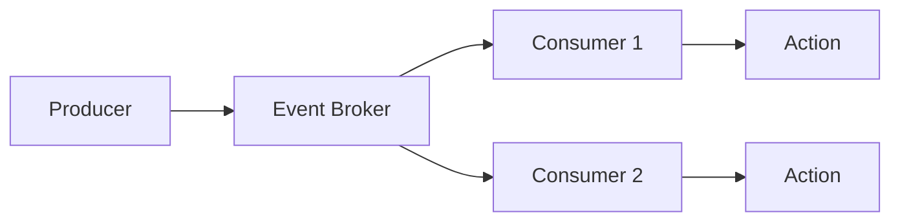

## Overview

Event-Driven Systems are architectures where components react to events asynchronously. Events are messages representing state changes, processed by event handlers or consumers.

## Detailed Explanation

Key components:
- **Event Producers**: Generate events (e.g., user actions).
- **Event Brokers**: Route events (e.g., Kafka, RabbitMQ).
- **Event Consumers**: Process events.

Benefits: Decoupling, scalability, real-time processing.

Challenges: Eventual consistency, debugging complexity.

### Event Flow Diagram



## Real-world Examples & Use Cases

- **E-commerce**: Order placed event triggers inventory update and email.
- **IoT**: Sensor data events processed for analytics.
- **Social Media**: Like event updates feeds asynchronously.

## Code Examples

### Simple Event System in Java

```java
import java.util.ArrayList;
import java.util.List;

interface EventListener {
    void onEvent(String event);
}

class EventManager {
    private List<EventListener> listeners = new ArrayList<>();
    
    public void subscribe(EventListener listener) {
        listeners.add(listener);
    }
    
    public void publish(String event) {
        for (EventListener listener : listeners) {
            listener.onEvent(event);
        }
    }
}

// Usage
EventManager manager = new EventManager();
manager.subscribe(e -> System.out.println("Handled: " + e));
manager.publish("User Logged In");
```

## References

- [Event-Driven Architecture](https://martinfowler.com/articles/201701-event-driven.html)
- [Kafka Documentation](https://kafka.apache.org/documentation/)

## Github-README Links & Related Topics

- [event-driven-architecture](../event-driven-architecture/README.md)
- [message-queues-and-brokers](../message-queues-and-brokers/README.md)
- [kafka-internals](../kafka-internals/README.md)
