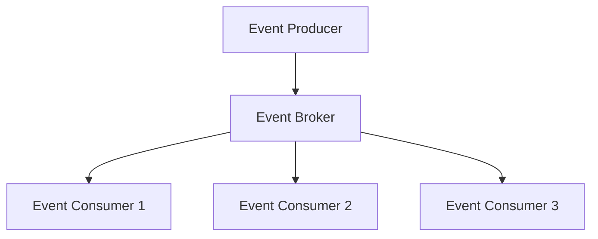

# Overview

Event-driven systems are architectures where the flow of the program is determined by events such as user actions, sensor outputs, or messages from other programs. Instead of a linear execution, components react to events asynchronously, promoting decoupling, scalability, and responsiveness.

# Detailed Explanation

### Key Components
- **Event Producers**: Generate events (e.g., user clicks, data changes).
- **Event Consumers**: React to events (e.g., update UI, process data).
- **Event Brokers/Message Queues**: Middleware like Kafka, RabbitMQ for routing events.
- **Event Channels**: Topics or queues for event distribution.

### Patterns
- **Publish-Subscribe (Pub-Sub)**: Producers publish to channels, consumers subscribe.
- **Event Sourcing**: Store state as sequence of events.
- **CQRS**: Separate read/write models, often event-driven.

### Benefits
- Loose coupling between components.
- Scalability through asynchronous processing.
- Real-time responsiveness.

### Challenges
- Eventual consistency.
- Debugging complex event flows.
- Handling event ordering and duplicates.

## Architecture Diagram



# Real-world Examples & Use Cases

- **User Interfaces**: GUI frameworks like Java Swing use event listeners for button clicks.
- **IoT Systems**: Sensors publish events to central hubs for processing.
- **E-commerce**: Order placement triggers inventory updates, notifications.
- **Financial Trading**: Market data events drive algorithmic trading systems.
- **Social Media**: User posts trigger notifications, feed updates, and analytics.

# Code Examples

### Simple Event Listener in Java
```java
import java.awt.event.ActionEvent;
import java.awt.event.ActionListener;
import javax.swing.JButton;
import javax.swing.JFrame;

public class EventExample {
    public static void main(String[] args) {
        JFrame frame = new JFrame();
        JButton button = new JButton("Click Me");

        button.addActionListener(new ActionListener() {
            @Override
            public void actionPerformed(ActionEvent e) {
                System.out.println("Button clicked!");
            }
        });

        frame.add(button);
        frame.setSize(200, 200);
        frame.setVisible(true);
    }
}
```

### Using Kafka for Event Streaming (Producer)
```java
import org.apache.kafka.clients.producer.KafkaProducer;
import org.apache.kafka.clients.producer.ProducerRecord;

Properties props = new Properties();
props.put("bootstrap.servers", "localhost:9092");
props.put("key.serializer", "org.apache.kafka.common.serialization.StringSerializer");
props.put("value.serializer", "org.apache.kafka.common.serialization.StringSerializer");

KafkaProducer<String, String> producer = new KafkaProducer<>(props);
producer.send(new ProducerRecord<>("events", "key", "event data"));
producer.close();
```

### Consumer Example with Kafka
```java
import org.apache.kafka.clients.consumer.KafkaConsumer;
import org.apache.kafka.clients.consumer.ConsumerRecords;

Properties props = new Properties();
props.put("bootstrap.servers", "localhost:9092");
props.put("group.id", "event-consumers");
props.put("key.deserializer", "org.apache.kafka.common.serialization.StringDeserializer");
props.put("value.deserializer", "org.apache.kafka.common.serialization.StringDeserializer");

KafkaConsumer<String, String> consumer = new KafkaConsumer<>(props);
consumer.subscribe(Arrays.asList("events"));

while (true) {
    ConsumerRecords<String, String> records = consumer.poll(Duration.ofMillis(100));
    for (ConsumerRecord<String, String> record : records) {
        System.out.println("Received event: " + record.value());
        // Process event
    }
}
```

# Data Models / Message Formats

### Event Structure (JSON)
```json
{
  "eventId": "uuid-123",
  "eventType": "OrderPlaced",
  "timestamp": "2023-09-26T10:00:00Z",
  "payload": {
    "orderId": 456,
    "userId": 789,
    "amount": 99.99
  },
  "metadata": {
    "source": "ecommerce-app",
    "version": "1.0"
  }
}
```

### Avro Schema for Events
```avro
{
  "type": "record",
  "name": "OrderEvent",
  "fields": [
    {"name": "eventId", "type": "string"},
    {"name": "eventType", "type": "string"},
    {"name": "timestamp", "type": "long", "logicalType": "timestamp-millis"},
    {"name": "payload", "type": {
      "type": "record",
      "name": "OrderPayload",
      "fields": [
        {"name": "orderId", "type": "long"},
        {"name": "userId", "type": "long"},
        {"name": "amount", "type": "double"}
      ]
    }}
  ]
}
```

# Journey / Sequence


# Common Pitfalls & Edge Cases

- **Event Ordering**: Ensure consumers handle out-of-order events.
- **Duplicate Events**: Implement idempotency to handle retries.
- **Event Schema Evolution**: Version events carefully to avoid breaking changes.
- **Backpressure**: Handle high event volumes without overwhelming consumers.
- **Event Loss**: Use durable storage and acknowledgments.

# Tools & Libraries

- **Apache Kafka**: Distributed event streaming platform.
- **RabbitMQ**: Message broker with advanced routing.
- **Apache Pulsar**: Multi-tenant, high-performance messaging.
- **AWS EventBridge**: Serverless event bus.
- **Spring Cloud Stream**: Framework for building event-driven microservices.

# References

- [Event-Driven Architecture - Microservices.io](https://microservices.io/patterns/data/event-driven-architecture.html)
- [Apache Kafka Documentation](https://kafka.apache.org/documentation/)
- [Event Sourcing - Martin Fowler](https://martinfowler.com/eaaDev/EventSourcing.html)
- [CQRS Pattern](https://docs.microsoft.com/en-us/azure/architecture/patterns/cqrs)
- "Designing Event-Driven Systems" by Ben Stopford

# Github-README Links & Related Topics

- [Event-Driven Architecture](./event-driven-architecture/)
- [Event-Driven Microservices](./event-driven-microservices/)
- [Event Sourcing](./event-sourcing/)
- [CQRS Pattern](./cqrs-pattern/)
- [Message Queue Patterns](./message-queue-patterns/)
