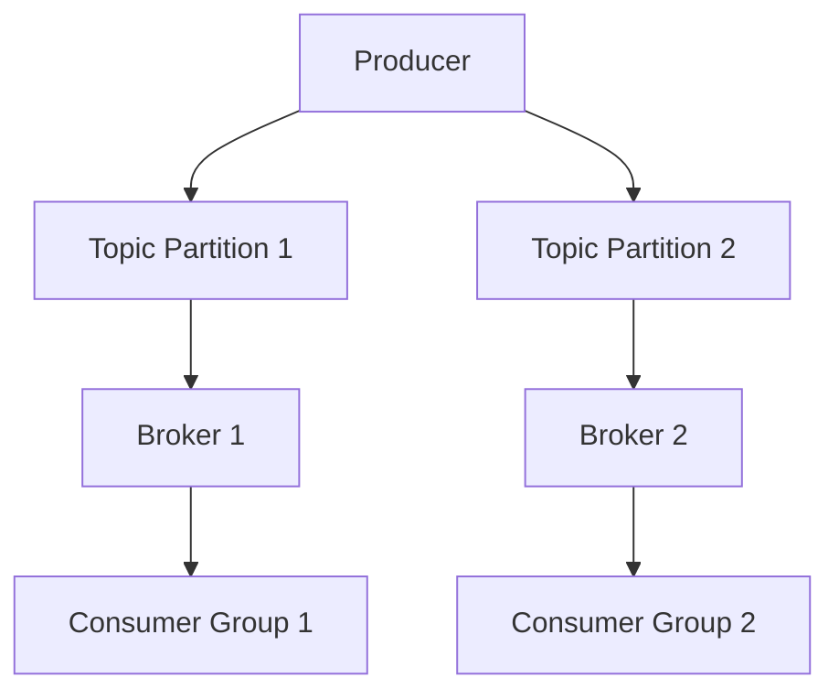
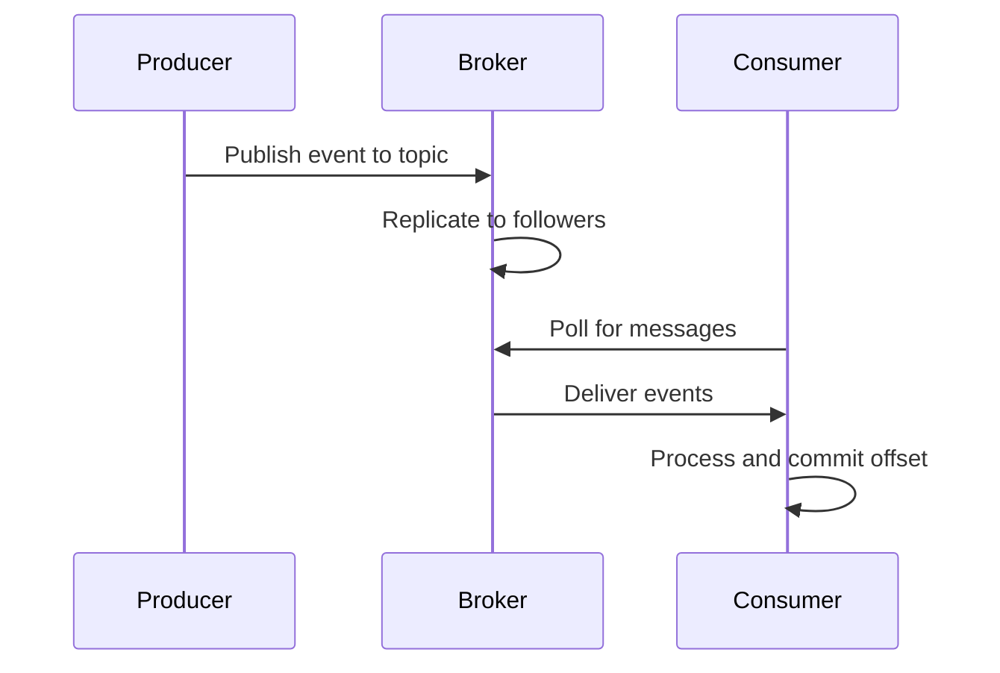

# Overview

Apache Kafka is a distributed event streaming platform that enables building real-time data pipelines and streaming applications. It provides high-throughput, fault-tolerant messaging with publish-subscribe semantics.

# Detailed Explanation

Kafka decouples data producers from consumers through topics, partitions, and consumer groups. Producers publish events to topics, brokers store and replicate data, and consumers subscribe to topics for processing.

## Key Concepts

- **Topics**: Categories for events.
- **Partitions**: Parallel processing units within topics.
- **Producers**: Publish events to topics.
- **Consumers**: Read events from topics.
- **Brokers**: Servers managing data storage and replication.
- **ZooKeeper/KRaft**: Metadata management.



## Journey / Sequence



# Real-world Examples & Use Cases

- **Log Aggregation**: Collect logs from multiple sources.
- **Real-time Analytics**: Process user activity for recommendations.
- **Event Sourcing**: Store application events for replay.
- **IoT Data Processing**: Handle sensor data streams.
- **Microservices Communication**: Async messaging between services.

# Code Examples

## Java Producer

```java
Properties props = new Properties();
props.put("bootstrap.servers", "localhost:9092");
props.put("key.serializer", "org.apache.kafka.common.serialization.StringSerializer");
props.put("value.serializer", "org.apache.kafka.common.serialization.StringSerializer");

Producer<String, String> producer = new KafkaProducer<>(props);
producer.send(new ProducerRecord<String, String>("my-topic", "key", "value"));
producer.close();
```

## Java Consumer

```java
Properties props = new Properties();
props.put("bootstrap.servers", "localhost:9092");
props.put("group.id", "test");
props.put("key.deserializer", "org.apache.kafka.common.serialization.StringDeserializer");
props.put("value.deserializer", "org.apache.kafka.common.serialization.StringDeserializer");

Consumer<String, String> consumer = new KafkaConsumer<>(props);
consumer.subscribe(Arrays.asList("my-topic"));

while (true) {
    ConsumerRecords<String, String> records = consumer.poll(Duration.ofMillis(100));
    for (ConsumerRecord<String, String> record : records) {
        System.out.println(record.value());
    }
}
```

## Kafka Streams Processing

```java
StreamsBuilder builder = new StreamsBuilder();
KStream<String, String> source = builder.stream("input-topic");
source.mapValues(value -> value.toUpperCase()).to("output-topic");

KafkaStreams streams = new KafkaStreams(builder.build(), props);
streams.start();
```

# Common Pitfalls & Edge Cases

- **Data Loss**: Improper retention and replication settings.
- **Consumer Lag**: Slow consumers causing backlog.
- **Partition Imbalance**: Uneven data distribution.
- **Rebalancing Issues**: Frequent group rebalances.
- **Message Ordering**: Guarantees within partitions only.

# Tools & Libraries

- **Kafka CLI**: Command-line tools for management.
- **Confluent Platform**: Enterprise features and tools.
- **Kafka Connect**: Data integration.
- **Schema Registry**: Avro schema management.
- **KSQL**: SQL for stream processing.

# References

- [Apache Kafka Documentation](https://kafka.apache.org/documentation/)
- [Kafka: The Definitive Guide](https://www.oreilly.com/library/view/kafka-the-definitive/9781492043078/)
- [Confluent Documentation](https://docs.confluent.io/)

# Github-README Links & Related Topics

- [Message Queues and Brokers](../message-queues-and-brokers/README.md)
- [Distributed Systems](../cap-theorem-and-distributed-systems/README.md)
- [Event-Driven Architecture](../event-driven-architecture/README.md)