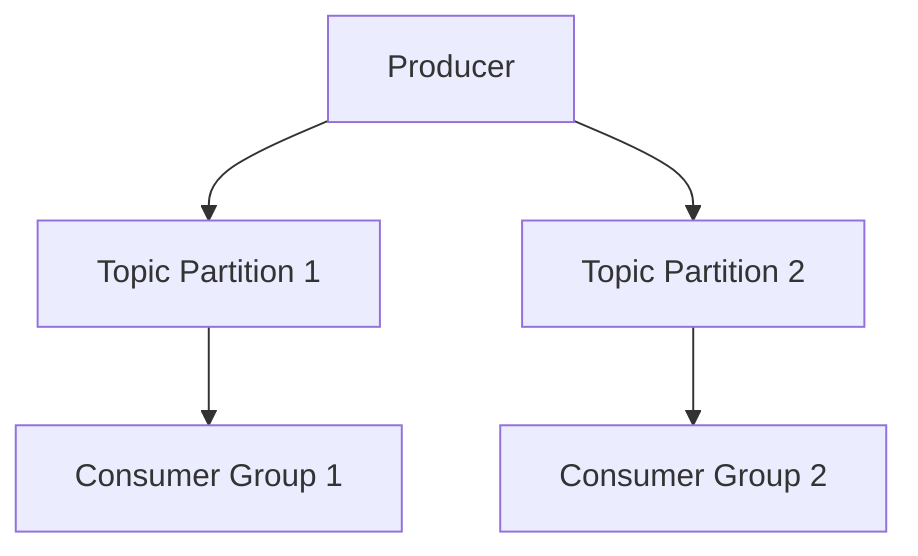

# Event Streaming with Apache Kafka

## Overview

Apache Kafka is a distributed event streaming platform used for building real-time data pipelines and streaming applications.

## Detailed Explanation

### Producers and Consumers

Producers send messages to topics, consumers read from topics.

### Topics and Partitions

Topics are categories for messages, partitions allow parallelism.

### Brokers and Clusters

Brokers store data, clusters provide fault tolerance.

### Retention and Scaling

Configure message retention and scale with more partitions/brokers.

## Real-world Examples & Use Cases

- Log aggregation in distributed systems.
- Real-time analytics for user behavior.
- Event-driven microservices communication.

## Code Examples

```java
// Kafka Producer example
Properties props = new Properties();
props.put("bootstrap.servers", "localhost:9092");
props.put("key.serializer", "org.apache.kafka.common.serialization.StringSerializer");
props.put("value.serializer", "org.apache.kafka.common.serialization.StringSerializer");

Producer<String, String> producer = new KafkaProducer<>(props);
producer.send(new ProducerRecord<String, String>("my-topic", "key", "value"));
producer.close();
```

```java
// Kafka Consumer example
Properties props = new Properties();
props.put("bootstrap.servers", "localhost:9092");
props.put("group.id", "test");
props.put("key.deserializer", "org.apache.kafka.common.serialization.StringDeserializer");
props.put("value.deserializer", "org.apache.kafka.common.serialization.StringDeserializer");

KafkaConsumer<String, String> consumer = new KafkaConsumer<>(props);
consumer.subscribe(Arrays.asList("my-topic"));
while (true) {
    ConsumerRecords<String, String> records = consumer.poll(Duration.ofMillis(100));
    for (ConsumerRecord<String, String> record : records)
        System.out.printf("offset = %d, key = %s, value = %s%n", record.offset(), record.key(), record.value());
}
```

## References

- [Apache Kafka Documentation](https://kafka.apache.org/documentation/)
- [Kafka Streams](https://kafka.apache.org/documentation/streams/)

## Github-README Links & Related Topics

- [Event Driven Architecture](./event-driven-architecture/README.md)
- [Message Queues and Brokers](./message-queues-and-brokers/README.md)
- [Event Streaming with Apache Kafka](./event-streaming-with-apache-kafka/README.md)

