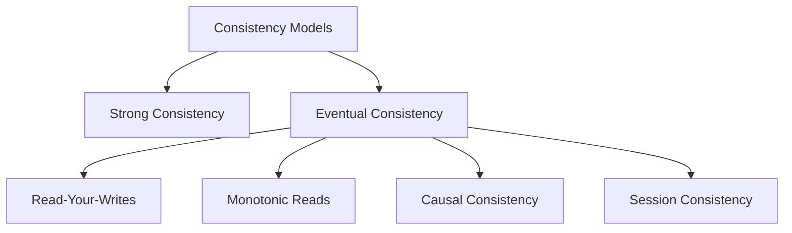

# Eventual Consistency in Distributed Systems

## Overview

Eventual consistency is a consistency model used in distributed systems where, given enough time and no new updates, all replicas of a data item will converge to the same value. It's a weaker form of consistency that allows for temporary inconsistencies to achieve higher availability and partition tolerance.

## Detailed Explanation

In distributed systems, the CAP theorem states that it's impossible to simultaneously achieve Consistency, Availability, and Partition tolerance. Eventual consistency sacrifices strong consistency for availability and partition tolerance.

### Key Concepts

- **Strong Consistency**: All reads return the most recent write
- **Eventual Consistency**: Reads may return stale data temporarily
- **Convergence**: All replicas eventually agree on the latest value
- **Conflict Resolution**: Mechanisms to handle concurrent updates

### Consistency Models



### BASE vs ACID

| ACID | BASE |
|------|------|
| Atomicity | Basically Available |
| Consistency | Soft-state |
| Isolation | Eventually consistent |
| Durability | |

## Real-world Examples & Use Cases

### DNS Propagation

When a domain's DNS records are updated, it takes time for the changes to propagate globally. Different resolvers may return different results temporarily.

### Social Media Timelines

Posts may not appear immediately in all users' feeds due to replication delays, but eventually all users see the same content.

### E-commerce Inventory

Stock levels may be inconsistent across regions during high traffic, but systems reconcile eventually to prevent overselling.

### Distributed Databases

- **Cassandra**: Uses eventual consistency with tunable consistency levels
- **DynamoDB**: Offers eventual consistency as a read option
- **CouchDB**: Built on eventual consistency principles

## Code Examples

### Conflict Resolution Strategy

```java
public class ConflictResolver {
    public void resolveConflicts(List<VersionedData> versions) {
        // Last-Writer-Wins strategy
        VersionedData latest = versions.stream()
            .max(Comparator.comparing(VersionedData::getTimestamp))
            .orElseThrow();
        
        // Apply the latest version
        applyVersion(latest);
    }
}
```

### Eventual Consistency in Cassandra

```java
// Write with eventual consistency
session.execute(
    SimpleStatement.builder("INSERT INTO users (id, name) VALUES (?, ?)")
        .addPositionalValues(userId, name)
        .setConsistencyLevel(ConsistencyLevel.ONE) // Weak consistency
        .build()
);

// Read with eventual consistency
ResultSet result = session.execute(
    SimpleStatement.builder("SELECT * FROM users WHERE id = ?")
        .addPositionalValues(userId)
        .setConsistencyLevel(ConsistencyLevel.ONE)
        .build()
);
```

### Vector Clocks for Versioning

```python
class VectorClock:
    def __init__(self, node_id):
        self.node_id = node_id
        self.clock = {node_id: 0}
    
    def increment(self):
        self.clock[self.node_id] += 1
    
    def merge(self, other):
        for node, time in other.clock.items():
            self.clock[node] = max(self.clock.get(node, 0), time)
    
    def is_concurrent(self, other):
        return not self.dominates(other) and not other.dominates(self)
    
    def dominates(self, other):
        return all(self.clock.get(node, 0) >= time for node, time in other.clock.items())
```

## Common Pitfalls & Edge Cases

- **Stale Reads**: Applications must handle potentially outdated data
- **Conflict Resolution**: Choosing appropriate strategies for concurrent updates
- **Network Partitions**: Ensuring convergence after partitions heal
- **Client Expectations**: Educating users about eventual consistency behavior
- **Testing**: Difficult to test eventual consistency scenarios

## Tools & Libraries

- **Conflict-free Replicated Data Types (CRDTs)**: Automatic conflict resolution
- **Vector Clocks**: For tracking causality and versions
- **Operational Transformation**: For collaborative editing
- **Event Sourcing**: For rebuilding state from events

## References

- [CAP Theorem](https://en.wikipedia.org/wiki/CAP_theorem)
- [Eventual Consistency - Martin Kleppmann](https://www.youtube.com/watch?v=4YK9NkETxwE)
- [BASE: An Acid Alternative](https://queue.acm.org/detail.cfm?id=1394128)
- [Cassandra Consistency Levels](https://docs.datastax.com/en/cassandra-oss/3.0/cassandra/dml/dmlConfigConsistency.html)

## Github-README Links & Related Topics

- [CAP Theorem and Distributed Systems](../cap-theorem-and-distributed-systems/)
- [Data Consistency Models](../data-consistency-models/)
- [Distributed Consensus](../distributed-consensus/)
- [Replication vs Sharding vs Partitioning](../replication-vs-sharding-vs-partitioning/)