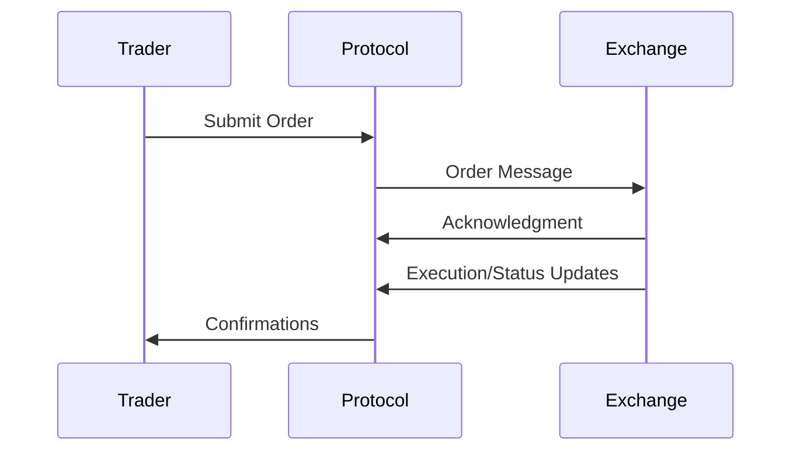

# Overview

Order entry protocols enable the submission, modification, and cancellation of trading orders to exchanges. These protocols provide standardized interfaces for connecting trading systems to market infrastructure, supporting various order types and ensuring reliable execution.

# STAR Summary

**SITUATION**: Trading firms needed efficient ways to submit orders electronically without manual phone calls.

**TASK**: Develop protocols for electronic order entry that support various order types and provide reliable confirmation.

**ACTION**: Created protocols like FIX and OUCH with message types for order submission, modification, and status updates.

**RESULT**: Enabled high-frequency trading with sub-millisecond order processing and improved market efficiency.

# Detailed Explanation

Order entry protocols define message formats for:
- **Order Submission**: New orders with parameters like symbol, quantity, price, type
- **Order Modification**: Changes to existing orders (price, quantity)
- **Order Cancellation**: Removal of pending orders
- **Order Status**: Confirmations and rejections

Key protocols include:
- **FIX**: Versatile protocol supporting complex order types
- **OUCH**: NASDAQ's binary protocol for low-latency order entry
- **Proprietary APIs**: Exchange-specific interfaces

Messages include fields for order identification, routing, and execution instructions.

# Real-world Examples & Use Cases

Order entry protocols are used by:
- Algorithmic trading systems for automated order management
- Broker dealers for client order routing
- Market makers for quote updates
- Retail platforms for user order submission

An HFT system might use OUCH to rapidly enter and cancel orders based on market conditions.

# Message Formats / Data Models

## FIX New Order Single

| Tag | Field | Description |
|-----|-------|-------------|
| 35 | MsgType | D (New Order Single) |
| 11 | ClOrdID | Client order ID |
| 55 | Symbol | Security symbol |
| 54 | Side | 1=Buy, 2=Sell |
| 38 | OrderQty | Quantity |
| 40 | OrdType | 1=Market, 2=Limit |
| 44 | Price | Limit price |

## OUCH Enter Order

Binary format with fixed fields for symbol, shares, price, etc.

# Journey of a Trade



This diagram shows the order entry flow from submission to execution feedback.

# Common Pitfalls & Edge Cases

- **Order Rejection**: Invalid parameters or market conditions
- **Latency Issues**: Network delays affecting execution timing
- **Sequence Errors**: Out-of-order messages causing state inconsistencies
- **Rate Limits**: Exchange-imposed limits on order frequency
- **Session Management**: Connection failures requiring reconnection

# Tools & Libraries

- **FIX Engines**: QuickFIX, FIX Antenna
- **OUCH Libraries**: NASDAQ-provided SDKs
- **Trading APIs**: REST/Websocket interfaces

Sample code for FIX order submission:

```python
# Using QuickFIX
order = fix.Message()
order.getHeader().setField(fix.MsgType(fix.MsgType_NewOrderSingle))
order.setField(fix.ClOrdID("ORDER123"))
order.setField(fix.Symbol("AAPL"))
order.setField(fix.Side(fix.Side_BUY))
order.setField(fix.OrderQty(100))
order.setField(fix.OrdType(fix.OrdType_LIMIT))
order.setField(fix.Price(150.00))
fix.Session.sendToTarget(order, sessionID)
```

# References

- [FIX Protocol Specification](https://www.fixtrading.org/standards/)
- [NASDAQ OUCH Specification](https://www.nasdaq.com/solutions/technology-innovation/trading-protocols)

# Github-README Links & Related Topics

- [FIX Protocol](fix-protocol/)
- [OUCH Protocol](ouch-protocol/)
- [Order Types](order-types/)
- [Execution Report](execution-report/)
- [Journey of a Trade](journey-of-a-trade/)