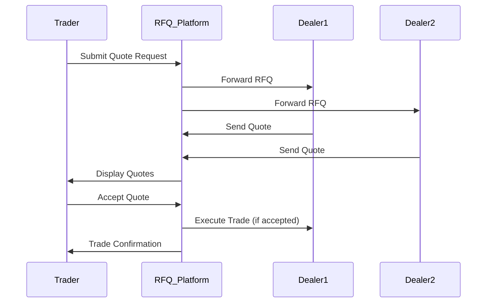

## Overview

Request for Quote (RFQ) workflows enable traders to obtain competitive pricing for large, illiquid, or complex instruments that aren't continuously quoted on exchanges. This process involves sending quote requests to multiple dealers, collecting responses, and selecting the best offer. Quotes can be firm or indicative, with workflows varying by asset class and regulatory requirements.

## STAR Summary

**SITUATION:** For over-the-counter (OTC) trading, continuous market data isn't available, requiring interactive quote solicitation.

**TASK:** Design and document RFQ workflows, including message flows and best practices.

**ACTION:** Studied FIX RFQ specifications, analyzed dealer platforms, and reviewed regulatory frameworks like MiFID II.

**RESULT:** Developed a guide for implementing RFQ systems that ensure fair pricing and compliance.

## Detailed Explanation

RFQ workflows typically follow these steps:

1. **RFQ Initiation:** Trader identifies a security or instrument needing a quote and sends a request to selected dealers.

2. **Quote Solicitation:** Dealers receive the request and provide quotes, which may include bid/ask spreads, quantities, and conditions.

3. **Quote Evaluation:** Trader reviews responses, potentially negotiating terms.

4. **Quote Acceptance/Rejection:** Trader accepts a quote, triggering execution, or rejects all.

5. **Execution and Confirmation:** Accepted quotes lead to trade execution with confirmations sent to all parties.

RFQs are common in fixed income, FX, and derivatives markets. Electronic RFQ platforms automate much of this process.

## Real-world Examples & Use Cases

**Corporate Bond RFQ:** An asset manager needs to sell $10M of corporate bonds. They send RFQs to multiple dealers, receiving quotes with tight spreads, ultimately executing with the best offer.

**FX RFQ:** A hedge fund requests quotes for EUR/USD swap, getting responses from multiple banks within seconds.

**High-Yield Bond Trading:** Dealers provide indicative quotes first, then firm quotes upon request.

## Message Formats / Data Models

**FIX QuoteRequest Message:**
```
8=FIX.4.4|35=R|49=TRADER|56=DEALER|11=RFQ123|55=BOND123|38=1000000|10=123|
```

**FIX Quote Message:**
```
8=FIX.4.4|35=S|49=DEALER|56=TRADER|117=QUOTE123|55=BOND123|132=99.50|133=100.00|134=1000000|10=124|
```

| Field | Tag | Description |
|-------|-----|-------------|
| QuoteReqID | 131 | RFQ identifier |
| Symbol | 55 | Instrument |
| BidPx | 132 | Bid price |
| OfferPx | 133 | Ask price |
| BidSize | 134 | Bid quantity |
| OfferSize | 135 | Ask quantity |

## Journey of a Trade



## Common Pitfalls & Edge Cases

- **Quote Staleness:** Dealers may withdraw quotes quickly, leading to failed executions.
- **Dealer Selection Bias:** Poor dealer selection can result in uncompetitive pricing.
- **Regulatory Scrutiny:** RFQs must comply with best execution rules; non-transparent processes can attract fines.
- **Liquidity Issues:** For very illiquid assets, few or no quotes may be received.
- **Timing Pressures:** RFQ responses have time limits; delays can cause missed opportunities.

## Tools & Libraries

- **RFQ Platforms:** Bloomberg RFQ, eSpeed for bonds.
- **FIX RFQ Engines:** Libraries for handling quote messages.
- **Analytics Tools:** Quote comparison and dealer performance tracking.

```python
# Example: RFQ quote collection (pseudocode)
quotes = []

def collect_quote(dealer, symbol, quantity):
    # Simulate dealer response
    bid = random_price()
    ask = bid + spread
    quotes.append({'dealer': dealer, 'bid': bid, 'ask': ask})

# Collect from multiple dealers
for dealer in ['BankA', 'BankB', 'BankC']:
    collect_quote(dealer, 'EURUSD', 1000000)

best_quote = min(quotes, key=lambda q: q['ask'])
print(f"Best ask: {best_quote['ask']} from {best_quote['dealer']}")
```

## Github-README Links & Related Topics

- [FIX Protocol](/fix-protocol)
- [Order Entry Protocols](/order-entry-protocols)
- [Market Data](/market-data-overview-dissemination)
- [Execution Report](/execution-report)

## References

- [FIX RFQ Specification](https://www.fixtrading.org/standards/)
- [RFQ Best Practices - FCA](https://www.fca.org.uk/markets/rfq)
- [MiFID II RFQ Requirements](https://www.esma.europa.eu/mifid-ii)