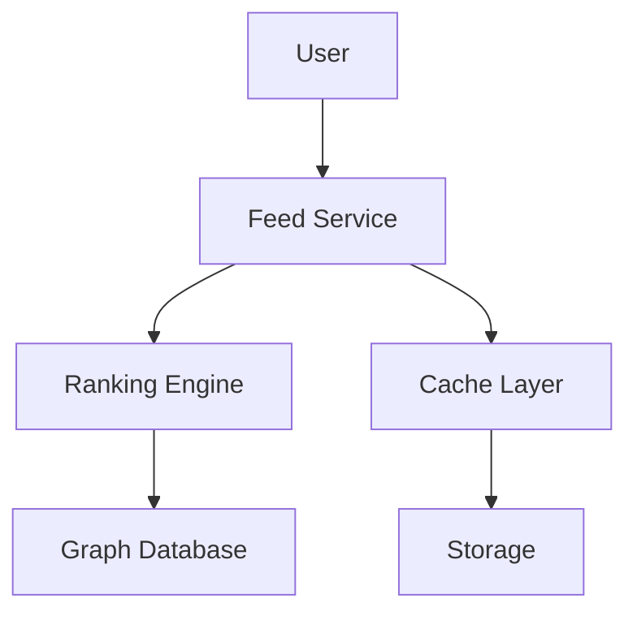

# Facebook News Feed Design

## Overview

The Facebook News Feed ranks and delivers personalized content to users in real-time, using algorithms to prioritize posts from friends, pages, and ads.

## Detailed Explanation

Components:
- **Content Generation**: Posts, likes, comments.
- **Ranking Algorithm**: EdgeRank or similar for relevance.
- **Feed Generation**: Pull-based with caching.
- **Real-time Updates**: Push for live interactions.

### Architecture Diagram



## Real-world Examples & Use Cases

- **Personalization**: Shows relevant content.
- **Ads Integration**: Sponsored posts.
- **Live Updates**: Instant notifications.

## Code Examples

### Java (Simplified Feed Ranking)

```java
import java.util.List;
import java.util.Comparator;

public class NewsFeed {
    public List<Post> rankPosts(List<Post> posts, User user) {
        return posts.stream()
            .sorted(Comparator.comparingDouble(p -> calculateScore(p, user)))
            .toList();
    }
    
    private double calculateScore(Post post, User user) {
        double affinity = getAffinity(user, post.getAuthor());
        double timeDecay = 1 / (1 + post.getAgeHours());
        return affinity * timeDecay;
    }
    
    private double getAffinity(User user, User author) {
        // Simplified affinity calculation
        return Math.random(); // In reality, based on interactions
    }
}
```

## References

- [Facebook: News Feed FYI](https://about.fb.com/news/2021/06/news-feed-fyi/)
- [Designing Facebook's News Feed](https://www.facebook.com/business/news/designing-facebooks-news-feed)

## Github-README Links & Related Topics

- [Graph Databases](./graph-databases/)
- [Event Streaming With Apache Kafka](./event-streaming-with-apache-kafka/)
- [Distributed Tracing](./distributed-tracing/)