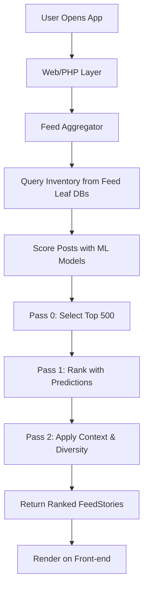

## Overview

The Facebook News Feed is a personalized content delivery system that ranks and presents posts, stories, and updates to users based on relevance, engagement, and long-term value. Leveraging machine learning (ML) models, it processes billions of potential content items daily for over 2 billion users, ensuring a tailored experience that prioritizes meaningful interactions over promotional or irrelevant content. The system evolved from early graph-based algorithms like EdgeRank to advanced neural networks, focusing on multitask learning for predictions like likes, comments, and shares. Key challenges include scalability, real-time processing, and balancing personalization with diversity and integrity.

## Detailed Explanation

### Core Components

The News Feed ranking system operates in three main phases: inventory collection, scoring, and aggregation. It uses a distributed architecture with a Web/PHP front-end querying a feed aggregator backend, which fetches data from feed leaf databases.

#### Inventory Collection
- **Candidate Posts**: Includes posts from friends, groups, and pages since the user's last login. Unseen high-quality posts are "bumped" for reconsideration.
- **Unread and Action Bumping**: Ensures older relevant content isn't buried; posts with new comments can resurface.

#### Scoring with Machine Learning
- **Prediction Models**: Multitask neural networks predict engagement probabilities (e.g., like, comment, share) using features like post type, recency, user relationships, and embeddings.
- **Features**: Over thousands of signals per user, including content attributes (e.g., tagged people, media type) and behavioral data (e.g., past interactions).
- **Parallel Processing**: Models run on predictors for scalability, handling ~1,000 posts per user daily.

#### Ranking Passes
The system uses a multi-pass approach for efficiency:

1. **Pass 0**: Lightweight model selects ~500 top candidates.
2. **Pass 1**: Main scoring with linear combination of predictions (e.g., \( V_{ijt} = w_{1} Y_{1} + w_{2} Y_{2} + \dots \)), personalized by user surveys on meaningful actions.
3. **Pass 2**: Contextual adjustments for diversity (e.g., avoid consecutive videos) and integrity checks.

### Architecture Diagram



### Key Algorithms and Models
- **Objective Function**: Optimizes for long-term value, aligned with user surveys on meaningfulness.
- **Embeddings**: Deep learning representations for users, content, and relationships.
- **Offline Learning**: Trains models on historical data for better predictions.

## Real-world Examples & Use Cases

- **Personalized User Experience**: A user logging in sees a friend's recent photo ranked higher than a distant acquaintance's frequent posts, based on interaction history.
- **Business and Pages**: Brands use insights from feed ranking to optimize content; e.g., timely articles from followed pages appear prominently.
- **Groups and Communities**: Cooking group recipes are prioritized for engaged users, fostering community interaction.
- **Global Scale**: Handles diverse content types (videos, photos, links) for users worldwide, adapting to cultural preferences via ML.
- **Use Case: Event Promotion**: During a major event, relevant updates from friends and pages are boosted, while spam is filtered.

| Ranking Factor | Example Impact | Weight in Model |
|----------------|----------------|-----------------|
| Recency | Fresh posts score higher | High |
| Relationship Strength | Close friends' content prioritized | Medium-High |
| Engagement History | User's past likes/comments | High |
| Content Type | Videos vs. text diversity | Medium |
| Integrity Signals | Spam/misinfo detection | Critical |

## Code Examples

### Pseudocode for Simplified Ranking Score Calculation

```python
def calculate_ranking_score(user, post, features):
    # Features: dict of post/user attributes
    predictions = {}
    for action in ['like', 'comment', 'share']:
        predictions[action] = ml_model.predict(features, action)
    
    # Linear combination with user-specific weights (from surveys)
    weights = user_weights[user]  # e.g., {'like': 0.5, 'comment': 0.3, 'share': 0.2}
    score = sum(weights[action] * predictions[action] for action in predictions)
    
    # Apply diversity penalty if needed
    if post.type == 'video' and previous_posts_are_videos(user):
        score *= 0.9
    
    return score

# Example usage
user = 'juan'
post_features = {'recency': 0.8, 'relationship': 0.9, 'type': 'video'}
score = calculate_ranking_score(user, post_features)
```

### Python Snippet for Simulating Feed Aggregation (using mock data)

```python
import random

class FeedAggregator:
    def __init__(self, user):
        self.user = user
        self.inventory = []  # List of posts
    
    def collect_inventory(self):
        # Mock: Add candidate posts
        self.inventory = [
            {'id': 1, 'type': 'photo', 'author': 'friend', 'recency': 0.9},
            {'id': 2, 'type': 'video', 'author': 'page', 'recency': 0.7},
            # ... more
        ]
    
    def score_posts(self):
        for post in self.inventory:
            post['score'] = random.uniform(0, 1)  # Simplified ML prediction
    
    def rank_feed(self):
        self.inventory.sort(key=lambda x: x['score'], reverse=True)
        return self.inventory[:10]  # Top 10

# Usage
aggregator = FeedAggregator('juan')
aggregator.collect_inventory()
aggregator.score_posts()
feed = aggregator.rank_feed()
print(feed)
```

## Common Pitfalls & Edge Cases

- **Echo Chambers**: Over-personalization can limit exposure to diverse views; mitigated by diversity rules.
- **Misinformation Spread**: Low-quality content may rank high if engaging; integrity passes detect and downrank.
- **Cold Start Problem**: New users lack history; relies on global defaults and onboarding.
- **Scalability Bottlenecks**: Real-time scoring for billions; handled via parallel predictors and caching.
- **Bias in Training Data**: Models trained on biased interactions; ongoing audits and fairness research.

## Tools & Libraries

- **Machine Learning**: TensorFlow or PyTorch for neural networks and embeddings.
- **Data Processing**: Apache Spark for large-scale feature engineering.
- **Databases**: Distributed systems like TAO (Facebook's graph database) for feed data.
- **Monitoring**: Custom tools for A/B testing and offline evaluation.

## References

- [How News Feed Works - Meta](https://about.fb.com/news/2021/01/how-news-feed-works/)
- [News Feed Ranking - Engineering at Meta](https://engineering.fb.com/2021/01/26/data-infrastructure/news-feed-ranking/)
- [Meaningful Interactions on Facebook](https://about.fb.com/news/2018/01/news-feed-fyi-bringing-people-closer-together/)
- [Research on Personalization](https://dl.acm.org/doi/10.1145/3328526.3329558)

## Github-README Links & Related Topics

- [Machine Learning Infrastructure](../machine-learning-infrastructure/README.md)
- [Caching Strategies](../caching-strategies/README.md)
- [Distributed Systems](../system-design-basics/README.md)
- [Personalization Algorithms](../probabilistic-algorithms/README.md)
- [Graph Algorithms](../graph-algorithms/README.md)