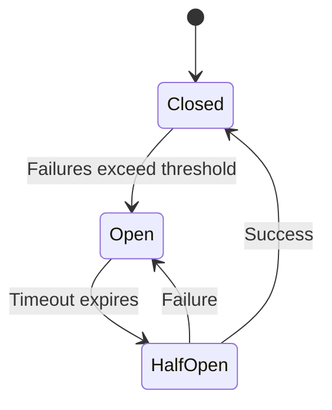

## Overview

Fault tolerance in distributed systems refers to the ability of a system to continue operating properly despite failures in one or more components, such as nodes, networks, or services. Unlike resilience, which allows graceful degradation, fault tolerance ensures no downtime or performance loss. Key mechanisms include replication, redundancy, and patterns like circuit breakers to handle failures like node crashes, network partitions, or Byzantine faults.

## Detailed Explanation

Fault tolerance is achieved through redundancy and error-handling techniques. Systems are designed with no single points of failure, isolating faults and preventing propagation.

### Key Concepts
- **Replication**: Duplicating components (e.g., data or services) across nodes. Types include:
  - **Active Replication**: All replicas process requests in parallel, using quorum for consensus.
  - **Passive Replication**: One primary handles requests; backups take over on failure.
- **Redundancy**: Providing extra resources, such as hardware (e.g., RAID for storage) or software (e.g., multiple service instances).
- **Circuit Breaker Pattern**: Prevents cascading failures by temporarily stopping calls to a failing service, allowing recovery.
- **Failure Detection and Isolation**: Monitoring for faults (e.g., timeouts, errors) and containing them to avoid system-wide impact.
- **Recovery Mechanisms**: Automatic failover, state synchronization, and rollback.

### Fault Tolerance Techniques
| Technique | Description | Example |
|-----------|-------------|---------|
| Replication | Multiple copies of data/services for availability. | Database sharding with replicas. |
| Circuit Breaker | Stops calls to failing components; retries after timeout. | Netflix Hystrix. |
| Retry with Backoff | Retries failed operations with increasing delays. | Exponential backoff in HTTP clients. |
| Bulkhead | Isolates failures to prevent resource exhaustion. | Thread pools per service. |
| Graceful Degradation | Reduces functionality instead of failing. | Serving cached data during outages. |

### State Diagram for Circuit Breaker


## Real-world Examples & Use Cases

- **Amazon Aurora**: Uses replication across multiple Availability Zones. If a primary fails, a replica promotes automatically, ensuring <30s downtime.
- **Netflix Hystrix**: Implements circuit breakers for microservices. If a service fails, it opens the circuit, preventing overload and allowing fallback responses.
- **Google Spanner**: Globally distributed database with synchronous replication and Paxos for consensus, tolerating node failures without data loss.
- **Kubernetes**: Uses pod replication and health checks for fault tolerance. Failed pods restart automatically.
- **Air Traffic Control Systems**: Redundant hardware and software ensure continuous operation despite failures.

## Code Examples

### Circuit Breaker in Java (Simplified)
```java
public class CircuitBreaker {
    private enum State { CLOSED, OPEN, HALF_OPEN }
    private State state = State.CLOSED;
    private int failureCount = 0;
    private final int threshold = 5;
    private final long timeout = 10000; // ms
    private long lastFailureTime = 0;

    public <T> T call(Supplier<T> supplier) throws Exception {
        if (state == State.OPEN) {
            if (System.currentTimeMillis() - lastFailureTime > timeout) {
                state = State.HALF_OPEN;
            } else {
                throw new RuntimeException("Circuit is open");
            }
        }
        try {
            T result = supplier.get();
            reset();
            return result;
        } catch (Exception e) {
            recordFailure();
            throw e;
        }
    }

    private void recordFailure() {
        failureCount++;
        lastFailureTime = System.currentTimeMillis();
        if (failureCount >= threshold) {
            state = State.OPEN;
        }
    }

    private void reset() {
        failureCount = 0;
        state = State.CLOSED;
    }
}
```

### Replication Example in Python (Simple Leader Election)
```python
import random

class Replica:
    def __init__(self, id):
        self.id = id
        self.is_leader = False

    def elect_leader(self, replicas):
        # Simple random election for demo
        leader = random.choice(replicas)
        for r in replicas:
            r.is_leader = (r == leader)
        return leader

# Usage
replicas = [Replica(i) for i in range(3)]
leader = replicas[0].elect_leader(replicas)
print(f"Leader: {leader.id}")
```

## STAR Summary

**Situation**: In a distributed e-commerce system, payment service failures caused cascading outages, losing revenue.

**Task**: Implement fault tolerance to handle service unavailability without full system failure.

**Action**: Added circuit breakers, replicated payment services across regions, and used retry logic with exponential backoff.

**Result**: Reduced downtime by 90%, improved availability to 99.9%, and maintained user experience during failures.

## Journey / Sequence

1. **Detection**: Monitor for failures (e.g., timeouts, errors) using health checks.
2. **Isolation**: Use circuit breakers or bulkheads to contain faults.
3. **Recovery**: Failover to replicas or retry with backoff.
4. **Prevention**: Implement redundancy and regular testing (e.g., chaos engineering).
5. **Monitoring**: Log state changes and alert on trips.

## Data Models / Message Formats

- **Heartbeat Messages**: JSON format for node health: `{"node_id": "n1", "status": "healthy", "timestamp": 1634567890}`.
- **Failure Logs**: Structured logs: `{"event": "circuit_open", "service": "payment", "reason": "timeout"}`.
- **Replication State**: Vector clocks for consistency: `{"node": "n1", "clock": {"n1": 5, "n2": 3}}`.

## Common Pitfalls & Edge Cases

- **Over-Reliance on Retries**: Can amplify load on failing services; use circuit breakers.
- **Inconsistent State**: During failovers, ensure data consistency (e.g., via consensus algorithms).
- **Network Partitions**: Handle split-brain scenarios with quorum-based decisions.
- **Resource Exhaustion**: Thread pools can fill; implement limits.
- **Testing Challenges**: Simulate failures (e.g., with tools like Chaos Monkey) to validate tolerance.

## Tools & Libraries

- **Hystrix (Netflix)**: Circuit breaker for Java microservices.
- **Resilience4j**: Lightweight fault tolerance library for Java.
- **Istio**: Service mesh with circuit breakers and retries.
- **Kubernetes**: Built-in replication and health checks.
- **Apache ZooKeeper**: Coordination for leader election and failure detection.

## References

- [Fault Tolerance - Wikipedia](https://en.wikipedia.org/wiki/Fault_tolerance)
- [Circuit Breaker Pattern - Martin Fowler](https://martinfowler.com/bliki/CircuitBreaker.html)
- [Amazon Aurora Under the Hood](https://www.allthingsdistributed.com/2022/08/amazon-aurora-under-the-hood.html)
- [Fault-Tolerant Computing - Cornell Paper](https://www.cs.cornell.edu/fbs/publications/FTCS.pdf)

## Github-README Links & Related Topics

- [Cap Theorem and Distributed Systems](../cap-theorem-and-distributed-systems/)
- [Microservices Architecture](../microservices-architecture/)
- [Load Balancing and Strategies](../load-balancing-and-strategies/)
- [Replication vs Sharding vs Partitioning](../replication-vs-sharding-vs-partitioning/)
- [Circuit Breaker Pattern](../circuit-breaker-pattern/)