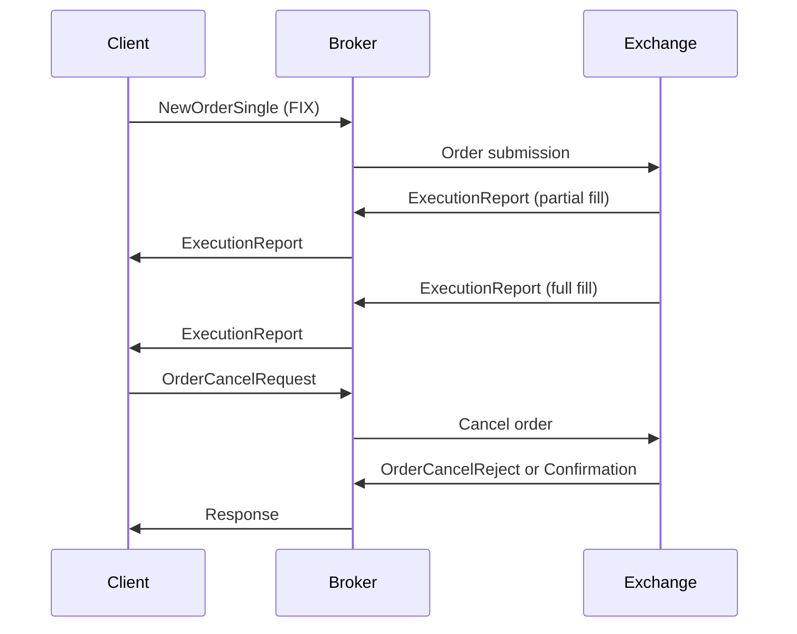

# Overview

The Financial Information eXchange (FIX) protocol is an electronic communications protocol initiated in 1992 for international real-time exchange of information related to securities transactions and markets. FIX has become the de facto messaging standard for pre-trade and trade communication in the global equity markets, and is expanding into post-trade space for straight-through processing, as well as foreign exchange, fixed income, and derivatives markets.

# STAR Summary

**SITUATION**: In the early 1990s, securities trading relied on verbal communication over telephones, leading to errors, delays, and lost information between broker-dealers and institutional clients.

**TASK**: Develop a standardized, machine-readable protocol for electronic exchange of trade-related information to improve efficiency and reduce errors.

**ACTION**: Fidelity Investments and Salomon Brothers collaborated to create FIX, starting with simple tagvalue encoding for equity trading data, later evolving into a family of standards with multiple encodings and session protocols.

**RESULT**: FIX became the global standard for electronic trading communications, handling trillions in daily transactions and supporting algorithmic trading, market data dissemination, and regulatory reporting.

# Detailed Explanation

FIX was originally authored in 1992 by Robert Lamoureux and Chris Morstatt to enable electronic communication of equity trading data. Initially monolithic, FIX evolved into a family of related technical standards including:

- **Message Encodings**: Tagvalue (classic ASCII), FIXML (XML), Simple Binary Encoding (SBE), FAST (binary for streaming), and others like Google Protocol Buffers and JSON.

- **Session Protocols**: FIX Transport (FIXT) for point-to-point communication with guaranteed delivery, and FIX Performance Session Layer (FIXP) for high-performance scenarios.

- **Application Layer**: Defines semantics for messages like NewOrderSingle, ExecutionReport, and MarketDataSnapshot.

FIX supports transport independence, allowing multiple application versions over common session layers, and has expanded beyond equities to FX, derivatives, and post-trade processing.

# Real-world Examples & Use Cases

FIX is used by buy-side institutions, sell-side brokers, and exchanges for:

- Order routing and execution
- Market data dissemination
- Trade reporting and confirmation
- Algorithmic trading workflows
- Regulatory compliance (e.g., MiFID II)

Example: A hedge fund sends a NewOrderSingle message to execute a buy order, receives ExecutionReport confirmations, and subscribes to market data feeds.

# Message Formats / Data Models

FIX messages use tag=value pairs separated by SOH (0x01). A sample NewOrderSingle message:

```
8=FIX.4.2|9=178|35=D|49=BUYSIDE|56=SELLSIDE|34=1|52=20230926-12:00:00|11=ORDER123|21=1|55=AAPL|54=1|38=100|40=2|44=150.00|10=123|
```

Common tags:
| Tag | Name | Description |
|-----|------|-------------|
| 8 | BeginString | FIX version |
| 9 | BodyLength | Message length |
| 35 | MsgType | Message type (D=NewOrderSingle) |
| 49 | SenderCompID | Sender ID |
| 56 | TargetCompID | Receiver ID |
| 34 | MsgSeqNum | Sequence number |
| 52 | SendingTime | Timestamp |
| 11 | ClOrdID | Client order ID |
| 55 | Symbol | Security symbol |
| 54 | Side | Buy/Sell |
| 38 | OrderQty | Quantity |
| 44 | Price | Limit price |
| 10 | CheckSum | Message checksum |

# Journey of a Trade



# Common Pitfalls & Edge Cases

- **Sequence Number Gaps**: Missed messages can cause session resets; implement gap-fill requests.
- **Checksum Errors**: Corrupted messages; validate on receipt.
- **Session Timeouts**: Heartbeat messages prevent disconnection.
- **Version Mismatches**: Ensure compatible FIX versions between parties.
- **High Latency**: Use binary encodings like SBE for low-latency needs.

# Tools & Libraries

- **QuickFIX**: Open-source FIX engine in C++, Java, Python, .NET.
- **FIXimate**: Online FIX dictionary and message parser.
- **OnixS**: Commercial FIX solutions.
- **Sample Code (Python with QuickFIX)**:

```python
import quickfix as fix

class Application(fix.Application):
    def onMessage(self, message, sessionID):
        msgType = fix.MsgType()
        message.getHeader().getField(msgType)
        if msgType.getValue() == fix.MsgType_NewOrderSingle:
            # Process order
            pass

app = Application()
storeFactory = fix.FileStoreFactory(settings)
logFactory = fix.FileLogFactory(settings)
initiator = fix.SocketInitiator(app, storeFactory, settings, logFactory)
initiator.start()
```

# Github-README Links & Related Topics

[[itch-protocol]]
[[ouch-protocol]]
[[market-data]]
[[order-types]]
[[execution-report]]