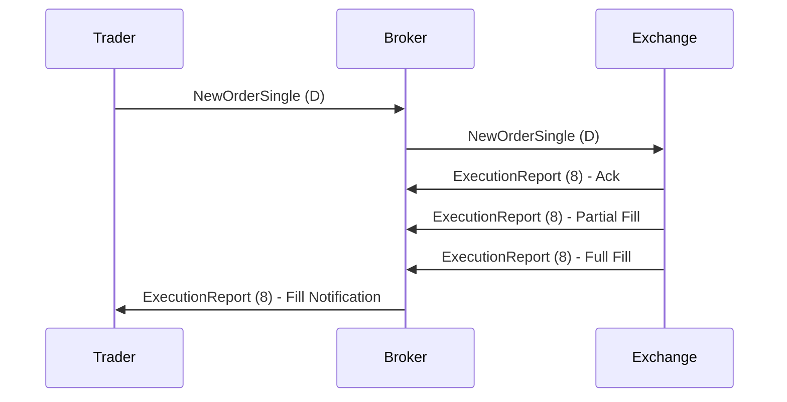

# Overview

The Financial Information eXchange (FIX) protocol is a standardized electronic communication protocol used extensively in the financial industry for real-time exchange of trading-related information. Developed in 1992 by a consortium of broker-dealers, FIX enables seamless interoperability between trading systems, including order routing, execution reporting, and market data dissemination. It is maintained by the FIX Trading Community and is the most widely adopted protocol in global electronic trading, handling over 90% of equity trading volume.

# STAR Summary

**SITUATION:** Prior to FIX, electronic trading relied on proprietary interfaces, causing integration difficulties and inefficiencies in communication between brokers, exchanges, and other market participants.

**TASK:** Create a universal, extensible protocol for electronic trading communications that supports various message types and ensures reliable delivery.

**ACTION:** The FIX protocol was designed with a tag-value message format, incorporating session management for connection reliability and application messages for business logic. It evolved through versions, with FIX 5.0 introducing XML alongside the traditional format.

**RESULT:** FIX became the industry standard, adopted by major exchanges, brokers, and trading platforms worldwide, significantly reducing integration costs and enabling global trading ecosystems.

# Detailed Explanation

FIX operates on a client-server model, with messages exchanged over TCP/IP connections. Each message consists of fields identified by numeric tags (e.g., 35 for MsgType), separated by SOH (ASCII 1) characters. The protocol is divided into layers:

- **Transport Layer:** Ensures message delivery, including sequencing and resend mechanisms.

- **Session Layer:** Manages connection lifecycle with messages like Logon (A), Heartbeat (0), and Logout (5). Sequence numbers prevent message loss.

- **Application Layer:** Handles business logic, such as order submission, cancellations, and market data requests.

FIX supports multiple versions; FIX 4.4 is common for equities, while FIX 5.0 SP2 is used for derivatives. Messages are human-readable in tag-value format, making debugging easier, though XML variants exist for complex structures.

Key message types:

- NewOrderSingle (D): Initiates a new order.

- OrderCancelRequest (F): Cancels an existing order.

- ExecutionReport (8): Reports order status, including fills and rejections.

- MarketDataSnapshotFullRefresh (W): Provides full market data snapshots.

- QuoteRequest (R): Requests quotes from market makers.

The protocol's extensibility allows custom fields via user-defined tags (5000+ range).

# Real-world Examples & Use Cases

In high-frequency trading (HFT), a trading algorithm sends a NewOrderSingle to buy 1000 shares of MSFT at market price. The exchange acknowledges with an ExecutionReport, followed by fill reports as the order executes against the order book.

Case Study: During the 2010 Flash Crash, FIX messages were analyzed to trace erroneous orders, highlighting the protocol's role in post-trade analysis.

Use cases include:

- Retail brokerage platforms routing orders to exchanges.

- Institutional trading desks managing large portfolios.

- Dark pools and alternative trading systems.

- Cross-border trading requiring standardized communication.

# Message Formats / Data Models

FIX messages follow a header-body-trailer structure. Example NewOrderSingle message (simplified):

```
8=FIX.4.4|9=123|35=D|49=SENDER|56=TARGET|34=1|52=20230926-10:00:00.000|11=ORDER123|55=MSFT|54=1|38=1000|40=1|59=0|10=123|
```

Field table for NewOrderSingle:

| Tag | Field Name | Type | Required | Description |
|-----|------------|------|----------|-------------|
| 35 | MsgType | STRING | Y | 'D' |
| 49 | SenderCompID | STRING | Y | Sender's ID |
| 56 | TargetCompID | STRING | Y | Receiver's ID |
| 34 | MsgSeqNum | SEQNUM | Y | Message sequence |
| 52 | SendingTime | UTCTIMESTAMP | Y | Timestamp |
| 11 | ClOrdID | STRING | Y | Client order ID |
| 55 | Symbol | STRING | Y | Instrument |
| 54 | Side | CHAR | Y | 1=Buy, 2=Sell |
| 38 | OrderQty | QTY | Y | Quantity |
| 40 | OrdType | CHAR | Y | 1=Market, 2=Limit |
| 44 | Price | PRICE | C | Limit price (if OrdType=2) |
| 59 | TimeInForce | CHAR | N | 0=Day, 1=GTC |

# Journey of a Trade



This diagram illustrates the end-to-end flow from order submission to execution confirmation.

# Common Pitfalls & Edge Cases

- **Sequence Number Gaps:** If a message is lost, the session may reset, requiring resend of messages from the gap.

- **Rejection Handling:** Orders can be rejected for reasons like invalid symbol or insufficient margin; systems must handle retries or cancellations.

- **Time Synchronization:** Timestamps must be UTC; discrepancies can lead to out-of-order processing.

- **High Volume:** In HFT, FIX over TCP can introduce latency; optimizations like FIX Fast or binary protocols are used.

- **Version Compatibility:** Upgrading FIX versions requires careful testing to avoid breaking changes.

- **Edge Case:** Orders with TimeInForce=GTC may persist across sessions, requiring state management.

# Tools & Libraries

- **QuickFIX:** Open-source FIX engine supporting C++, Java, .NET, Python. Handles session management and message parsing.

  Example (Java):

  ```java
  import quickfix.Application;
  import quickfix.Message;
  import quickfix.SessionID;

  public class MyApp implements Application {
      @Override
      public void onMessage(Message message, SessionID sessionID) {
          if (message.getHeader().getString(35).equals("D")) {
              // Process NewOrderSingle
              String symbol = message.getString(55);
              int qty = (int) message.getDouble(38);
              // Logic here
          }
      }
      // Other methods...
  }
  ```

- **SimpleFIX (Python):** Lightweight library for parsing and building FIX messages.

- **FIXimulator:** Testing tool for simulating FIX sessions.

# Github-README Links & Related Topics

- [ITCH Protocol](../itch-protocol/README.md)
- [OUCH Protocol](../ouch-protocol/README.md)
- [Market Data (overview & dissemination)](../market-data-overview-and-dissemination/README.md)
- [Order Entry Protocols](../order-entry-protocols/README.md)
- [Journey of a Trade](../journey-of-a-trade/README.md)

# References

- FIX Trading Community: https://www.fixtrading.org/
- FIX Protocol Specification (FIX 5.0): https://www.fixtrading.org/standards/fix-5-0/
- Investopedia on FIX: https://www.investopedia.com/terms/f/fix.asp
- NASDAQ FIX Resources: https://www.nasdaq.com/solutions/fix-protocol