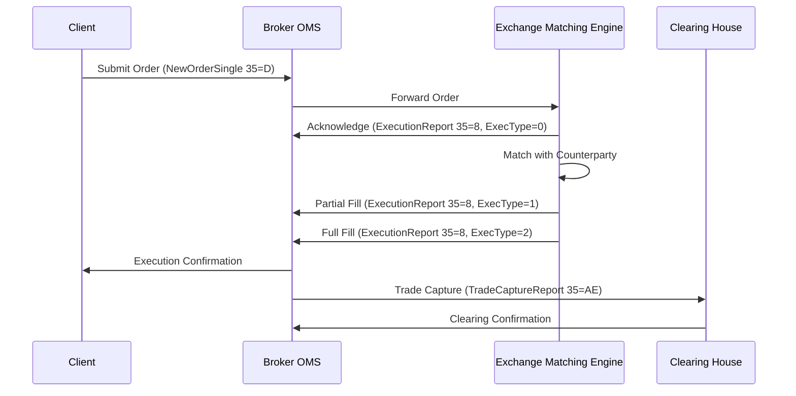

# FIX Protocol

## Overview

The Financial Information eXchange (FIX) protocol is a series of messaging specifications for the electronic communication of trade-related messages. It is the most widely used protocol in financial markets for communicating orders, executions, market data, and other trading information between brokers, dealers, exchanges, and other financial institutions. FIX is maintained by the FIX Trading Community, a non-profit organization that ensures the protocol's evolution and standardization.

FIX messages are structured in a tag=value format, where each field is identified by a numeric tag, followed by an equals sign, the value, and terminated by the ASCII character 1 (SOH). Messages consist of three main parts: a header, a body, and a trailer. The header contains metadata like message type and sequence numbers, the body contains the specific data for the message type, and the trailer includes a checksum for integrity verification.

## STAR Summary

**S: Situation** - In the early 1990s, electronic trading was rapidly expanding, but the lack of a standardized protocol led to proprietary systems, high integration costs, and interoperability issues between different market participants.

**T: Task** - Develop an open, standardized protocol that enables real-time, reliable electronic communication of trade-related information across diverse systems and platforms.

**A: Action** - A consortium of broker-dealers and technology vendors formed the FIX protocol in 1992. Starting with version 2.7, it evolved through community-driven development to the current FIX 5.0 SP2, incorporating feedback from global financial markets.

**R: Result** - FIX has become the de facto standard for electronic trading, used by over 90% of trading venues worldwide. It processes billions of messages daily, enabling seamless communication between brokers, exchanges, and clearing houses, significantly reducing costs and improving market efficiency.

## Detailed Explanation

FIX operates at the application layer, typically over TCP/IP connections. It is session-oriented, meaning that connections are established and maintained through session-level messages. Each FIX session has a unique identifier and uses sequence numbers to ensure message ordering and detect gaps or duplicates.

Key architectural components:

- **Message Structure**: All messages follow the same format: Header | Body | Trailer. The header includes fields like MsgType (35), SenderCompID (49), TargetCompID (56), and MsgSeqNum (34). The body varies by message type. The trailer always includes a CheckSum (10).

- **Session Management**: Sessions are initiated with a Logon (35=A) message and maintained with Heartbeat (35=0) messages. Sequence numbers ensure reliability; if a gap is detected, a ResendRequest (35=2) is sent.

- **Message Types**: FIX defines numerous message types for different purposes:
  - Order Handling: NewOrderSingle (35=D), OrderCancelRequest (35=F), OrderCancelReplaceRequest (35=G)
  - Execution Reporting: ExecutionReport (35=8)
  - Market Data: MarketDataRequest (35=V), MarketDataSnapshotFullRefresh (35=W)
  - Administrative: Logon, Logout, Heartbeat, TestRequest

- **Versions**: FIX has evolved from 4.0 to 5.0, with service packs. FIX 5.0 introduced more structured data using repeating groups and components.

FIX supports various financial instruments, order types (market, limit, stop), time-in-force conditions, and execution instructions. It also handles complex scenarios like algorithmic trading and multi-leg orders.

## Real-world Examples & Use Cases

1. **Equities Trading**: A retail broker sends a NewOrderSingle to an exchange for buying 100 shares of AAPL at market. The exchange responds with ExecutionReport messages as the order is partially filled.

2. **Derivatives Trading**: In OTC markets, FIX is used for Request for Quote (RFQ) workflows, where a dealer sends a QuoteRequest (35=R) and receives Quote (35=S) messages.

3. **Cross-Venue Trading**: Smart order routers use FIX to send orders to multiple exchanges, routing based on best execution.

4. **Clearing and Settlement**: FIX messages are used to communicate trade details to clearing houses for post-trade processing.

## Message Formats / Data Models

Example NewOrderSingle message (human-readable format, SOH represented as |):

8=FIX.4.4|9=122|35=D|49=BrokerComp|56=ExchangeComp|34=1|52=20230926-10:00:00.000|11=ORD12345|21=1|55=AAPL|54=1|60=20230926-10:00:00.000|38=100|40=1|44=150.00|10=123|

Key fields for NewOrderSingle:

| Tag | Name | Type | Required | Description |
|-----|------|------|----------|-------------|
| 35 | MsgType | String | Y | D = NewOrderSingle |
| 11 | ClOrdID | String | Y | Unique client order ID |
| 55 | Symbol | String | Y | Instrument symbol (e.g., AAPL) |
| 54 | Side | Char | Y | 1=Buy, 2=Sell, 5=Sell Short |
| 38 | OrderQty | Qty | Y | Quantity to trade |
| 40 | OrdType | Char | Y | 1=Market, 2=Limit, 3=Stop, etc. |
| 44 | Price | Price | C | Limit price (required for limit orders) |
| 59 | TimeInForce | Char | N | 0=Day, 1=GTC, 3=IOC, 4=FOK |
| 21 | HandlInst | Char | N | 1=Automated execution |

## Journey of a Trade



This diagram shows the end-to-end flow from order submission to clearing, highlighting FIX's role in each step.

## Common Pitfalls & Edge Cases

1. **Sequence Number Management**: Gaps in sequence numbers can cause session resets. Implement robust gap-filling logic and avoid processing out-of-order messages.

2. **Session Timeouts**: Heartbeats must be sent at agreed intervals (default 30 seconds). Network issues can lead to false timeouts.

3. **Field Validation**: Invalid or missing required fields cause rejections. Always validate messages before sending.

4. **High-Frequency Trading**: In HFT environments, FIX over TCP can introduce latency; some venues use FIX over UDP or proprietary protocols.

5. **Version Compatibility**: Ensure all parties support the same FIX version; mismatches can cause parsing errors.

6. **Repeating Groups**: Complex messages with repeating groups (e.g., for multi-leg orders) require careful parsing to avoid data corruption.

7. **Regulatory Changes**: FIX must adapt to new regulations like MiFID II; outdated implementations may not support required fields.

## Tools & Libraries

- **QuickFIX/J**: Open-source Java implementation of FIX engine. Supports FIX 4.0-5.0.
- **QuickFIX/Python**: Python port for scripting and testing.
- **QuickFIX/N**: .NET version for Windows-based systems.
- **OnixS FIX Engine**: Commercial C++ engine for high-performance applications.

Sample code snippet (Java with QuickFIX):

```java
import quickfix.Application;
import quickfix.Message;
import quickfix.field.*;

public class FixOrderSender implements Application {
    public void onMessage(Message message) {
        // Handle incoming messages
    }

    public void sendNewOrder() {
        Message order = new Message();
        order.getHeader().setField(new MsgType(MsgType.ORDER_SINGLE));
        order.setField(new ClOrdID("12345"));
        order.setField(new Symbol("AAPL"));
        order.setField(new Side(Side.BUY));
        order.setField(new OrderQty(100));
        order.setField(new OrdType(OrdType.MARKET));
        // Send via session
    }
}
```

## Github-README Links & Related Topics

[[ITCH Protocol]]
[[OUCH Protocol]]
[[Market Data]]
[[Order Entry Protocols]]
[[Execution Report]]

## References

- [FIX Trading Community Official Site](https://www.fixtrading.org/)
- [FIX Protocol Specifications](https://www.fixtrading.org/standards/)
- [FIX Dictionary](https://www.fixtrading.org/online-specification/)
- [FIX Trading Community GitHub](https://github.com/FIXTradingCommunity)