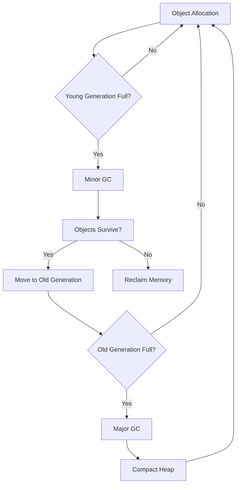

# Garbage Collection Algorithms

## Overview

Garbage Collection (GC) is the process of automatically reclaiming memory occupied by objects that are no longer in use. Java provides several GC algorithms that differ in their approach, performance characteristics, and suitability for different application types.

## Detailed Explanation

### Memory Generations

JVM divides heap memory into generations:

- **Young Generation**: Where new objects are allocated
  - Eden Space: Initial allocation
  - Survivor Spaces (S0, S1): Objects that survive minor GC
- **Old Generation**: Long-lived objects
- **Permanent Generation/Metaspace**: Class metadata (Java 8+)

### GC Algorithms

#### Serial GC
- Single-threaded collector
- Suitable for small applications
- Uses mark-sweep-compact algorithm

#### Parallel GC
- Multi-threaded version of Serial GC
- Default in Java 8
- Better for multi-core systems

#### CMS (Concurrent Mark Sweep)
- Concurrent collection with application threads
- Low pause times
- Deprecated in Java 9, removed in Java 14

#### G1 (Garbage First)
- Default since Java 9
- Divides heap into regions
- Predictable pause times

#### ZGC and Shenandoah
- Low-latency collectors
- Sub-millisecond pause times
- Suitable for large heaps

### GC Process



## Real-world Examples & Use Cases

- **Web Applications**: G1 GC for predictable response times
- **Batch Processing**: Parallel GC for throughput
- **Real-time Systems**: ZGC for low latency requirements
- **Microservices**: CMS for concurrent collection in containerized environments
- **Big Data**: Tuning GC for large heap applications

## Code Examples

### Demonstrating GC Behavior

```java
import java.lang.management.GarbageCollectorMXBean;
import java.lang.management.ManagementFactory;
import java.util.ArrayList;
import java.util.List;

public class GCExample {
    
    public static void main(String[] args) {
        System.out.println("GC Algorithm Example");
        
        // Print current GC algorithms
        List<GarbageCollectorMXBean> gcBeans = ManagementFactory.getGarbageCollectorMXBeans();
        for (GarbageCollectorMXBean gcBean : gcBeans) {
            System.out.println("GC Algorithm: " + gcBean.getName());
        }
        
        // Demonstrate object lifecycle
        demonstrateObjectLifecycle();
        
        // Force GC
        System.gc();
        System.out.println("Explicit GC called");
    }
    
    private static void demonstrateObjectLifecycle() {
        List<byte[]> objects = new ArrayList<>();
        
        System.out.println("Creating objects...");
        for (int i = 0; i < 1000; i++) {
            // Create objects of varying sizes
            byte[] obj = new byte[1024]; // 1KB each
            objects.add(obj);
            
            if (i % 100 == 0) {
                System.out.println("Created " + (i + 1) + " objects");
            }
        }
        
        // Clear references to make objects eligible for GC
        System.out.println("Clearing references...");
        objects.clear();
        
        // Suggest GC (doesn't guarantee execution)
        System.gc();
        
        System.out.println("Objects should be garbage collected");
    }
}
```

### Memory Leak Demonstration

```java
import java.util.ArrayList;
import java.util.List;

public class MemoryLeakExample {
    
    private static List<Object> leakList = new ArrayList<>();
    
    public static void main(String[] args) {
        System.out.println("Memory Leak Demonstration");
        
        Runtime runtime = Runtime.getRuntime();
        
        for (int i = 0; i < 100000; i++) {
            // Add objects to a static list (memory leak)
            leakList.add(new Object());
            
            if (i % 10000 == 0) {
                long usedMemory = runtime.totalMemory() - runtime.freeMemory();
                System.out.println("Iteration " + i + ", Used Memory: " + usedMemory / 1024 / 1024 + " MB");
                
                // Try to trigger GC
                System.gc();
            }
        }
        
        System.out.println("Final leak list size: " + leakList.size());
    }
}
```

### Weak References Example

```java
import java.lang.ref.WeakReference;
import java.util.ArrayList;
import java.util.List;

public class WeakReferenceExample {
    
    public static void main(String[] args) {
        System.out.println("Weak Reference Example");
        
        // Create a strong reference
        Object strongRef = new Object();
        
        // Create a weak reference to the same object
        WeakReference<Object> weakRef = new WeakReference<>(strongRef);
        
        System.out.println("Strong reference: " + strongRef);
        System.out.println("Weak reference: " + weakRef.get());
        
        // Remove strong reference
        strongRef = null;
        
        // Suggest GC
        System.gc();
        
        // Check if weak reference was cleared
        System.out.println("After GC - Weak reference: " + weakRef.get());
        
        if (weakRef.get() == null) {
            System.out.println("Object was garbage collected");
        } else {
            System.out.println("Object still exists");
        }
    }
}
```

## Common Pitfalls & Edge Cases

- **GC Pauses**: Long pauses affecting application responsiveness
- **Memory Leaks**: Objects not being collected due to strong references
- **Heap Fragmentation**: Inefficient memory usage
- **Incorrect GC Tuning**: Wrong parameters causing performance issues
- **Finalizer Abuse**: Using finalizers instead of try-with-resources

## Tools & Libraries

- **GC Tuning Tools**: JVM flags (-XX:+UseG1GC, -Xmx, -Xms)
- **Monitoring Tools**: JVisualVM, Java Mission Control
- **Memory Analyzers**: Eclipse MAT, YourKit Java Profiler
- **GC Log Analyzers**: GCViewer, GCEasy

## References

- [Oracle GC Tuning Guide](https://docs.oracle.com/javase/8/docs/technotes/guides/vm/gctuning/)
- [Java Garbage Collection Handbook](https://www.amazon.com/Java-Garbage-Collection-Handbook/dp/1326908454)
- [Understanding Java GC](https://www.oracle.com/webfolder/technetwork/tutorials/obe/java/gc01/index.html)

## Github-README Links & Related Topics

- [JVM Internals & Class Loading](../jvm-internals-and-class-loading/README.md)
- [Java Memory Management](../java-memory-management/README.md)
- [GC Tuning](../gc-tuning/README.md)
- [JVM Performance Tuning](../java/jvm-performance-tuning/README.md)
