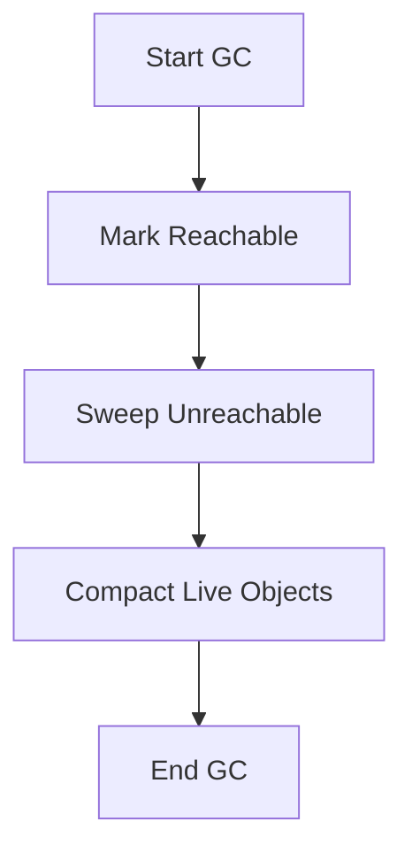
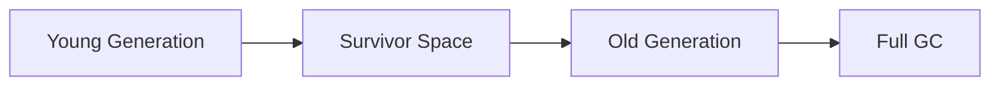

# Overview

Garbage Collection (GC) Algorithms in Java automatically manage memory by identifying and reclaiming heap space occupied by unreachable objects. These algorithms are crucial for JVM performance, minimizing memory leaks, and optimizing latency in applications. Key algorithms include mark-sweep, generational, concurrent mark-sweep (CMS), and Garbage-First (G1), each balancing throughput, latency, and memory footprint.

# Detailed Explanation

## Core Concepts

GC algorithms operate on the heap, divided into young and old generations. Objects start in the young generation (Eden space) and are promoted to old if they survive collections. Roots include static variables, local variables, and active threads.

### Mark-Sweep Algorithm

- **Mark Phase**: Traverse from GC roots to mark reachable objects.
- **Sweep Phase**: Reclaim memory from unmarked objects, leaving fragmentation.

Pros: Simple. Cons: Fragmentation, pauses.

### Mark-Sweep-Compact

Adds a compact phase to move live objects together, eliminating fragmentation.



### Generational GC

Assumes most objects die young. Young generation uses copy collection; old uses mark-sweep-compact.

- **Minor GC**: Collects young generation.
- **Major/Full GC**: Collects entire heap.

### Concurrent Mark-Sweep (CMS)

Runs marking concurrently with application threads to reduce pauses. No compaction, leading to fragmentation.

Phases: Initial mark, concurrent mark, remark, concurrent sweep.

### Garbage-First (G1)

Divides heap into regions, collects garbage-rich regions first. Balances pauses and throughput.

Phases: Young collection, mixed collection, concurrent marking.

### Other Algorithms

- **Serial GC**: Single-threaded, for small heaps.
- **Parallel GC**: Multi-threaded young and old collections for throughput.
- **ZGC/Shenandoah**: Low-latency, concurrent, for large heaps (Java 11+).

| Algorithm | JVM Flags | Pros | Cons | Best For |
|-----------|-----------|------|------|----------|
| Serial | `-XX:+UseSerialGC` | Low overhead | Long pauses | Small apps, single-threaded |
| Parallel | `-XX:+UseParallelGC` | High throughput | Pauses | Batch processing |
| CMS | `-XX:+UseConcMarkSweepGC` | Low latency | Fragmentation, CPU overhead | Web servers |
| G1 | `-XX:+UseG1GC` | Predictable pauses | Tuning | Large heaps, mixed workloads |
| ZGC | `-XX:+UseZGC` | Sub-millisecond pauses | Memory overhead | High-performance, large heaps |



This diagram illustrates object promotion in generational GC.

# Real-world Examples & Use Cases

- **E-commerce Platforms**: G1 GC for predictable pauses during high traffic, ensuring responsive user experiences.
- **Financial Trading Systems**: CMS or ZGC to minimize latency in real-time data processing.
- **Batch Data Processing**: Parallel GC for maximizing throughput in ETL jobs.
- **Microservices**: G1 in Kubernetes environments for efficient resource utilization.
- **Embedded/IoT**: Serial GC for constrained devices with limited memory.

# Code Examples

## Basic GC Monitoring

```java
public class GCMonitor {
    public static void main(String[] args) {
        Runtime rt = Runtime.getRuntime();
        System.out.println("Total memory: " + rt.totalMemory());
        System.out.println("Free memory: " + rt.freeMemory());
        System.out.println("Used memory: " + (rt.totalMemory() - rt.freeMemory()));
        
        // Suggest GC (not guaranteed)
        System.gc();
        System.out.println("After GC - Free memory: " + rt.freeMemory());
    }
}
```

## Using Weak References

```java
import java.lang.ref.WeakReference;

public class WeakReferenceExample {
    public static void main(String[] args) {
        Object strongRef = new Object();
        WeakReference<Object> weakRef = new WeakReference<>(strongRef);
        
        System.out.println("Strong ref: " + strongRef);
        System.out.println("Weak ref: " + weakRef.get());
        
        strongRef = null; // Remove strong reference
        System.gc(); // Suggest GC
        
        System.out.println("After GC - Weak ref: " + weakRef.get()); // Likely null
    }
}
```

## Tuning G1 GC

```bash
# Run JVM with G1, set max pause time to 200ms, heap 4GB
java -XX:+UseG1GC -XX:MaxGCPauseMillis=200 -Xmx4g -Xms4g MyApp
```

## Custom Reference Types

```java
import java.lang.ref.SoftReference;
import java.lang.ref.PhantomReference;
import java.lang.ref.ReferenceQueue;

public class ReferenceTypesExample {
    public static void main(String[] args) {
        Object obj = new Object();
        
        // Soft reference - cleared before OOM
        SoftReference<Object> softRef = new SoftReference<>(obj);
        
        // Phantom reference - for cleanup
        ReferenceQueue<Object> queue = new ReferenceQueue<>();
        PhantomReference<Object> phantomRef = new PhantomReference<>(obj, queue);
        
        obj = null;
        System.gc();
        
        System.out.println("Soft ref: " + softRef.get());
        System.out.println("Phantom ref enqueued: " + (queue.poll() != null));
    }
}
```

# References

- [Oracle JVM GC Tuning Guide](https://docs.oracle.com/javase/8/docs/technotes/guides/vm/gctuning/)
- [G1 Garbage Collector](https://docs.oracle.com/javase/9/gctuning/garbage-first-garbage-collector.htm)
- [Z Garbage Collector](https://docs.oracle.com/en/java/javase/11/gctuning/z-garbage-collector.html)
- [Shenandoah GC](https://wiki.openjdk.java.net/display/shenandoah/Main)

# Github-README Links & Related Topics

- [JVM Internals and Class Loading](./jvm-internals-and-class-loading/README.md)
- [GC Tuning](./gc-tuning/README.md)
- [Java Memory Management](./java-memory-management/README.md)
- [Performance Optimization Techniques](./performance-optimization-techniques/README.md)