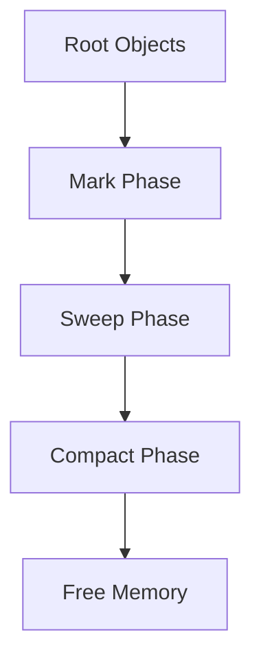

# Garbage Collection Algorithms

## Overview

Garbage Collection (GC) is the process of automatically reclaiming memory occupied by objects that are no longer in use. Java's JVM includes several GC algorithms to manage heap memory efficiently.

## Detailed Explanation

### Common Algorithms

- **Mark and Sweep**: Marks reachable objects, sweeps unreachable
- **Mark and Compact**: Compacts memory after sweeping
- **Copying GC**: Copies live objects to a new area
- **Generational GC**: Divides heap into young and old generations



## Real-world Examples & Use Cases

- Preventing memory leaks in long-running applications
- Optimizing performance in high-throughput systems
- Managing memory in embedded systems

## Code Examples

### Forcing GC (Not recommended)

```java
System.gc(); // Suggests GC run
```

### Monitoring GC

Use JVM flags like -XX:+PrintGCDetails

## References

- [Oracle GC Tuning](https://docs.oracle.com/javase/8/docs/technotes/guides/vm/gctuning/)

## Github-README Links & Related Topics

- [JVM Internals & Class Loading](../jvm-internals-and-class-loading/)
- [Java Memory Management](../java-memory-management/)
