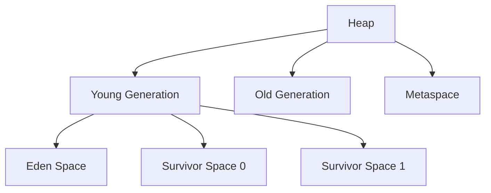

# Garbage Collection Algorithms

## Overview

Garbage Collection (GC) is an automatic memory management feature in Java that reclaims memory occupied by objects that are no longer in use. The JVM's garbage collector identifies and removes unreachable objects, preventing memory leaks and reducing the burden on developers. Understanding GC algorithms is crucial for optimizing Java application performance, especially for low-latency and high-throughput systems.

## Detailed Explanation

### What is Garbage Collection?
GC automatically manages memory by:
1. Allocating memory for new objects
2. Tracking object references
3. Identifying unreachable objects
4. Reclaiming memory from unreachable objects

### Generations in Heap
Modern GC uses generational hypothesis:
- **Young Generation**: Newly created objects (Eden, Survivor spaces)
- **Old Generation**: Long-lived objects
- **Permanent Generation/Metaspace**: Class metadata (Java 8+)



### Common GC Algorithms

#### 1. Mark-Sweep
- **Mark Phase**: Traverse object graph, mark reachable objects
- **Sweep Phase**: Reclaim memory from unmarked objects
- **Pros**: Simple, low pause times
- **Cons**: Fragmentation, potential for memory leaks if mark fails

#### 2. Mark-Compact
- Similar to Mark-Sweep but adds compaction
- **Compact Phase**: Move surviving objects to eliminate fragmentation
- **Pros**: No fragmentation
- **Cons**: Higher pause times due to compaction

#### 3. Copying Collectors
- Divide heap into two spaces (from-space, to-space)
- Copy live objects from from-space to to-space
- Swap spaces
- **Pros**: Fast allocation, no fragmentation
- **Cons**: Wastes half the heap space

#### 4. Generational GC
- Combines multiple algorithms
- Young gen: Copying collector
- Old gen: Mark-Sweep-Compact
- **Pros**: Exploits generational hypothesis for efficiency

### Modern GC Implementations

#### Serial GC
- Single-threaded, for small applications
- Uses copying in young, mark-sweep-compact in old

#### Parallel GC
- Multi-threaded version of Serial GC
- Good for throughput

#### CMS (Concurrent Mark Sweep)
- Concurrent marking to reduce pause times
- Deprecated in Java 9, removed in Java 14

#### G1 (Garbage First)
- Divides heap into regions
- Concurrent and parallel
- Predictable pause times
- Default GC since Java 9

#### ZGC (Z Garbage Collector)
- Low-latency GC for large heaps
- Pause times independent of heap size
- Available since Java 11

#### Shenandoah
- Similar to ZGC, low pause times
- Available in OpenJDK

## Real-world Examples & Use Cases

1. **Web Applications**: G1 GC for predictable response times in e-commerce sites
2. **Big Data Processing**: Parallel GC for high-throughput batch jobs
3. **Real-time Systems**: ZGC for applications requiring sub-millisecond pauses
4. **Microservices**: CMS/G1 for low-latency API responses
5. **Embedded Systems**: Serial GC for resource-constrained environments

## Code Examples

### Forcing Garbage Collection (Not Recommended)
```java
public class GCExample {
    public static void main(String[] args) {
        // Create some objects
        for (int i = 0; i < 1000000; i++) {
            new Object();
        }
        
        // Request GC (not guaranteed to run immediately)
        System.gc();
        
        // Better to let JVM handle GC automatically
        System.out.println("GC requested");
    }
}
```

### Monitoring GC Activity
```java
import java.lang.management.GarbageCollectorMXBean;
import java.lang.management.ManagementFactory;
import java.util.List;

public class GCMonitoring {
    public static void main(String[] args) {
        List<GarbageCollectorMXBean> gcBeans = ManagementFactory.getGarbageCollectorMXBeans();
        
        for (GarbageCollectorMXBean gcBean : gcBeans) {
            System.out.println("GC Name: " + gcBean.getName());
            System.out.println("Collection Count: " + gcBean.getCollectionCount());
            System.out.println("Collection Time: " + gcBean.getCollectionTime() + " ms");
        }
    }
}
```

### Weak References Example
```java
import java.lang.ref.WeakReference;

public class WeakReferenceExample {
    public static void main(String[] args) {
        Object strongRef = new Object();
        WeakReference<Object> weakRef = new WeakReference<>(strongRef);
        
        System.out.println("Strong ref: " + strongRef);
        System.out.println("Weak ref: " + weakRef.get());
        
        // Remove strong reference
        strongRef = null;
        
        // Suggest GC
        System.gc();
        
        // Weak reference should now be null
        System.out.println("After GC - Weak ref: " + weakRef.get());
    }
}
```

### Memory Leak Simulation
```java
import java.util.ArrayList;
import java.util.List;

public class MemoryLeakExample {
    private static List<Object> leakList = new ArrayList<>();
    
    public static void main(String[] args) {
        Runtime runtime = Runtime.getRuntime();
        
        for (int i = 0; i < 100000; i++) {
            // This creates a memory leak if objects are never removed
            leakList.add(new byte[1024]); // 1KB objects
            
            if (i % 10000 == 0) {
                System.out.println("Used Memory: " + (runtime.totalMemory() - runtime.freeMemory()) / 1024 / 1024 + " MB");
            }
        }
        
        // In a real leak, objects would never be removed from the list
        // leakList.clear(); // Uncomment to fix the leak
    }
}
```

## Common Pitfalls & Edge Cases

1. **Premature optimization**: Calling System.gc() manually
2. **Memory leaks**: Holding references longer than needed
3. **Large object allocation**: Objects too big for young generation
4. **GC thrashing**: Too frequent GC due to small heap
5. **Reference cycles**: Objects referencing each other preventing collection

## Tools & Libraries

- **JVM Flags**: -XX:+UseG1GC, -Xmx, -Xms
- **Monitoring Tools**: jstat, jconsole, VisualVM
- **Profiling Tools**: YourKit, JProfiler, async-profiler
- **GC Logging**: -XX:+PrintGCDetails, -XX:+PrintGCTimeStamps

## References

- [Oracle GC Tuning Guide](https://docs.oracle.com/javase/8/docs/technotes/guides/vm/gctuning/)
- [G1 GC Overview](https://www.oracle.com/technetwork/tutorials/tutorials-1876574.html)
- [ZGC: The Z Garbage Collector](https://wiki.openjdk.java.net/display/zgc/Main)
- [Baeldung Garbage Collection](https://www.baeldung.com/jvm-garbage-collectors)

## Github-README Links & Related Topics

- [JVM Internals & Class Loading](../jvm-internals-and-class-loading/README.md)
- [JVM Memory Model](../jvm-memory-model/README.md)
- [JVM Performance Tuning](../jvm-performance-tuning/README.md)
- [Java Memory Management](../java-memory-management/README.md)
