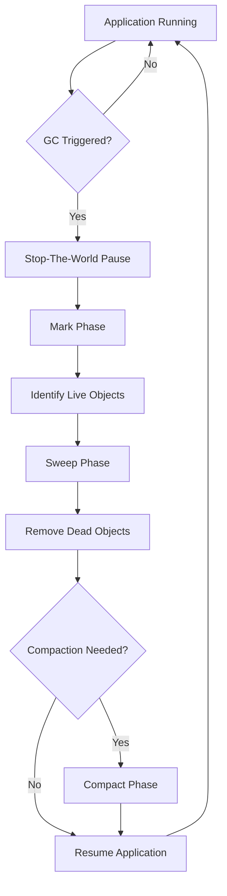

# Garbage Collection Algorithms

## Overview

Garbage Collection (GC) is the automatic process of managing memory in the Java Virtual Machine (JVM) by identifying and reclaiming memory occupied by objects that are no longer reachable. Understanding GC algorithms is essential for optimizing JVM performance, reducing latency, and preventing memory-related issues.

## Detailed Explanation

### Fundamentals of Garbage Collection

- **Automatic Memory Management:** JVM automatically handles memory allocation and deallocation
- **Reachability Analysis:** Objects are considered garbage if they cannot be reached from GC roots (static variables, local variables, etc.)
- **Generational Hypothesis:** Most objects die young; objects that survive become long-lived

### Memory Generations

- **Young Generation:** Where new objects are allocated
  - Eden space
  - Survivor spaces (S0, S1)
- **Old Generation (Tenured):** Long-lived objects
- **Permanent Generation/Metaspace:** Class metadata (in newer JVMs, Metaspace replaces PermGen)

### Common Garbage Collection Algorithms

1. **Serial GC:** Single-threaded, stops-the-world collection. Suitable for small applications.
2. **Parallel GC:** Multi-threaded version of Serial GC. Good for throughput.
3. **Concurrent Mark Sweep (CMS):** Concurrent marking with application threads. Low pause times.
4. **G1 (Garbage First):** Divides heap into regions. Predictable pause times.
5. **Z Garbage Collector (ZGC):** Low-latency GC for large heaps.
6. **Shenandoah:** Similar to ZGC, focuses on reducing pause times.

### GC Phases

1. **Mark:** Identify all reachable objects
2. **Sweep:** Remove unreachable objects
3. **Compact:** Move surviving objects to eliminate fragmentation (optional)

## Real-world Examples & Use Cases

- **High-Throughput Applications:** Batch processing systems using Parallel GC
- **Low-Latency Applications:** Real-time systems using G1 or ZGC
- **Large Heap Applications:** Big data processing with ZGC or Shenandoah
- **Microservices:** CMS or G1 for reduced pause times in containerized environments

## Code Examples

### Demonstrating GC Behavior

```java
import java.util.ArrayList;
import java.util.List;

public class GCExample {
    public static void main(String[] args) {
        List<byte[]> list = new ArrayList<>();
        
        // Allocate memory to trigger GC
        for (int i = 0; i < 1000; i++) {
            list.add(new byte[1024 * 1024]); // 1MB each
            
            if (i % 100 == 0) {
                System.out.println("Allocated " + (i + 1) + " MB");
                System.gc(); // Suggest GC (not guaranteed)
            }
        }
        
        System.out.println("GC example completed");
    }
}
```

### Weak References Example

```java
import java.lang.ref.WeakReference;

public class WeakReferenceExample {
    public static void main(String[] args) {
        Object strongRef = new Object();
        WeakReference<Object> weakRef = new WeakReference<>(strongRef);
        
        System.out.println("Strong reference: " + strongRef);
        System.out.println("Weak reference: " + weakRef.get());
        
        // Remove strong reference
        strongRef = null;
        System.gc();
        
        System.out.println("After GC - Weak reference: " + weakRef.get());
    }
}
```

### Finalizer Example (Avoid in production)

```java
public class FinalizerExample {
    @Override
    protected void finalize() throws Throwable {
        System.out.println("Finalizer called for " + this);
        super.finalize();
    }
    
    public static void main(String[] args) {
        FinalizerExample obj = new FinalizerExample();
        obj = null;
        System.gc();
        System.runFinalization();
        
        try {
            Thread.sleep(1000); // Give time for finalizer
        } catch (InterruptedException e) {
            Thread.currentThread().interrupt();
        }
    }
}
```

## Data Models / Message Formats

### Garbage Collection Process Flow



### GC Algorithm Comparison Table

| Algorithm | Throughput | Pause Time | Heap Size | Use Case |
|-----------|------------|------------|-----------|----------|
| Serial GC | Low | High | Small | Simple apps |
| Parallel GC | High | Medium | Medium-Large | Batch processing |
| CMS | Medium | Low | Large | Web applications |
| G1 | High | Low | Very Large | General purpose |
| ZGC | High | Very Low | Huge | Low-latency apps |
| Shenandoah | High | Very Low | Huge | Low-latency apps |

## Common Pitfalls & Edge Cases

- **Memory Leaks:** Objects kept alive unintentionally (e.g., static collections)
- **GC Pauses:** Long pauses in latency-sensitive applications
- **Heap Fragmentation:** In non-compacting GCs
- **Incorrect GC Tuning:** Using wrong GC for the workload
- **Finalizer Abuse:** Finalizers can cause performance issues and resurrection

## Tools & Libraries

- **JVM Flags for GC Tuning:**
  - `-XX:+UseSerialGC`
  - `-XX:+UseParallelGC`
  - `-XX:+UseConcMarkSweepGC`
  - `-XX:+UseG1GC`
  - `-XX:+UseZGC`
- **Monitoring Tools:**
  - VisualVM
  - JConsole
  - GC logs with `-Xlog:gc*`

## References

- [Oracle GC Tuning Guide](https://docs.oracle.com/javase/8/docs/technotes/guides/vm/gctuning/)
- [G1 GC Overview](https://www.oracle.com/technetwork/tutorials/tutorials-1876574.html)
- [ZGC: A Scalable Low-Latency Garbage Collector](https://openjdk.java.net/jeps/333)
- [Understanding Java Garbage Collection](https://www.baeldung.com/java-garbage-collection)

## Github-README Links & Related Topics

- [JVM Internals & Class Loading](./jvm-internals-and-class-loading)
- [JVM Performance Tuning](../java/jvm-performance-tuning)
- [Memory Models](../java/memory-models)
