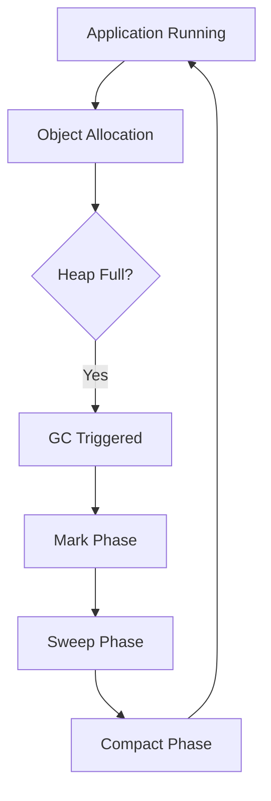

# Garbage Collection Algorithms

## Overview

Garbage Collection (GC) in Java automatically manages memory by reclaiming unused objects, preventing memory leaks and improving application stability.

## Detailed Explanation

## Common Algorithms

### Mark-and-Sweep

The basic GC algorithm:
1. **Mark Phase**: Traverse from root objects (GC roots) and mark all reachable objects.
2. **Sweep Phase**: Scan the heap and reclaim memory from unmarked objects.

Pros: Simple implementation.
Cons: Fragmentation, potential for long pauses.

### Generational GC

Based on the "generational hypothesis" that most objects die young:
- **Young Generation**: For new objects, uses minor GC (copying collector).
- **Old Generation**: For long-lived objects, uses major GC (mark-sweep-compact).
- **Permanent Generation/Metaspace**: For class metadata.

### G1 Garbage Collector

Designed for large heaps with low pause times:
- Divides heap into regions (1-32MB).
- Prioritizes regions with most garbage for collection.
- Concurrent marking and evacuation phases.

### Other Algorithms

| Algorithm | Description | Use Case |
|-----------|-------------|----------|
| Serial GC | Single-threaded, stop-the-world | Small applications |
| Parallel GC | Multi-threaded, stop-the-world | High-throughput applications |
| CMS (Concurrent Mark Sweep) | Concurrent marking, low pauses | Deprecated in favor of G1 |
| ZGC | Low-latency, concurrent | Large heaps, sub-millisecond pauses |
| Shenandoah | Similar to ZGC | OpenJDK project |



## Real-world Examples & Use Cases

- **Web Servers**: Apache Tomcat uses G1 GC for handling multiple concurrent requests with minimal pauses.
- **Big Data Processing**: Apache Spark applications benefit from parallel GC for high-throughput data processing.
- **Gaming**: Real-time games use low-pause GC like ZGC to maintain smooth frame rates.
- **Financial Systems**: High-frequency trading platforms require predictable GC pauses to ensure transaction consistency.
- **Microservices**: Containerized applications in Kubernetes often tune GC for efficient resource utilization.

## Code Examples

```java
public class GCExample {
    public static void main(String[] args) {
        // Allocate objects to fill young generation
        for (int i = 0; i < 100000; i++) {
            new Object();
        }

        // Suggest GC (not guaranteed to run)
        System.gc();

        // Create long-lived objects for old generation
        List<Object> longLived = new ArrayList<>();
        for (int i = 0; i < 1000; i++) {
            longLived.add(new Object());
        }

        // Monitor GC with JVM options: -XX:+PrintGCDetails -XX:+PrintGCTimeStamps
    }
}
```

```java
// WeakReference example for understanding reachability
import java.lang.ref.WeakReference;

public class WeakRefExample {
    public static void main(String[] args) {
        Object strongRef = new Object();
        WeakReference<Object> weakRef = new WeakReference<>(strongRef);

        strongRef = null; // Remove strong reference
        System.gc(); // Suggest GC

        System.out.println("Weak reference: " + weakRef.get()); // Likely null after GC
    }
}
```

## Common Pitfalls & Edge Cases

- **Memory Leaks**: Holding references to unused objects prevents GC.
- **GC Pauses**: Long pauses in stop-the-world collectors can affect application responsiveness.
- **Heap Sizing**: Incorrect heap configuration leads to frequent GC or out-of-memory errors.
- **Reference Types**: Misunderstanding strong, soft, weak, and phantom references.
- **Finalizers**: Deprecated, can cause performance issues and resurrection of objects.

## References

- [Oracle GC Tuning](https://docs.oracle.com/javase/8/docs/technotes/guides/vm/gctuning/)
- [JVM GC Algorithms](https://www.oracle.com/technetwork/java/javase/gc-tuning-5-138395.html)
- [G1 GC Deep Dive](https://www.oracle.com/technetwork/tutorials/tutorials-1876574.html)

## Github-README Links & Related Topics

- [JVM Internals & Class Loading](../jvm-internals-and-class-loading/README.md)
- [Java Memory Management](../java-memory-management/README.md)