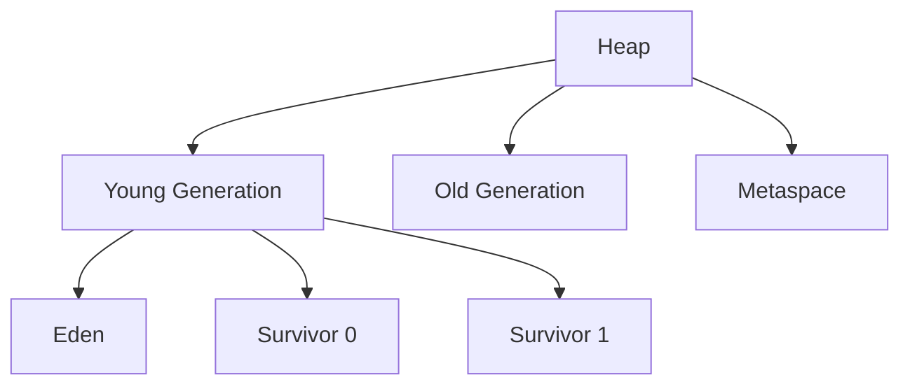

# Garbage Collection Algorithms

## Overview

Garbage Collection (GC) is the process of automatically managing memory in Java by reclaiming memory occupied by objects that are no longer in use. Understanding GC algorithms is essential for optimizing Java application performance and troubleshooting memory-related issues. This topic covers various GC algorithms, their mechanisms, and best practices.

## Detailed Explanation

### What is Garbage Collection?

Garbage collection automatically identifies and reclaims memory occupied by objects that are no longer reachable from the application. In Java, developers don't need to manually deallocate memory, reducing the risk of memory leaks and dangling pointers.

### Mark and Sweep Algorithm

The basic GC algorithm consists of two phases:

1. **Mark Phase:** Traverse the object graph starting from root objects (static variables, local variables, etc.) and mark all reachable objects.
2. **Sweep Phase:** Iterate through the heap and reclaim memory from unmarked objects.

**Advantages:** Simple to implement
**Disadvantages:** Causes application pauses, heap fragmentation

### Generational Garbage Collection

Modern JVMs use generational GC, based on the observation that most objects die young (generational hypothesis).

**Heap Structure:**
- **Young Generation:** Newly created objects
  - Eden Space
  - Survivor Spaces (S0, S1)
- **Old Generation (Tenured):** Long-lived objects
- **Permanent Generation/Metaspace:** Class metadata (Java 8+)



### Common GC Algorithms

#### Serial GC
- Single-threaded GC
- Suitable for small applications
- Uses mark-sweep-compact

#### Parallel GC
- Multi-threaded version of Serial GC
- Uses multiple threads for GC work
- Good for throughput

#### CMS (Concurrent Mark Sweep)
- Concurrent GC for low pause times
- Runs most GC work concurrently with application
- Deprecated in Java 9, removed in Java 14

#### G1 (Garbage First)
- Designed for large heaps (>4GB)
- Divides heap into regions
- Predictable pause times
- Default GC since Java 9

#### ZGC (Z Garbage Collector)
- Low-latency GC
- Handles heaps up to 16TB
- Pause times <10ms
- Available since Java 11

#### Shenandoah
- Similar to ZGC
- Concurrent evacuation
- Available in OpenJDK

### GC Tuning Parameters

Common JVM flags for GC tuning:

- `-XX:+UseSerialGC`
- `-XX:+UseParallelGC`
- `-XX:+UseConcMarkSweepGC` (deprecated)
- `-XX:+UseG1GC`
- `-XX:+UseZGC`
- `-Xmx` (max heap size)
- `-Xms` (initial heap size)
- `-XX:MaxGCPauseMillis`
- `-XX:GCTimeRatio`

## Real-world Examples & Use Cases

- **Web Applications:** Tuning GC for low-latency responses
- **Big Data Processing:** Optimizing GC for large datasets
- **Microservices:** Configuring GC for containerized environments

## Code Examples

### Monitoring GC Activity

```java
import java.lang.management.GarbageCollectorMXBean;
import java.lang.management.ManagementFactory;
import java.util.List;

public class GCMonitor {
    public static void main(String[] args) {
        List<GarbageCollectorMXBean> gcBeans = ManagementFactory.getGarbageCollectorMXBeans();
        
        for (GarbageCollectorMXBean gcBean : gcBeans) {
            System.out.println("GC Name: " + gcBean.getName());
            System.out.println("Collection Count: " + gcBean.getCollectionCount());
            System.out.println("Collection Time: " + gcBean.getCollectionTime() + " ms");
            System.out.println("---");
        }
    }
}
```

### Creating Objects to Trigger GC

```java
import java.util.ArrayList;
import java.util.List;

public class GCTrigger {
    public static void main(String[] args) {
        List<byte[]> list = new ArrayList<>();
        
        // Create objects to fill heap and trigger GC
        for (int i = 0; i < 100000; i++) {
            list.add(new byte[1024]); // 1KB objects
            
            if (i % 10000 == 0) {
                System.out.println("Created " + i + " objects");
                System.gc(); // Suggest GC (not guaranteed)
            }
        }
    }
}
```

### Custom Finalizer (Not Recommended)

```java
public class CustomFinalizer {
    private String resource;
    
    public CustomFinalizer(String resource) {
        this.resource = resource;
    }
    
    @Override
    protected void finalize() throws Throwable {
        try {
            // Clean up resources
            System.out.println("Finalizing: " + resource);
        } finally {
            super.finalize();
        }
    }
    
    public static void main(String[] args) {
        CustomFinalizer obj = new CustomFinalizer("Some Resource");
        obj = null; // Make object eligible for GC
        
        System.gc(); // Suggest GC
        System.runFinalization();
        
        try {
            Thread.sleep(1000); // Give GC time to run
        } catch (InterruptedException e) {
            Thread.currentThread().interrupt();
        }
    }
}
```

## Common Pitfalls & Edge Cases

- **GC Pauses:** Long GC pauses can affect application responsiveness
- **Memory Leaks:** Objects kept alive unintentionally by strong references
- **Heap Sizing:** Incorrect heap sizing can lead to frequent GC or OutOfMemoryError
- **Finalizer Issues:** Finalizers can cause performance problems and are generally discouraged

## Tools & Libraries

- **JVM Tools:** jstat, jmap, jhat for GC analysis
- **VisualVM:** GUI tool for GC monitoring
- **GC Logs:** `-Xlog:gc*` for detailed GC logging

## References

- [Oracle GC Tuning Guide](https://docs.oracle.com/javase/8/docs/technotes/guides/vm/gctuning/)
- [OpenJDK GC Documentation](https://openjdk.java.net/groups/hotspot/docs/GarbageCollection.html)
- [Baeldung - Java Garbage Collection](https://www.baeldung.com/java-garbage-collection)

## Github-README Links & Related Topics

- [JVM Internals & Class Loading](../jvm-internals-class-loading/README.md)
- [Java Memory Management](../java-memory-management/README.md)
- [JVM Performance Tuning](../jvm-performance-tuning/README.md)
- [GC Tuning](../gc-tuning/README.md)