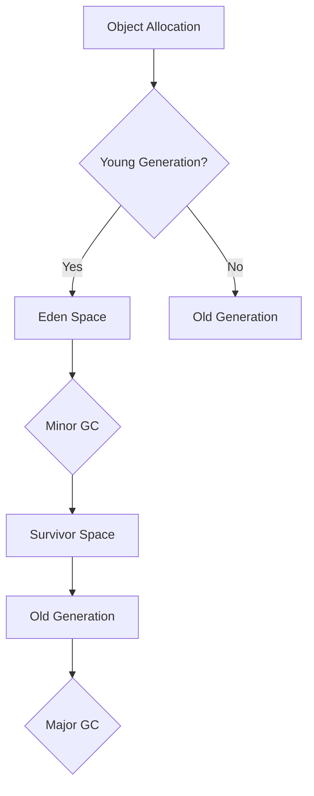

# Garbage Collection Algorithms

## Overview

Garbage Collection (GC) is the process of automatically managing memory by reclaiming space occupied by objects that are no longer in use. Java provides several GC algorithms with different trade-offs in terms of throughput, latency, and memory usage.

## Detailed Explanation

### Mark-Sweep

The basic algorithm:

1. **Mark**: Traverse the object graph, marking reachable objects
2. **Sweep**: Reclaim memory from unmarked objects

**Pros:** Simple
**Cons:** Fragmentation, pauses

### Mark-Sweep-Compact

Adds a compaction phase to defragment memory.

### Copying Collectors

Divide heap into two spaces (from-space and to-space).

1. Copy live objects from from-space to to-space
2. Swap spaces

**Pros:** No fragmentation
**Cons:** Uses only half the heap

### Generational GC

Based on the generational hypothesis: most objects die young.

- **Young Generation**: Eden, Survivor spaces
- **Old Generation**: Long-lived objects

### Common Algorithms

- **Serial GC**: Single-threaded, for small applications
- **Parallel GC**: Multi-threaded, for throughput
- **CMS (Concurrent Mark Sweep)**: Low pause times
- **G1**: Regional, predictable pauses
- **ZGC/Shenandoah**: Low latency, large heaps



## Real-world Examples & Use Cases

- Tuning GC for high-throughput web servers
- Minimizing GC pauses in real-time systems
- Optimizing memory usage in microservices

## Code Examples

```java
// GC Tuning Example
public class GCTuningExample {
    public static void main(String[] args) {
        // Force GC (not recommended in production)
        System.gc();
        
        // Get GC information
        Runtime runtime = Runtime.getRuntime();
        long totalMemory = runtime.totalMemory();
        long freeMemory = runtime.freeMemory();
        long usedMemory = totalMemory - freeMemory;
        
        System.out.println("Used Memory: " + usedMemory / 1024 / 1024 + " MB");
    }
}
```

## References

- [Oracle GC Tuning Guide](https://docs.oracle.com/javase/8/docs/technotes/guides/vm/gctuning/)
- "The Garbage Collection Handbook" by Richard Jones et al.

## Github-README Links & Related Topics

- [JVM Internals](jvm-internals-class-loading)
- [JVM Performance Tuning](jvm-performance-tuning)
