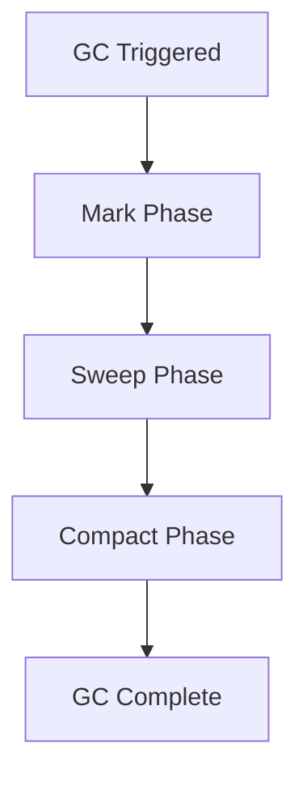

# Garbage Collection Algorithms

## Overview

Garbage Collection (GC) is the process of automatically reclaiming memory occupied by objects that are no longer in use. The JVM provides several GC algorithms with different trade-offs in terms of throughput, latency, and memory usage. Understanding these algorithms is essential for optimizing Java application performance.

## Detailed Explanation

### Generational Hypothesis

The weak generational hypothesis states that most objects survive for only a short period of time. This is based on empirical observations that a majority of objects die young, allowing efficient garbage collection by focusing on short-lived objects. This leads to generational GC:
- **Young Generation:** Where new objects are allocated (eden + survivor spaces)
- **Old Generation:** Long-lived objects
- **Permanent Generation/Metaspace:** Class metadata (Java 8+)

### GC Algorithms

#### Serial GC
- Single-threaded
- Suitable for small applications
- Uses mark-sweep-compact

#### Parallel GC
- Multi-threaded version of Serial GC
- Default in Java 8
- Good for throughput

#### Concurrent Mark Sweep (CMS)
- Concurrent marking phase
- Low pause times
- Deprecated in Java 9, removed in Java 14

#### G1 GC
- Default since Java 9
- Divides heap into regions
- Predictable pause times
- Good balance of throughput and latency

#### Z Garbage Collector (ZGC)
- Available since Java 11
- Sub-millisecond pause times
- Handles heaps up to 16TB
- Concurrent compaction

#### Shenandoah
- Similar to ZGC
- Concurrent evacuation
- Low pause times

### Comparison of GC Algorithms

| Garbage Collector | Threads | Generational | Compaction | Pause Time | Throughput | Use Case |
|-------------------|---------|--------------|------------|------------|------------|----------|
| Serial | Single | Yes | Yes | High | Low | Small applications, single-threaded environments |
| Parallel | Multi | Yes | Yes | Medium | High | Batch processing, high-throughput applications |
| CMS | Multi (concurrent) | Yes | No | Low | Medium | Web servers, low-latency requirements (deprecated) |
| G1 | Multi | Yes (regions) | Yes | Low (predictable) | Medium-High | General-purpose, large heaps |
| ZGC | Multi (concurrent) | No | Yes | Very Low | High | Ultra-low latency, heaps up to 16TB |
| Shenandoah | Multi (concurrent) | Yes | Yes | Very Low | High | Low-pause, concurrent compaction |

### GC Phases

1. **Mark:** Identify live objects
2. **Sweep:** Remove dead objects
3. **Compact:** Defragment memory (optional)



### Performance Metrics

- **Throughput:** Percentage of total time not spent in garbage collection over long periods.
- **Latency:** Responsiveness of the application; garbage collection pauses affect latency.
- **Footprint:** Working set of the process, measured in pages and cache lines.
- **Promptness:** Time between when an object becomes dead and when its memory becomes available.

Selecting a GC algorithm involves trade-offs between these metrics. For example, maximizing throughput may increase pause times, while minimizing latency may reduce overall throughput.

## Real-world Examples & Use Cases

- **High-throughput applications:** Use Parallel GC for maximum throughput
- **Low-latency applications:** Use G1 or ZGC for predictable pause times
- **Large heap applications:** ZGC for heaps > 4GB with low latency requirements
- **Microservices:** Tune GC based on workload characteristics

## Code Examples

### Monitoring GC
```java
public class GCMonitoring {
    public static void main(String[] args) {
        // Print GC information
        System.out.println("GC Information:");
        for (java.lang.management.GarbageCollectorMXBean gc : 
             java.lang.management.ManagementFactory.getGarbageCollectorMXBeans()) {
            System.out.println("Name: " + gc.getName());
            System.out.println("Collection count: " + gc.getCollectionCount());
            System.out.println("Collection time: " + gc.getCollectionTime() + "ms");
        }
        
        // Force GC (not recommended in production)
        System.gc();
    }
}
```

### Memory Leak Simulation
```java
import java.util.ArrayList;
import java.util.List;

public class MemoryLeakExample {
    private static List<Object> leak = new ArrayList<>();
    
    public static void main(String[] args) {
        while (true) {
            leak.add(new byte[1024 * 1024]); // 1MB objects
            try {
                Thread.sleep(100);
            } catch (InterruptedException e) {
                Thread.currentThread().interrupt();
            }
        }
    }
}
```

### Weak References
```java
import java.lang.ref.WeakReference;

public class WeakReferenceExample {
    public static void main(String[] args) {
        Object strongRef = new Object();
        WeakReference<Object> weakRef = new WeakReference<>(strongRef);
        
        System.out.println("Strong ref: " + strongRef);
        System.out.println("Weak ref: " + weakRef.get());
        
        // Remove strong reference
        strongRef = null;
        System.gc();
        
        System.out.println("After GC - Weak ref: " + weakRef.get());
    }
}
```

### GC Logging
Run the JVM with `-verbose:gc` or `-Xlog:gc*` to monitor garbage collection activity.

Example command:
```bash
java -Xlog:gc* -jar your-app.jar
```

Example output:
```
[15,651s][info ][gc] GC(36) Pause Young (G1 Evacuation Pause) 239M->57M(307M) (15,646s, 15,651s) 5,048ms
```

This shows the GC event type, heap usage before/after (239M->57M), heap size (307M), timestamps, and duration (5,048ms).

## Common Pitfalls & Edge Cases

- **GC thrashing:** Too frequent GC due to small heap
- **Memory leaks:** Objects not being garbage collected
- **Long GC pauses:** Impacting application responsiveness
- **Incorrect GC tuning:** Using wrong GC for workload

## Tools & Libraries

- **JVM flags:** -XX:+UseG1GC, -XX:MaxGCPauseMillis=200
- **Monitoring tools:** VisualVM, JConsole, GC logs
- **Profiling tools:** YourKit, JProfiler

## References

- [Oracle GC Tuning Guide (Java 21)](https://docs.oracle.com/en/java/javase/21/gctuning/)
- [Garbage Collector Implementation](https://docs.oracle.com/en/java/javase/21/gctuning/garbage-collector-implementation.html)
- [G1 GC](https://www.oracle.com/technetwork/tutorials/tutorials-1876574.html)
- [ZGC](https://wiki.openjdk.java.net/display/zgc/Main)
- [JVM GC Algorithms](https://www.baeldung.com/jvm-garbage-collectors)

## Github-README Links & Related Topics

- [JVM Internals & Class Loading](../jvm-internals-and-class-loading/README.md)
- [Java Memory Management](../java-memory-management/README.md)
- [GC Tuning](../gc-tuning/README.md)
- [JVM Performance Tuning](../jvm-performance-tuning/README.md)
