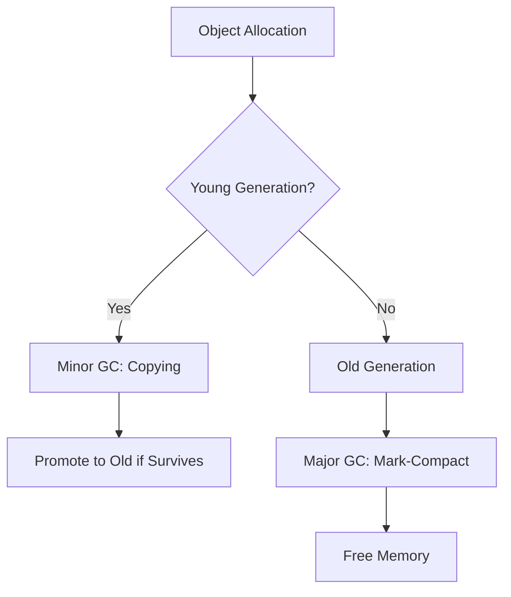

# Garbage Collection Algorithms

## Overview

Garbage collection (GC) is a form of automatic memory management that reclaims memory occupied by objects no longer in use, preventing memory leaks and dangling pointers. Invented by John McCarthy in 1959 for Lisp, GC eliminates manual deallocation, reducing bugs but introducing overhead. In Java, the JVM uses various GC algorithms, primarily tracing-based, to manage heap memory across generations (young, old) for efficiency.

## Detailed Explanation

GC algorithms identify and free unreachable objects. Key strategies include tracing, reference counting, and escape analysis. Java HotSpot VM implements generational GC, assuming most objects die young.

### Tracing Garbage Collection
Tracing starts from root objects (e.g., static variables, stack references) and marks reachable objects. Unmarked objects are garbage.

- **Mark-Sweep**: Marks live objects, sweeps dead ones. Simple but causes fragmentation.
- **Mark-Compact**: After marking, compacts live objects to eliminate fragmentation.
- **Copying**: Divides heap into from/to spaces; copies live objects, discarding the rest. Efficient for young generation but wastes space.

### Reference Counting
Each object has a reference count. Incremented on reference creation, decremented on destruction. When count reaches zero, object is freed. Fast for deallocation but struggles with cycles (e.g., circular references).

### Escape Analysis
Compile-time technique to allocate objects on stack instead of heap if they don't escape the method, reducing GC pressure.

### Generational GC
Divides heap into young (Eden, Survivor spaces) and old generations. Minor GC collects young generation via copying; major GC handles old via mark-sweep-compact. Reduces full heap scans.

### Java GC Implementations
| Algorithm | Description | Use Case | Pros | Cons |
|-----------|-------------|----------|------|------|
| Serial | Single-threaded, stop-the-world | Small apps, single-core | Simple, low overhead | Pauses application |
| Parallel | Multi-threaded stop-the-world | Batch processing | Faster collection | Still pauses |
| CMS (Concurrent Mark Sweep) | Concurrent marking, sweeping | Low-latency apps | Reduced pauses | Fragmentation, CPU overhead |
| G1 (Garbage-First) | Regional, incremental | Large heaps | Predictable pauses | Higher overhead |
| ZGC/Shenandoah | Concurrent, low-pause | Real-time systems | Sub-millisecond pauses | Memory overhead |



## Real-world Examples & Use Cases

- **Web Servers (e.g., Tomcat)**: Use G1 for predictable pauses in high-throughput apps, avoiding long stops during requests.
- **Big Data (e.g., Spark)**: Parallel GC handles large heaps efficiently in batch jobs.
- **Real-Time Systems (e.g., Trading Platforms)**: ZGC minimizes pauses for microsecond-sensitive operations.
- **Mobile Apps (e.g., Android)**: ART uses generational GC to balance battery life and responsiveness.
- **Embedded Systems**: Reference counting in languages like Python for deterministic deallocation, though Java avoids it due to cycles.

## Code Examples

### Java: Forcing GC (Not Recommended in Production)
```java
System.gc(); // Hints JVM to run GC, but no guarantee
```

### Java: Monitoring GC
```java
// JVM flags: -XX:+PrintGCDetails -XX:+PrintGCTimeStamps
// Output shows GC events, e.g., [GC (Allocation Failure)  1024K->512K(2048K), 0.0012345 secs]
```

### Java: Tuning G1
```bash
java -XX:+UseG1GC -XX:MaxGCPauseMillis=200 -Xmx4g MyApp
```

### Python: Reference Counting Example
```python
import sys
a = [1, 2, 3]  # ref count 1
b = a           # ref count 2
del a           # ref count 1
print(sys.getrefcount(b))  # 2 (one from b, one from getrefcount)
```

## References

- [Oracle Java GC Tuning Guide](https://docs.oracle.com/en/java/javase/21/gctuning/)
- [Wikipedia: Garbage Collection](https://en.wikipedia.org/wiki/Garbage_collection_(computer_science))
- [Microsoft: Fundamentals of GC](https://learn.microsoft.com/en-us/dotnet/standard/garbage-collection/fundamentals)

## Github-README Links & Related Topics

- [JVM Memory Management](jvm-memory-management/)
- [Java Memory Management](java-memory-management/)
- [Concurrent Programming Patterns](concurrent-programming-patterns/)
- [Data Structures and Algorithms](algorithms/)

## Common Pitfalls & Edge Cases

- **Memory Leaks**: Holding references unintentionally (e.g., static collections).
- **GC Pauses**: In real-time apps, use concurrent collectors like ZGC.
- **Fragmentation**: Mark-sweep can leave holes; compacting helps.
- **Cycle Detection**: Tracing handles cycles; reference counting does not.
- **Tuning Overhead**: Over-tuning can degrade performance; profile first.

## Tools & Libraries

- **JVM Tools**: jstat, jmap, VisualVM for monitoring.
- **Libraries**: JOL (Java Object Layout) for heap analysis.
- **Alternatives**: Manual management in C/C++, RAII in C++.
