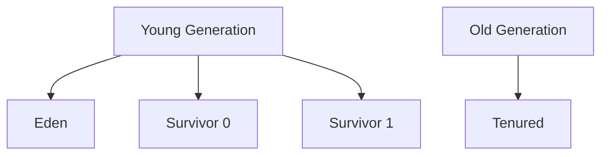

# Overview

Garbage Collection (GC) is the automatic memory management process in the JVM that identifies and reclaims memory occupied by objects that are no longer in use. Various algorithms exist to optimize GC performance, throughput, and latency for different application needs.

# Detailed Explanation

## Basic GC Concepts

- **Reachability**: Objects are reachable if they can be accessed from GC roots (static variables, local variables, etc.)
- **Generational Hypothesis**: Most objects die young; long-lived objects tend to live longer

## Common GC Algorithms

### Mark-Sweep

1. Mark: Traverse object graph from roots, mark reachable objects
2. Sweep: Reclaim memory of unmarked objects

Pros: Simple
Cons: Fragmentation, pause times

### Copying Collection

Divide heap into two spaces. Copy live objects from one to the other, reclaim the old space.

Pros: No fragmentation
Cons: Wastes half the heap

### Generational GC

- **Young Generation**: Eden, Survivor spaces (copying collection)
- **Old Generation**: Tenured objects (mark-sweep or mark-compact)



## Advanced GC Algorithms

- **Concurrent Mark Sweep (CMS)**: Concurrent marking, low pause times
- **G1 Garbage Collector**: Regionalized heap, predictable pauses
- **Z Garbage Collector**: Low latency, handles large heaps
- **Shenandoah**: Concurrent evacuation

# Real-world Examples & Use Cases

- **Web Applications**: Use G1 for balanced throughput and latency
- **Low-Latency Systems**: ZGC or Shenandoah for sub-millisecond pauses
- **Batch Processing**: Parallel GC for high throughput
- **Embedded Systems**: Serial GC for minimal memory footprint

# Code Examples

## GC Monitoring

```java
public class GCMonitoring {
    public static void main(String[] args) {
        Runtime runtime = Runtime.getRuntime();
        
        // Force GC (not recommended in production)
        System.gc();
        
        long freeMemory = runtime.freeMemory();
        long totalMemory = runtime.totalMemory();
        long maxMemory = runtime.maxMemory();
        
        System.out.println("Free: " + freeMemory / 1024 / 1024 + "MB");
        System.out.println("Total: " + totalMemory / 1024 / 1024 + "MB");
        System.out.println("Max: " + maxMemory / 1024 / 1024 + "MB");
    }
}
```

## Weak References

```java
import java.lang.ref.WeakReference;

public class WeakReferenceExample {
    public static void main(String[] args) {
        Object strongRef = new Object();
        WeakReference<Object> weakRef = new WeakReference<>(strongRef);
        
        strongRef = null; // Remove strong reference
        
        System.gc(); // Suggest GC
        
        if (weakRef.get() == null) {
            System.out.println("Object was garbage collected");
        }
    }
}
```

# References

- [Oracle GC Tuning](https://docs.oracle.com/javase/8/docs/technotes/guides/vm/gctuning/)
- [JVM GC Algorithms](https://www.oracle.com/webfolder/technetwork/tutorials/obe/java/gc01/index.html)
- [Baeldung GC Guide](https://www.baeldung.com/jvm-garbage-collectors)

# Github-README Links & Related Topics

- [JVM Internals & Class Loading](../jvm-internals-and-class-loading/)
- [GC Tuning](../gc-tuning/)
- [JVM Performance Tuning](../jvm-performance-tuning/)
