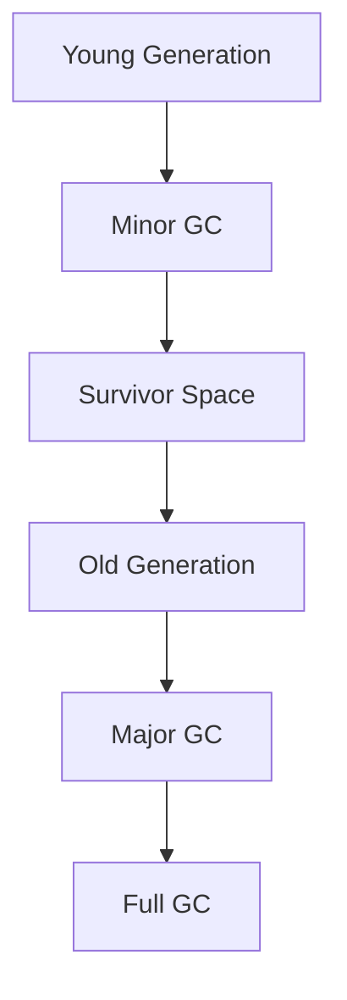

# Garbage Collection Algorithms

## Overview

Garbage Collection (GC) is the automatic process of reclaiming memory occupied by objects that are no longer reachable in a Java application. The JVM provides various GC algorithms optimized for different use cases, balancing throughput, latency, and memory efficiency.

## Detailed Explanation

### Basic Concepts
- **Reachability**: Objects are considered garbage if they are not reachable from root references (stack, static fields, etc.).
- **Generations**: Heap is divided into Young Generation (Eden, Survivor spaces) and Old Generation.

### Common GC Algorithms

#### Serial GC
- Single-threaded, stops-the-world collection.
- Suitable for small applications.

#### Parallel GC
- Multi-threaded version of Serial GC.
- Default for server applications.

#### CMS (Concurrent Mark Sweep)
- Concurrent marking and sweeping to reduce pause times.
- Deprecated in favor of G1.

#### G1 (Garbage First)
- Divides heap into regions, prioritizes regions with most garbage.
- Balances throughput and latency.

#### ZGC and Shenandoah
- Low-latency GCs with sub-millisecond pauses.



## Real-world Examples & Use Cases

- **Web Servers**: Use G1 GC for balanced performance.
- **Real-time Systems**: ZGC for minimal pauses.
- **Batch Processing**: Parallel GC for high throughput.

## Code Examples

### Monitoring GC

```java
// JVM options for GC logging
// -XX:+PrintGC -XX:+PrintGCDetails -XX:+PrintGCTimeStamps

// Programmatic GC (use sparingly)
System.gc();

// Weak references for custom cleanup
WeakReference<String> weakRef = new WeakReference<>(new String("test"));
```

### Custom Finalizer (Avoid if possible)

```java
public class ResourceHolder {
    @Override
    protected void finalize() throws Throwable {
        // Cleanup resources
        super.finalize();
    }
}
```

## References

- [Oracle GC Tuning Guide](https://docs.oracle.com/javase/8/docs/technotes/guides/vm/gctuning/)
- [JVM GC Algorithms Overview](https://www.oracle.com/technetwork/java/javase/gc-tuning-5-138395.html)
- [Baeldung - Java Garbage Collection](https://www.baeldung.com/java-garbage-collection)

## Github-README Links & Related Topics

- [GC Tuning](../gc-tuning/README.md)
- [Java Memory Management](../java-memory-management/README.md)
- [JVM Internals & Class Loading](../jvm-internals-class-loading/README.md)