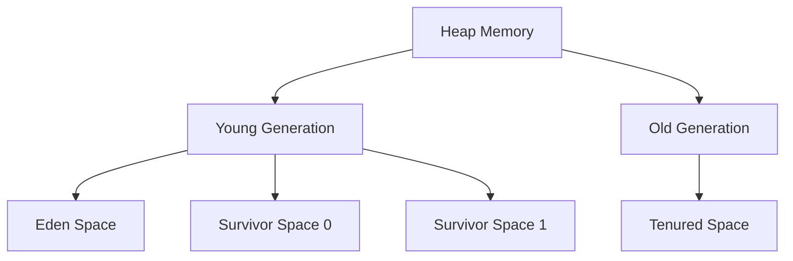
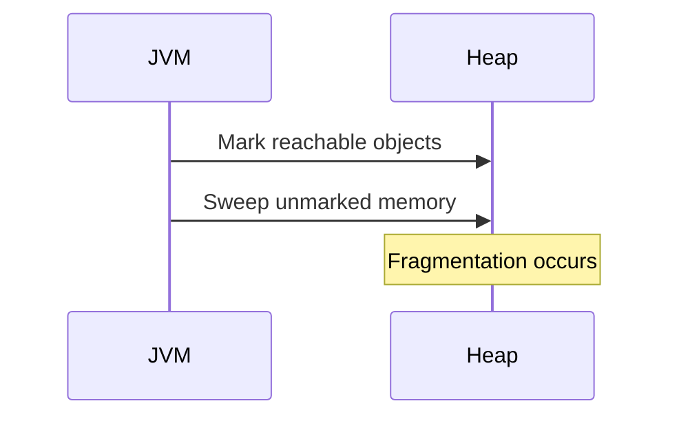
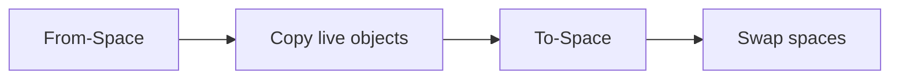
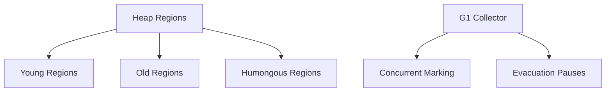

# Garbage Collection Algorithms

## Overview

Garbage Collection (GC) is a fundamental aspect of automatic memory management in runtime environments like the Java Virtual Machine (JVM). It automatically reclaims memory occupied by objects that are no longer reachable, preventing memory leaks and simplifying developer workflows. GC algorithms vary in approach, balancing trade-offs between throughput, latency, memory overhead, and complexity. This document covers key algorithms, their mechanisms, comparisons, and practical applications, tailored for interview preparation and engineering best practices.

## Detailed Explanation

### Core Concepts

- **GC Roots**: Starting points for reachability analysis, including static variables, local variables in active threads, and JNI references.
- **Reachability**: Objects are considered live if reachable from GC roots via reference chains.
- **Heap Structure**: Typically divided into generations (young, old) or regions, optimizing for the "weak generational hypothesis" where most objects die young.



### Basic Algorithms

#### Mark-Sweep
Traverses the object graph from roots, marking reachable objects, then sweeps unmarked memory for reclamation.



- **Pros**: Simple, low memory overhead.
- **Cons**: Fragmentation, potential heap exhaustion, stop-the-world pauses.

#### Mark-Compact
Extends mark-sweep with a compaction phase to defragment memory by moving live objects.

- **Pros**: Eliminates fragmentation, improves allocation efficiency.
- **Cons**: Higher complexity, longer pauses due to compaction.

#### Copying (Scavenge)
Divides heap into two semi-spaces; copies live objects from one to the other, swapping roles.



- **Pros**: No fragmentation, fast allocation.
- **Cons**: Doubles memory usage, copying cost for long-lived objects.

### Generational Algorithms
Leverages generational hypothesis: young objects die quickly, old ones survive longer.

- **Minor GC**: Collects young generation using copying.
- **Major/Full GC**: Collects entire heap, often mark-compact.

### Advanced Algorithms

#### Serial GC
Single-threaded, stop-the-world collection.

- **Use Case**: Small applications, embedded systems.

#### Parallel GC (Throughput Collector)
Multi-threaded young and old generation collection for high throughput.

- **Use Case**: Batch processing, high-CPU environments.

#### Concurrent Mark Sweep (CMS)
Concurrent marking minimizes pauses; uses mark-sweep on old generation.

- **Pros**: Low latency.
- **Cons**: CPU overhead, fragmentation.

#### G1 (Garbage-First)
Region-based, prioritizes garbage-rich regions for incremental collection.



- **Pros**: Predictable pauses, scalable to large heaps.
- **Cons**: Higher overhead.

#### ZGC (Z Garbage Collector)
Concurrent, region-based, aims for sub-millisecond pauses.

- **Pros**: Ultra-low latency, handles TB-scale heaps.
- **Cons**: Memory overhead, requires recent JVM versions.

#### Shenandoah
Similar to ZGC, concurrent evacuation for low pauses.

- **Pros**: Low pauses, good for large heaps.
- **Cons**: Complex, potential for higher CPU usage.

### Algorithm Comparison

| Algorithm       | Throughput | Latency | Memory Overhead | Fragmentation | JVM Options              | Best For                  |
|-----------------|------------|---------|-----------------|----------------|--------------------------|---------------------------|
| Serial          | Low        | High    | Low             | High          | `-XX:+UseSerialGC`      | Small apps, embedded      |
| Parallel        | High       | Medium  | Medium          | Low           | `-XX:+UseParallelGC`    | Batch jobs, high CPU      |
| CMS             | Medium     | Low     | High            | High          | `-XX:+UseConcMarkSweepGC`| Web servers, low latency  |
| G1              | Medium     | Low     | Medium          | Low           | `-XX:+UseG1GC`          | Large heaps, predictable  |
| ZGC             | Medium     | Very Low| High            | Low           | `-XX:+UseZGC`           | Low-latency, large heaps  |
| Shenandoah      | Medium     | Very Low| High            | Low           | `-XX:+UseShenandoahGC`  | Cloud, large apps         |

## Real-world Examples & Use Cases

- **E-commerce Platforms**: G1 or ZGC for predictable low-latency responses during peak traffic.
- **Big Data Processing**: Parallel GC for high-throughput ETL jobs in frameworks like Apache Spark.
- **Microservices**: CMS or G1 in containerized environments to minimize GC-induced delays.
- **Embedded/IoT**: Serial GC for resource-constrained devices with limited memory.
- **Real-time Systems**: ZGC or Shenandoah for applications requiring sub-millisecond pauses, e.g., financial trading.

## Code Examples

### Basic Memory Monitoring
```java
public class MemoryMonitor {
    public static void main(String[] args) {
        Runtime rt = Runtime.getRuntime();
        System.out.println("Total Memory: " + rt.totalMemory() / 1024 / 1024 + " MB");
        System.out.println("Free Memory: " + rt.freeMemory() / 1024 / 1024 + " MB");
        System.out.println("Used Memory: " + (rt.totalMemory() - rt.freeMemory()) / 1024 / 1024 + " MB");
    }
}
```

### Triggering GC (Demonstration Only)
```java
// Not recommended for production; JVM decides when to GC
System.gc();
```

### JMX-Based GC Monitoring
```java
import java.lang.management.GarbageCollectorMXBean;
import java.lang.management.ManagementFactory;
import java.util.List;

public class GCMonitor {
    public static void main(String[] args) {
        List<GarbageCollectorMXBean> gcBeans = ManagementFactory.getGarbageCollectorMXBeans();
        for (GarbageCollectorMXBean gc : gcBeans) {
            System.out.println("GC: " + gc.getName() + ", Collections: " + gc.getCollectionCount() +
                               ", Time: " + gc.getCollectionTime() + " ms");
        }
    }
}
```

### Simulating GC Behavior
```java
import java.util.ArrayList;
import java.util.List;

public class GCExample {
    public static void main(String[] args) {
        List<byte[]> objects = new ArrayList<>();
        for (int i = 0; i < 10000; i++) {
            objects.add(new byte[1024]); // 1KB objects
            if (i % 1000 == 0) {
                System.out.println("Created " + i + " objects. Free mem: " +
                                   Runtime.getRuntime().freeMemory() / 1024 + " KB");
            }
        }
        objects = null; // Make eligible for GC
        System.gc();
        System.out.println("After GC: Free mem: " + Runtime.getRuntime().freeMemory() / 1024 + " KB");
    }
}
```

### Custom Object with Finalizer (Avoid in Practice)
```java
public class ExampleObject {
    @Override
    protected void finalize() throws Throwable {
        System.out.println("Finalizing: " + this);
        super.finalize();
    }

    public static void main(String[] args) {
        new ExampleObject();
        System.gc(); // May trigger finalization
    }
}
```

## Common Pitfalls & Edge Cases

- **Memory Leaks**: Circular references in non-generational GC; use weak references (e.g., `WeakReference`) to break cycles.
- **Long GC Pauses**: In high-throughput apps, switch to concurrent collectors like G1.
- **Fragmentation**: Monitor with tools like VisualVM; compaction helps but increases pause time.
- **Tuning Overhead**: Over-tuning can degrade performance; profile with `-XX:+PrintGCDetails`.
- **Reference Types**: Strong references prevent GC; use soft/weak/phantom references for caches.
- **Large Objects**: "Humongous" objects in G1 can cause inefficiencies; avoid allocating >50% of region size.
- **NUMA Systems**: Parallel GC may not distribute threads optimally; consider affinity settings.
- **Containerized Environments**: Memory limits can trigger aggressive GC; monitor with JVM flags.

## References

- [Wikipedia: Garbage Collection (Computer Science)](https://en.wikipedia.org/wiki/Garbage_collection_(computer_science))
- [Oracle: Java Platform, Standard Edition HotSpot Virtual Machine Garbage Collection Tuning Guide](https://docs.oracle.com/en/java/javase/21/gctuning/)
- [Oracle: JVM Options for Java HotSpot VM](https://www.oracle.com/java/technologies/javase/vmoptions-jsp.html)
- [OpenJDK: ZGC](https://wiki.openjdk.java.net/display/zgc/Main)
- [OpenJDK: Shenandoah](https://wiki.openjdk.java.net/display/shenandoah/Main)
- [Baeldung: Java Garbage Collectors](https://www.baeldung.com/java-garbage-collectors)

## Github-README Links & Related Topics

- [Java Memory Management](../java-memory-management/)
- [GC Tuning](../gc-tuning/)
- [JVM Internals](../jvm-internals/)
- [Concurrency in Java](../concurrency-and-parallelism/)