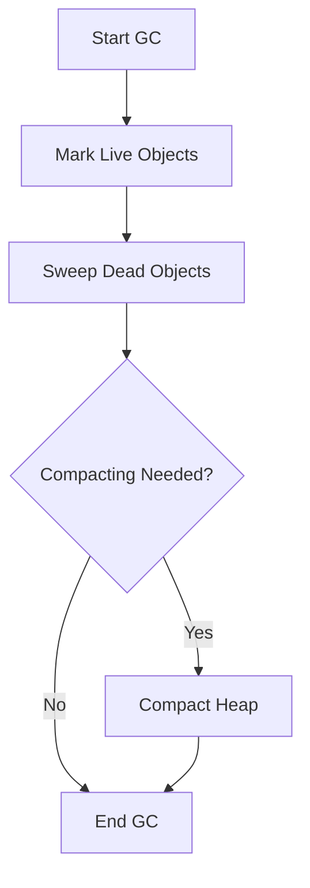

# Garbage Collection Algorithms

## Overview

Garbage Collection (GC) is the automatic memory management process in Java that reclaims heap space occupied by objects that are no longer in use. Understanding different GC algorithms is essential for optimizing application performance, reducing latency, and managing memory efficiently in Java applications.

## Detailed Explanation

### Garbage Collection Fundamentals

GC identifies and removes objects that are no longer reachable from the root set (static variables, local variables, etc.). The process involves:

1. **Marking**: Identifying live objects.
2. **Sweeping**: Removing dead objects and reclaiming memory.
3. **Compacting**: Moving live objects to create contiguous free space (optional).



### Common GC Algorithms

#### Serial GC

- Single-threaded collector
- Uses mark-sweep-compact algorithm
- Suitable for small applications and single-core machines
- JVM option: `-XX:+UseSerialGC`

#### Parallel GC

- Multi-threaded version of Serial GC
- Uses multiple threads for minor collections
- Good for throughput-oriented applications
- JVM option: `-XX:+UseParallelGC`

#### Concurrent Mark Sweep (CMS) GC

- Concurrent marking and sweeping
- Minimizes pause times
- Deprecated in Java 9, removed in Java 14
- JVM option: `-XX:+UseConcMarkSweepGC`

#### G1 GC (Garbage First)

- Divides heap into regions
- Concurrent marking with short pause times
- Good balance between throughput and latency
- Default GC since Java 9
- JVM option: `-XX:+UseG1GC`

#### ZGC (Z Garbage Collector)

- Low-latency collector
- Handles heaps from 8MB to 16TB
- Pause times under 10ms
- Available since Java 11
- JVM option: `-XX:+UseZGC`

#### Shenandoah GC

- Low-pause-time collector
- Concurrent evacuation
- Available since Java 12
- JVM option: `-XX:+UseShenandoahGC`

### Generational Hypothesis

Most objects die young, and objects that survive become long-lived. This leads to generational GC:

- **Young Generation**: New objects, frequent small collections
- **Old Generation**: Long-lived objects, less frequent major collections

### GC Phases

#### Minor GC

- Collects Young Generation
- Fast, short pauses
- Uses algorithms like Copying or Parallel Copying

#### Major/Full GC

- Collects entire heap
- Longer pauses
- Uses mark-sweep-compact

## Real-world Examples & Use Cases

1. **High-Throughput Batch Processing**: Using Parallel GC for data processing jobs.
2. **Low-Latency Web Services**: Implementing G1 or ZGC for responsive applications.
3. **Big Data Applications**: Configuring large heaps with appropriate GC algorithms.
4. **Microservices**: Tuning GC for containerized environments with limited resources.
5. **Real-time Systems**: Using low-pause collectors like ZGC or Shenandoah.

## Code Examples

### GC Monitoring

```java
public class GCMonitor {
    public static void main(String[] args) {
        // Enable GC logging
        // JVM options: -XX:+PrintGC -XX:+PrintGCDetails -XX:+PrintGCTimeStamps
        
        List<byte[]> list = new ArrayList<>();
        
        for (int i = 0; i < 10000; i++) {
            // Allocate memory to trigger GC
            list.add(new byte[1024 * 1024]); // 1MB each
            
            if (i % 1000 == 0) {
                System.out.println("Allocated " + (i + 1) + " MB");
                System.gc(); // Suggest GC (not guaranteed)
            }
        }
    }
}
```

### Memory Leak Detection

```java
public class MemoryLeakDetector {
    static List<Object> leakList = new ArrayList<>();
    
    public static void main(String[] args) {
        Runtime runtime = Runtime.getRuntime();
        
        for (int i = 0; i < 100000; i++) {
            // Simulate memory leak
            leakList.add(new Object());
            
            if (i % 10000 == 0) {
                System.out.println("Iteration: " + i);
                System.out.println("Free Memory: " + runtime.freeMemory() / (1024 * 1024) + " MB");
                System.out.println("Total Memory: " + runtime.totalMemory() / (1024 * 1024) + " MB");
            }
        }
    }
}
```

### Weak References Example

```java
import java.lang.ref.WeakReference;

public class WeakReferenceExample {
    public static void main(String[] args) {
        Object strongRef = new Object();
        WeakReference<Object> weakRef = new WeakReference<>(strongRef);
        
        System.out.println("Strong reference: " + strongRef);
        System.out.println("Weak reference: " + weakRef.get());
        
        // Remove strong reference
        strongRef = null;
        
        // Suggest GC
        System.gc();
        
        // Weak reference should be cleared
        System.out.println("After GC - Weak reference: " + weakRef.get());
    }
}
```

## Common Pitfalls & Edge Cases

1. **GC Pauses**: Long pauses in high-throughput applications.
2. **Memory Leaks**: Objects not being garbage collected due to strong references.
3. **Heap Fragmentation**: Inefficient memory usage leading to OutOfMemoryError.
4. **Incorrect GC Tuning**: Over-tuning can lead to worse performance.
5. **Generational GC Issues**: Premature promotion of objects to old generation.

## Tools & Libraries

- **VisualVM**: Monitor GC activity.
- **GCViewer**: Analyze GC logs.
- **jstat**: JVM statistics monitoring tool.
- **Java Mission Control**: Advanced profiling and diagnostics.
- **Async Profiler**: Low-overhead profiling.

## References

- [Oracle GC Tuning Guide](https://docs.oracle.com/en/java/javase/17/gctuning/)
- [Java Performance: The Definitive Guide](https://www.amazon.com/Java-Performance-Definitive-Guide-Getting/dp/1449358454)
- [The Garbage Collection Handbook](https://www.amazon.com/Garbage-Collection-Handbook-Management-Algorithms/dp/1420082795)

## Github-README Links & Related Topics

- [JVM Internals & Class Loading](../jvm-internals-and-class-loading/README.md)
- [Java Memory Management](../java-memory-management/README.md)
- [GC Tuning](../gc-tuning/README.md)
- [Latency and Throughput](../latency-and-throughput/README.md)
