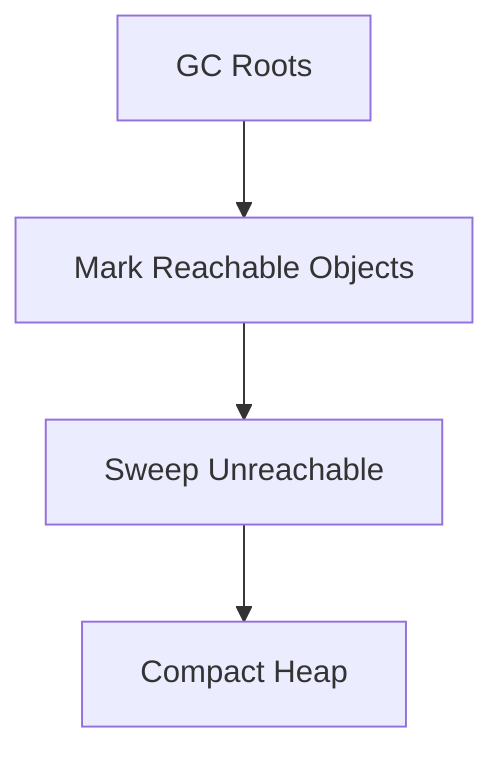

# Overview

Garbage Collection (GC) Algorithms in Java manage memory automatically, reclaiming heap space occupied by unreachable objects. Understanding these algorithms is essential for optimizing JVM performance, reducing pauses, and preventing memory leaks in high-throughput applications.

# Detailed Explanation

## Mark-Sweep-Compact

- **Mark Phase**: Identifies reachable objects from GC roots.
- **Sweep Phase**: Reclaims memory from unmarked objects.
- **Compact Phase**: Defragments heap for contiguous free space.

## Generational GC

Divides heap into Young (Eden, Survivor spaces) and Old generations. Most objects die young; promotes long-lived objects to Old.

## Concurrent Mark-Sweep (CMS)

Runs concurrently with application threads, minimizing pauses. Uses mark-sweep without compaction.

## G1 Garbage Collector

Divides heap into regions, prioritizing garbage-rich regions. Balances throughput and latency.

| Algorithm | Pros | Cons | Use Case |
|-----------|------|------|----------|
| Serial GC | Simple, low overhead | Long pauses | Single-threaded apps |
| Parallel GC | High throughput | Pauses during full GC | Batch processing |
| CMS | Low latency | CPU overhead, fragmentation | Web servers |
| G1 | Balanced, predictable pauses | Tuning complexity | Large heaps |



This diagram shows the mark-sweep-compact process.

# Real-world Examples & Use Cases

- **E-commerce Platforms**: Use G1 for low-latency responses during peak traffic.
- **Low-Latency Apps**: CMS to avoid long pauses in trading apps.
- **Batch Processing**: Parallel GC for high-throughput jobs.
- **Embedded Systems**: Serial GC for simplicity.

# Code Examples

## Monitoring GC
```java
public class GCMonitor {
    public static void main(String[] args) {
        System.gc(); // Suggest GC
        Runtime rt = Runtime.getRuntime();
        System.out.println("Free memory: " + rt.freeMemory());
    }
}
```

## Weak References
```java
import java.lang.ref.WeakReference;

public class WeakRefExample {
    public static void main(String[] args) {
        Object obj = new Object();
        WeakReference<Object> weakRef = new WeakReference<>(obj);
        obj = null;
        System.gc();
        System.out.println("Weak ref: " + weakRef.get()); // May be null
    }
}
```

# Common Pitfalls & Edge Cases

- **Memory Leaks**: Holding strong references to unused objects.
- **GC Pauses**: In latency-sensitive apps, tune heap sizes.
- **Fragmentation**: In CMS, leads to full GC; switch to G1.
- **Incorrect Tuning**: Over-tuning can degrade performance.

# References

- [Java Garbage Collection](https://docs.oracle.com/javase/8/docs/technotes/guides/vm/gctuning/)
- [G1 GC](https://docs.oracle.com/javase/9/gctuning/garbage-first-garbage-collector.htm)
- [JVM Performance Tuning](https://www.oracle.com/technetwork/java/javase/tech/vmoptions-jsp-140102.html)

# Github-README Links & Related Topics

- [JVM Internals & Class Loading](./jvm-internals-and-class-loading/README.md)
- [Java Memory Management](./java-memory-management/README.md)
- [Performance Optimization Techniques](./performance-optimization-techniques/README.md)