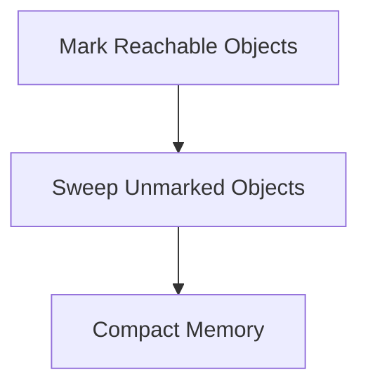

# Garbage Collection Algorithms

## Overview

Garbage Collection (GC) is the process by which the JVM automatically manages memory by reclaiming heap space occupied by objects that are no longer in use. Understanding GC algorithms is essential for optimizing Java application performance and preventing memory leaks.

## Detailed Explanation

### GC Fundamentals

- **Heap Structure**: Young generation (Eden, Survivor spaces), Old generation
- **GC Roots**: Objects referenced from stack, static fields, etc.
- **Reachability**: Objects reachable from GC roots are live

### Common GC Algorithms

#### Mark-Sweep

- **Mark Phase**: Traverse from GC roots, mark reachable objects
- **Sweep Phase**: Reclaim unmarked objects



#### Mark-Sweep-Compact

- Adds compaction to reduce fragmentation

#### Generational GC

- **Minor GC**: Collects young generation
- **Major/Full GC**: Collects entire heap

#### G1 GC

- Divides heap into regions
- Concurrent marking and evacuation

#### ZGC

- Low-latency GC for large heaps
- Concurrent compaction

### GC Collectors

| Collector | Algorithm | Use Case |
|-----------|-----------|----------|
| Serial | Mark-Sweep-Compact | Single-threaded apps |
| Parallel | Parallel Mark-Sweep | Throughput-oriented |
| CMS | Concurrent Mark-Sweep | Low pause times |
| G1 | Garbage-First | Balanced throughput/latency |
| ZGC | Concurrent Compaction | Ultra-low latency |

## Real-world Examples & Use Cases

- **Web Applications**: Tuning GC for reduced response times
- **Big Data Processing**: Managing large heaps efficiently
- **Real-time Systems**: Minimizing GC pauses

## Code Examples

### Monitoring GC

```java
public class GCMonitoring {
    public static void main(String[] args) {
        Runtime runtime = Runtime.getRuntime();
        
        // Force GC
        System.gc();
        
        // Memory info
        long totalMemory = runtime.totalMemory();
        long freeMemory = runtime.freeMemory();
        long usedMemory = totalMemory - freeMemory;
        
        System.out.println("Total Memory: " + totalMemory / 1024 / 1024 + " MB");
        System.out.println("Used Memory: " + usedMemory / 1024 / 1024 + " MB");
    }
}
```

### GC Tuning Example

```bash
# JVM flags for GC tuning
java -XX:+UseG1GC -XX:MaxGCPauseMillis=200 -Xmx4g -Xms4g MyApp
```

## Common Pitfalls & Edge Cases

- **Memory Leaks**: Objects held by long-lived references
- **GC Pauses**: Impact on application responsiveness
- **Heap Sizing**: Under/over-sizing leading to frequent GC or OOM

## References

- [Oracle GC Tuning Guide](https://docs.oracle.com/javase/8/docs/technotes/guides/vm/gctuning/)
- [JVM GC Documentation](https://docs.oracle.com/en/java/javase/21/gctuning/)

## Github-README Links & Related Topics

- [JVM Internals & Class Loading](../jvm-internals-class-loading/)
- [Java Memory Management](../java-memory-management/)
- [Performance Tuning](../performance-tuning-and-profiling/)
