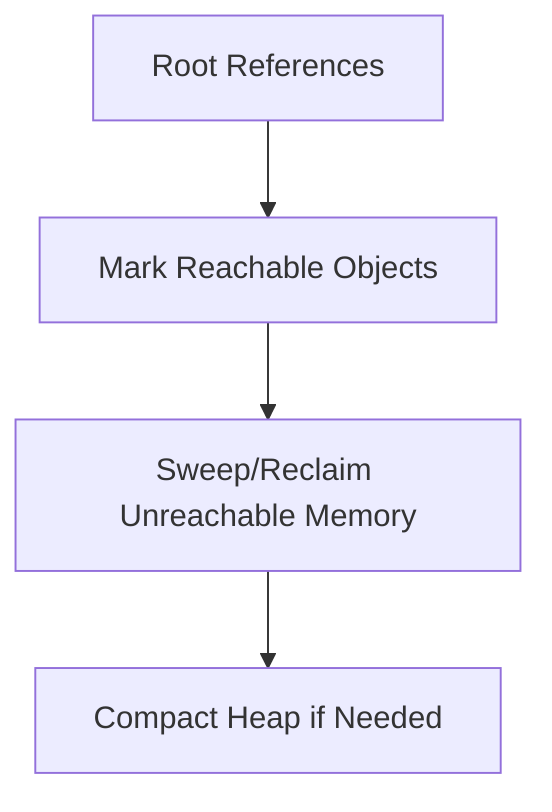
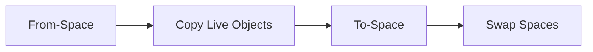
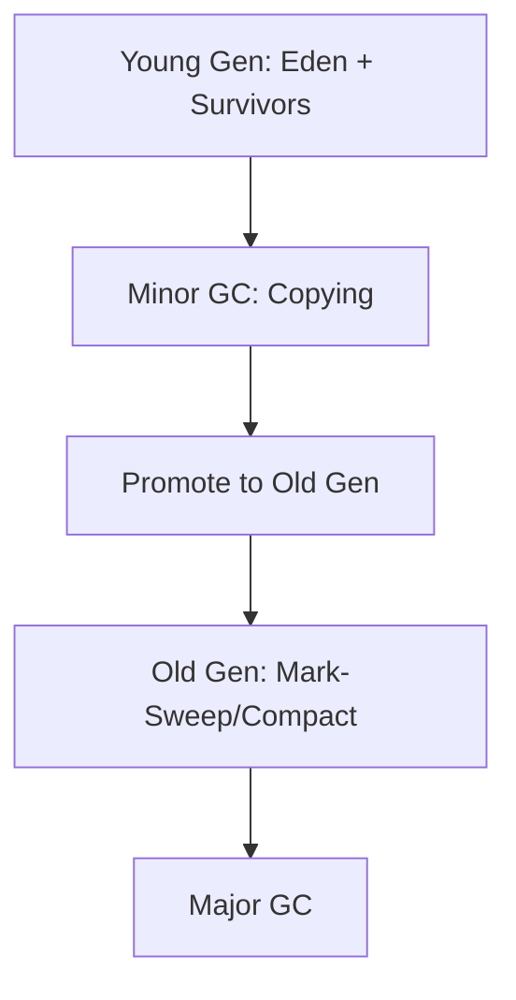

# Garbage Collection Algorithms

## Overview

Garbage Collection (GC) algorithms automatically manage memory by identifying and reclaiming objects that are no longer reachable. In the JVM, GC algorithms vary in approach, balancing throughput, latency, and memory efficiency. Common types include mark-sweep, copying, and generational collectors, each suited to different application needs.

## Detailed Explanation

### Core Concepts

GC algorithms operate on the heap, divided into generations or regions. They use reachability analysis to determine live objects, starting from root references (e.g., stack variables, static fields).



### Mark-Sweep Algorithm

- **Mark Phase**: Traverse the object graph from roots, marking reachable objects.
- **Sweep Phase**: Scan the heap, reclaiming unmarked objects.
- **Pros**: Simple, no object movement.
- **Cons**: Fragmentation, potential for long pauses.

### Copying Algorithm

- Divides heap into two spaces: from-space and to-space.
- Copies live objects from from-space to to-space, then swaps.
- **Pros**: No fragmentation, fast allocation.
- **Cons**: Wastes half the heap, copies long-lived objects repeatedly.



### Generational GC

Exploits the generational hypothesis: most objects die young.

- **Young Generation**: Eden, Survivor spaces (S0, S1). Uses copying GC.
- **Old Generation**: Tenured space. Uses mark-sweep or mark-compact.
- **Minor GC**: Collects young gen.
- **Major/Full GC**: Collects entire heap.



### JVM GC Implementations

| Algorithm | Threads | Pause Type | Use Case |
|-----------|---------|------------|----------|
| Serial GC | Single | Stop-the-world | Small apps, single-core |
| Parallel GC | Multi | Stop-the-world | High throughput |
| CMS | Concurrent mark, STW sweep | Low pause | Interactive apps |
| G1 | Regional, concurrent | Predictable pauses | Large heaps |
| ZGC | Concurrent | Sub-millisecond | Ultra-low latency |
| Shenandoah | Concurrent | Low pause | Large heaps |

## Real-world Examples & Use Cases

- **High-Throughput Batch Processing**: Use Parallel GC to maximize CPU utilization during data processing jobs.
- **Web Applications**: G1 GC for predictable pauses in e-commerce platforms handling variable loads.
- **Real-Time Systems**: ZGC or Shenandoah for gaming servers requiring consistent low latency.
- **Microservices**: CMS or G1 in containerized environments to minimize GC-induced delays.
- **Big Data Analytics**: Parallel GC in Spark jobs to handle large object graphs efficiently.

## Code Examples

### Configuring GC in JVM

```bash
# Parallel GC for throughput
java -XX:+UseParallelGC -jar app.jar

# G1 GC for large heaps
java -XX:+UseG1GC -XX:MaxGCPauseMillis=200 -jar app.jar

# ZGC for low latency
java -XX:+UseZGC -jar app.jar
```

### Monitoring GC with JMX

```java
import java.lang.management.GarbageCollectorMXBean;
import java.lang.management.ManagementFactory;
import java.util.List;

public class GCMonitor {
    public static void main(String[] args) {
        List<GarbageCollectorMXBean> gcBeans = ManagementFactory.getGarbageCollectorMXBeans();
        for (GarbageCollectorMXBean gcBean : gcBeans) {
            System.out.println("GC Name: " + gcBean.getName());
            System.out.println("Collection Count: " + gcBean.getCollectionCount());
            System.out.println("Collection Time: " + gcBean.getCollectionTime() + " ms");
        }
    }
}
```

### Weak References for Cache

```java
import java.lang.ref.WeakReference;
import java.util.HashMap;
import java.util.Map;

public class WeakCache<K, V> {
    private Map<K, WeakReference<V>> cache = new HashMap<>();

    public void put(K key, V value) {
        cache.put(key, new WeakReference<>(value));
    }

    public V get(K key) {
        WeakReference<V> ref = cache.get(key);
        return ref != null ? ref.get() : null;
    }
}
```

### Custom Cleaner (Java 9+)

```java
import java.lang.ref.Cleaner;

public class ResourceManager {
    private static final Cleaner cleaner = Cleaner.create();
    private final Cleaner.Cleanable cleanable;

    public ResourceManager() {
        this.cleanable = cleaner.register(this, () -> {
            // Cleanup native resources
            System.out.println("Cleaning up resources");
        });
    }

    public void close() {
        cleanable.clean();
    }
}
```

## References

- [Oracle JVM GC Tuning Guide](https://docs.oracle.com/en/java/javase/21/gctuning/)
- [OpenJDK GC Documentation](https://openjdk.org/groups/hotspot/docs/)
- [G1 GC Paper](https://dl.acm.org/doi/10.1145/1806596.1806603)
- [ZGC Overview](https://openjdk.org/jeps/333)

## Github-README Links & Related Topics

- [JVM Internals and Class Loading](../jvm-internals-and-class-loading/README.md)
- [GC Tuning](../gc-tuning/README.md)
- [Java Memory Management](../java-memory-management/README.md)
- [JVM Performance Tuning](../jvm-performance-tuning/README.md)