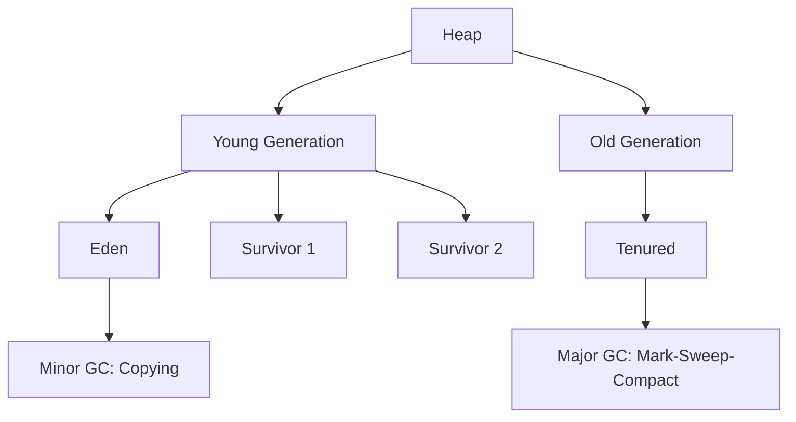

# Overview

Garbage Collection (GC) algorithms in Java automatically manage memory by reclaiming unused objects, preventing memory leaks and optimizing performance. Understanding these algorithms is crucial for JVM tuning, especially in high-performance applications.

# Detailed Explanation

GC works by identifying and removing objects that are no longer reachable from the root set (e.g., static variables, local variables). Java employs various algorithms, often in generational collectors.

| Algorithm | Description | Pros | Cons | Use Case |
|-----------|-------------|------|------|----------|
| Mark-and-Sweep | Marks live objects, sweeps dead ones | Simple implementation | Memory fragmentation | Basic applications |
| Mark-and-Compact | Marks and compacts to reduce fragmentation | Eliminates fragmentation | Higher overhead | General-purpose |
| Copying GC | Copies live objects to new space | Fast allocation, no fragmentation | Wastes space (50% heap) | Young generation |
| Generational GC | Divides heap into generations | Exploits object lifecycles | Complex tuning | Most JVMs |



Modern JVMs like G1, ZGC, and Shenandoah use concurrent and parallel techniques for low-pause GC.

# Real-world Examples & Use Cases

- **E-commerce Platforms**: Use G1 GC for balanced throughput and latency during peak sales.
- **Financial Systems**: Employ ZGC for sub-millisecond pauses in real-time trading.
- **Big Data Processing**: Parallel GC for high-throughput batch jobs in Hadoop/Spark.
- **Microservices**: Tune GC in Kubernetes pods to avoid OOM kills.

Example: In a web application, monitoring GC pauses to ensure <100ms response times.

# Code Examples

Forcing GC (use sparingly):

```java
public class GCExample {
    public static void main(String[] args) {
        // Allocate many objects
        List<Object> list = new ArrayList<>();
        for (int i = 0; i < 100000; i++) {
            list.add(new Object());
        }
        list = null; // Make eligible for GC
        System.gc(); // Suggest GC
    }
}
```

Monitoring GC with MXBean:

```java
import java.lang.management.GarbageCollectorMXBean;
import java.lang.management.ManagementFactory;

public class GCMonitor {
    public static void main(String[] args) {
        for (GarbageCollectorMXBean gc : ManagementFactory.getGarbageCollectorMXBeans()) {
            System.out.println("GC: " + gc.getName() + ", Collections: " + gc.getCollectionCount());
        }
    }
}
```

Custom finalize (deprecated, use try-with-resources):

```java
public class ResourceHolder {
    @Override
    protected void finalize() throws Throwable {
        // Cleanup code
        super.finalize();
    }
}
```

# Common Pitfalls & Edge Cases

- **Forcing GC**: `System.gc()` can cause long pauses; avoid in production.
- **Large Objects**: Bypass young generation, causing premature old gen promotion.
- **GC Pauses**: In low-latency apps, use concurrent GCs like ZGC.
- **Memory Leaks**: Soft references may not be collected under memory pressure.
- **Tuning Overkill**: Start with defaults; tune only if profiling shows issues.

# Tools & Libraries

- **Monitoring**: VisualVM, JConsole, Java Mission Control for GC analysis.
- **Logging**: JVM flags like `-Xlog:gc*` for detailed logs.
- **Profiling**: YourKit, JProfiler for heap dumps.
- **Libraries**: Eclipse Memory Analyzer for leak detection.

# References

- [Oracle GC Tuning Guide](https://docs.oracle.com/en/java/javase/21/gctuning/)
- [Baeldung JVM Garbage Collectors](https://www.baeldung.com/jvm-garbage-collectors)
- [OpenJDK GC Wiki](https://wiki.openjdk.java.net/display/zgc/Main)

# Github-README Links & Related Topics

- [JVM Internals & Class Loading](../jvm-internals-and-class-loading/)
- [JVM Memory Model](../jvm-memory-model/)
- [GC Tuning](../gc-tuning/)