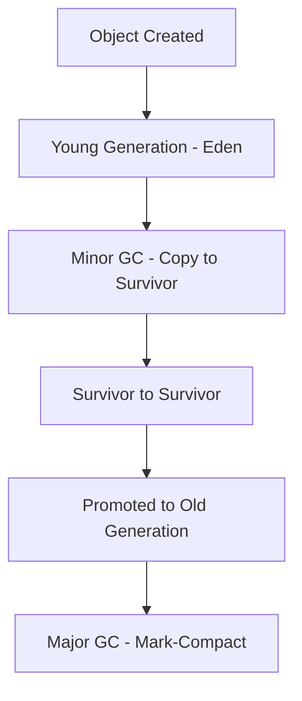

## Overview

Garbage collection (GC) is an automatic memory management mechanism in the Java Virtual Machine (JVM) that identifies and reclaims memory occupied by objects no longer reachable from the application. It prevents memory leaks, reduces manual memory management errors, and optimizes heap usage for better application performance.

## Detailed Explanation

## Basic Concepts
- **Heap**: Divided into Young Generation (Eden, Survivor spaces) and Old Generation.
- **GC Roots**: Starting points for reachability analysis (e.g., static variables, local variables).

## Common Algorithms
1. **Mark-Sweep**: Marks reachable objects, sweeps unmarked ones. Simple but causes fragmentation.
2. **Mark-Compact**: Similar to mark-sweep but compacts memory to reduce fragmentation.
3. **Copying GC**: Copies live objects to a new space, efficient for young generation but wastes space.
4. **Generational GC**: Exploits object lifecycle; most objects die young. Uses different algorithms for young and old generations.

## Modern Collectors
- **G1 (Garbage-First)**: Divides heap into regions, prioritizes regions with most garbage. Low-pause, suitable for large heaps.
- **ZGC**: Concurrent, low-latency collector for very large heaps (TB scale), pauses <1ms.
- **Shenandoah**: Similar to ZGC, focuses on minimizing pause times.



## Real-world Examples & Use Cases
- **Web Applications**: Tomcat servers use GC to manage session data and prevent OOM errors.
- **Big Data Processing**: Spark applications rely on efficient GC for in-memory computations.
- **Microservices**: Low-latency services use G1 or ZGC to minimize response times.

## Code Examples

```java
public class GCExample {
    public static void main(String[] args) {
        // Create objects
        for (int i = 0; i < 100000; i++) {
            new Object();
        }
        // Force GC
        System.gc();
        System.out.println("GC triggered");
    }
}
```

## Common Pitfalls & Edge Cases
- **GC Pauses**: Long pauses in CMS or Parallel GC can affect latency-sensitive apps.
- **Memory Leaks**: Soft references or static collections can prevent GC.
- **Tuning**: Incorrect heap sizes lead to frequent GC or OOM.

## Tools & Libraries
- **JVM Tools**: jstat, jmap, VisualVM for monitoring GC.
- **Libraries**: Eclipse Memory Analyzer for heap dumps.

## References
- [Oracle GC Tuning Guide](https://docs.oracle.com/javase/8/docs/technotes/guides/vm/gctuning/)
- [OpenJDK GC Documentation](https://openjdk.java.net/groups/hotspot/docs/)
## Github-README Links & Related Topics

- [JVM Internals & Class Loading](jvm-internals-and-class-loading/README.md)
- [JVM Performance Tuning](java/advanced-java-concepts/jvm-performance-tuning/README.md)
- [Memory Models](java/memory-models/README.md)