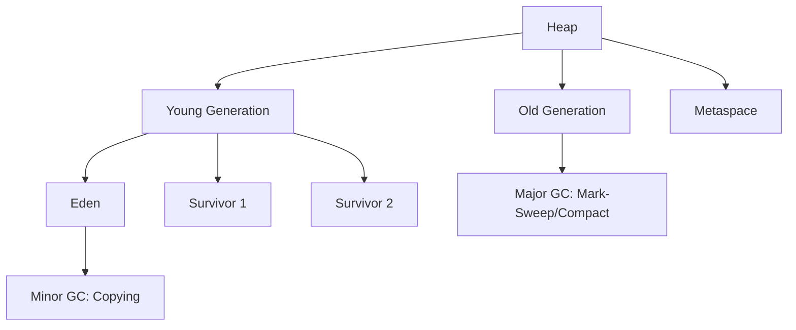

# Garbage Collection Algorithms

## Overview

Garbage Collection (GC) is the process by which the JVM automatically manages memory by reclaiming heap space occupied by objects that are no longer in use. Understanding GC algorithms is essential for optimizing Java application performance and avoiding memory-related issues like OutOfMemoryError.

## Detailed Explanation

### Basic Concepts

- **Garbage:** Objects that are no longer reachable from the root set (stack, static variables, etc.).
- **GC Roots:** Starting points for reachability analysis (local variables, active threads, static fields).
- **Stop-the-World:** Phases where application threads are paused for GC.

### Common GC Algorithms

#### Mark-Sweep

1. **Mark Phase:** Traverse the heap and mark all reachable objects.
2. **Sweep Phase:** Reclaim memory from unmarked objects.

**Pros:** Simple, no object movement.
**Cons:** Fragmentation, potential for memory leaks if marking is incomplete.

#### Mark-Compact

1. **Mark Phase:** Same as Mark-Sweep.
2. **Compact Phase:** Move surviving objects to one end of the heap, updating references.

**Pros:** Eliminates fragmentation.
**Cons:** More complex, higher pause times.

#### Copying (Scavenge)

Divide heap into two equal spaces: From and To.

1. Copy live objects from From to To space.
2. Swap spaces.

**Pros:** Fast allocation, no fragmentation.
**Cons:** Wastes half the heap, only suitable for short-lived objects.

#### Generational GC

Based on the "generational hypothesis": Most objects die young.

- **Young Generation:** For new objects. Uses Copying GC.
- **Old Generation:** For long-lived objects. Uses Mark-Sweep or Mark-Compact.
- **Permanent Generation/Metaspace:** For class metadata.



### JVM GC Implementations

- **Serial GC:** Single-threaded, for small applications.
- **Parallel GC:** Multi-threaded, for throughput.
- **CMS (Concurrent Mark Sweep):** Concurrent with application, low pauses.
- **G1 GC:** Regional, predictable pauses.
- **ZGC/Shenandoah:** Low-latency, concurrent.

## Real-world Examples & Use Cases

- **Web Applications:** Tuning GC for low-latency responses.
- **Batch Processing:** Optimizing for high throughput.
- **Microservices:** Choosing appropriate GC for containerized environments.
- **Big Data:** Handling large heaps with efficient GC.

## Code Examples

### Monitoring GC

```java
public class GCMonitoring {
    public static void main(String[] args) {
        // Add JVM args: -XX:+PrintGC -XX:+PrintGCDetails
        System.out.println("Creating objects...");
        
        for (int i = 0; i < 100000; i++) {
            new Object();
        }
        
        System.gc(); // Suggest GC (not guaranteed)
        System.out.println("GC suggested");
    }
}
```

### Memory Leak Example

```java
import java.util.ArrayList;
import java.util.List;

public class MemoryLeak {
    private static List<Object> list = new ArrayList<>();

    public static void main(String[] args) {
        while (true) {
            list.add(new Object()); // Objects never removed
            // Eventually OutOfMemoryError
        }
    }
}
```

## Common Pitfalls & Edge Cases

- **Premature Promotion:** Objects surviving too many minor GCs move to old gen, causing fragmentation.
- **GC Pauses:** Long pauses in high-throughput systems.
- **Memory Leaks:** Soft references, static collections holding references.
- **Tuning Complexity:** Incorrect GC flags can degrade performance.

## Tools & Libraries

- **JVM Tools:** jstat, jmap, jhat for monitoring.
- **VisualVM:** GUI for GC analysis.
- **GC Logs:** Analyze with tools like GCViewer.

## References

- [Oracle GC Tuning Guide](https://docs.oracle.com/javase/8/docs/technotes/guides/vm/gctuning/)
- [Baeldung: Java Garbage Collection](https://www.baeldung.com/java-garbage-collection)
- [GeeksforGeeks: Garbage Collection in Java](https://www.geeksforgeeks.org/garbage-collection-java/)

## Github-README Links & Related Topics

- [JVM Internals & Class Loading](../jvm-internals-class-loading)
- [JVM Performance Tuning](../jvm-performance-tuning)
- [Java Memory Management](../java-memory-management)
