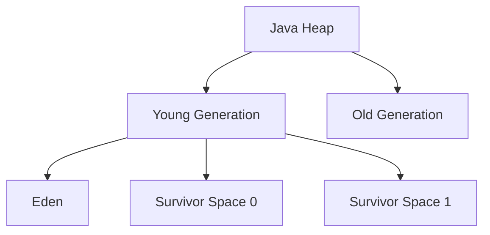
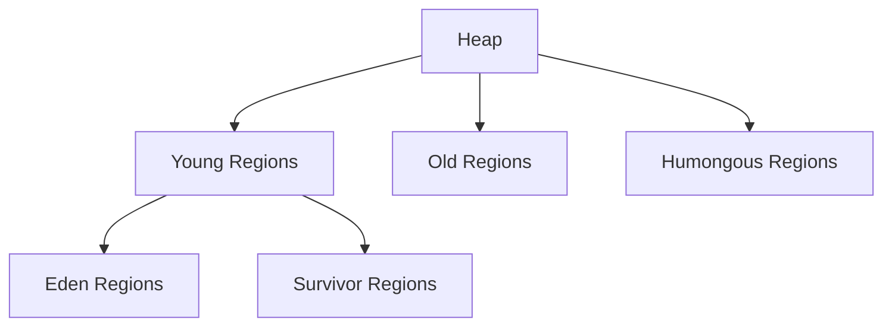

# Garbage Collection Algorithms

## Overview

Garbage collection (GC) is the automatic process of managing memory in the Java Virtual Machine (JVM) by identifying and reclaiming memory occupied by objects that are no longer in use. This prevents memory leaks and simplifies memory management for developers. Understanding GC algorithms is crucial for optimizing application performance, minimizing pause times, and ensuring efficient resource utilization in Java applications.

## Detailed Explanation

### Fundamentals of Garbage Collection

- **Reachability Analysis**: The GC determines which objects are reachable from GC roots (e.g., static variables, local variables on the stack, JNI references). Unreachable objects are considered garbage.
- **Heap Organization**: The JVM heap is divided into regions or generations to optimize GC performance based on object lifetimes.
- **GC Triggers**: GC runs when the heap is full, explicitly requested via `System.gc()`, or based on allocation pressure.

### Common Garbage Collection Algorithms

#### 1. Mark-Sweep
- **Process**: 
  - Mark phase: Traverse the object graph from roots, marking reachable objects.
  - Sweep phase: Scan the heap, reclaiming memory from unmarked objects.
- **Advantages**: Simple implementation, no object relocation.
- **Disadvantages**: Memory fragmentation, potential for long pause times.
- **Use Case**: Basic applications with low memory requirements.

#### 2. Mark-Sweep-Compact
- **Process**: Adds a compaction phase after sweep to move surviving objects together, reducing fragmentation.
- **Advantages**: Eliminates fragmentation, improves allocation efficiency.
- **Disadvantages**: Increased pause times due to object movement.
- **Use Case**: Applications requiring contiguous memory allocation.

#### 3. Copying Collector
- **Process**: Divides the heap into two semi-spaces (from-space and to-space). Live objects are copied from from-space to to-space, then spaces are swapped.
- **Advantages**: Fast allocation, no fragmentation, simple implementation.
- **Disadvantages**: Only half the heap is usable at any time, copying overhead for long-lived objects.
- **Use Case**: Young generation in generational GC.

#### 4. Generational Garbage Collection
- **Hypothesis**: Most objects die young (weak generational hypothesis).
- **Structure**: Heap divided into young generation (Eden, two survivor spaces) and old generation.
- **Process**: Minor GC collects young generation frequently; major GC collects old generation less often.
- **Advantages**: Efficient for typical Java applications.
- **Disadvantages**: Complex tuning required.



### Modern GC Implementations in JVM

| GC Algorithm | Introduced In | Key Features | Best For |
|--------------|---------------|--------------|----------|
| Serial GC | JDK 1.3 | Single-threaded, generational mark-sweep-compact | Small heaps, single processor machines |
| Parallel GC | JDK 1.4 | Multi-threaded, generational mark-sweep-compact | High throughput, multiprocessor hardware |
| G1 (Garbage First) | JDK 7 | Region-based, mostly concurrent, predictable pauses | Large heaps, low latency requirements |
| ZGC | JDK 11 | Concurrent, low latency, handles large heaps | Very large heaps (up to 16TB), sub-millisecond pauses |

#### G1 Garbage Collector
- Divides heap into ~2048 regions (1-32MB each).
- Prioritizes regions with most garbage for collection.
- Aims for predictable pause times via incremental collection.



#### Z Garbage Collector
- Designed for low-latency applications.
- Concurrent all phases except root scanning.
- Handles multi-terabyte heaps with pauses <10ms.

## Real-world Examples & Use Cases

- **E-commerce Platforms**: Use G1 or ZGC to minimize response times during peak traffic, ensuring smooth user experiences.
- **Big Data Processing**: Applications like Apache Spark employ parallel GC for high-throughput data processing with large heaps.
- **Real-time Systems**: Financial trading platforms require low-pause GC like ZGC to maintain microsecond-level latencies.
- **Microservices**: Containerized applications with limited memory use efficient GC to prevent out-of-memory errors.
- **Gaming Servers**: Concurrent GC prevents frame drops by avoiding long pauses during gameplay.

## Code Examples

### Monitoring GC Activity

```java
public class GCMonitor {
    public static void main(String[] args) {
        Runtime runtime = Runtime.getRuntime();
        
        // Print initial memory stats
        System.out.println("Max Memory: " + runtime.maxMemory() / 1024 / 1024 + " MB");
        System.out.println("Total Memory: " + runtime.totalMemory() / 1024 / 1024 + " MB");
        System.out.println("Free Memory: " + runtime.freeMemory() / 1024 / 1024 + " MB");
        
        // Allocate memory to trigger GC
        List<byte[]> list = new ArrayList<>();
        for (int i = 0; i < 100000; i++) {
            list.add(new byte[1024]); // 1KB per allocation
        }
        
        System.out.println("After allocation - Free Memory: " + runtime.freeMemory() / 1024 / 1024 + " MB");
        
        // Suggest GC
        System.gc();
        
        System.out.println("After GC - Free Memory: " + runtime.freeMemory() / 1024 / 1024 + " MB");
    }
}
```

### GC Tuning with JVM Flags

```bash
# Example JVM flags for G1 GC tuning
java -XX:+UseG1GC \
     -XX:MaxGCPauseMillis=200 \
     -XX:G1HeapRegionSize=16m \
     -XX:InitiatingHeapOccupancyPercent=45 \
     -Xms4g -Xmx8g \
     -XX:+PrintGCDetails \
     -XX:+PrintGCTimeStamps \
     -jar MyApplication.jar
```

### Using Weak References

```java
import java.lang.ref.WeakReference;
import java.util.ArrayList;
import java.util.List;

public class WeakReferenceExample {
    public static void main(String[] args) {
        List<WeakReference<Object>> weakRefs = new ArrayList<>();
        
        // Create objects with weak references
        for (int i = 0; i < 10; i++) {
            Object obj = new Object();
            weakRefs.add(new WeakReference<>(obj));
            obj = null; // Remove strong reference
        }
        
        // Force GC
        System.gc();
        
        // Check how many weak references are cleared
        int cleared = 0;
        for (WeakReference<Object> ref : weakRefs) {
            if (ref.get() == null) {
                cleared++;
            }
        }
        
        System.out.println("Weak references cleared: " + cleared + " out of " + weakRefs.size());
    }
}
```

### Custom Finalizer (Avoid in Production)

```java
public class FinalizerExample {
    @Override
    protected void finalize() throws Throwable {
        try {
            System.out.println("Finalizing: " + this);
            // Cleanup resources
        } finally {
            super.finalize();
        }
    }
    
    public static void main(String[] args) {
        FinalizerExample obj = new FinalizerExample();
        obj = null; // Make eligible for GC
        
        System.gc(); // Suggest GC
        try {
            Thread.sleep(1000); // Give GC time to run
        } catch (InterruptedException e) {
            Thread.currentThread().interrupt();
        }
    }
}
```

## Common Pitfalls & Edge Cases

- **Memory Leaks**: Holding references to objects longer than necessary, preventing GC.
- **GC Pauses**: Long pauses in high-throughput applications; tune GC parameters.
- **Fragmentation**: In mark-sweep without compaction, leading to allocation failures.
- **Reference Types Confusion**: Misusing soft/weak/phantom references can cause unexpected behavior.
- **Finalizer Abuse**: Finalizers delay GC and can cause deadlocks; prefer try-with-resources.
- **Large Object Allocation**: Objects larger than region size in G1 can cause premature full GC.

## Tools & Libraries

- **JVM Tools**:
  - `jstat`: Monitor GC statistics.
  - `jmap`: Heap dump analysis.
  - `jstack`: Thread dump for GC-related deadlocks.
  - `jcmd`: Send diagnostic commands to JVM.
- **Profiling Tools**:
  - **VisualVM**: Free GUI for memory and GC monitoring.
  - **JConsole**: JMX-based monitoring.
  - **YourKit**: Commercial profiler with detailed GC analysis.
  - **GCViewer**: Analyze GC logs.
- **Libraries**:
  - **Eclipse Memory Analyzer (MAT)**: Analyze heap dumps for memory leaks.
  - **JMH (Java Microbenchmark Harness)**: Benchmark GC performance.

## References

- [Oracle Garbage Collection Tuning Guide](https://docs.oracle.com/en/java/javase/21/gctuning/) - Official documentation on GC algorithms and tuning.
- [Garbage Collector Implementation](https://docs.oracle.com/en/java/javase/21/gctuning/garbage-collector-implementation.html) - Detailed explanation of generational GC and performance considerations.
- [Available Collectors](https://docs.oracle.com/en/java/javase/21/gctuning/available-collectors.html) - Overview of Serial, Parallel, G1, and Z Garbage Collectors.
- [OpenJDK GC Wiki](https://wiki.openjdk.org/display/HotSpot/Garbage+Collection) - Detailed information on JVM GC implementations.
- [Baeldung: Java Garbage Collection](https://www.baeldung.com/java-garbage-collection) - Comprehensive articles on GC concepts.
- [JVM Anatomy Series by Aleksey Shipilev](https://shipilev.net/jvm/anatomy-quarks/) - Deep dives into GC internals.
- [ZGC: A Scalable Low-Latency Garbage Collector](https://www.oracle.com/technetwork/java/javase/tech/zgc-introduction-4308374.html) - Introduction to Z Garbage Collector.

## Github-README Links & Related Topics

- [GC Tuning](../gc-tuning/)
- [Java Memory Management](../java-memory-management/)
- [JVM Internals & Class Loading](../jvm-internals-class-loading/)
- [Memory Models](../memory-models/)