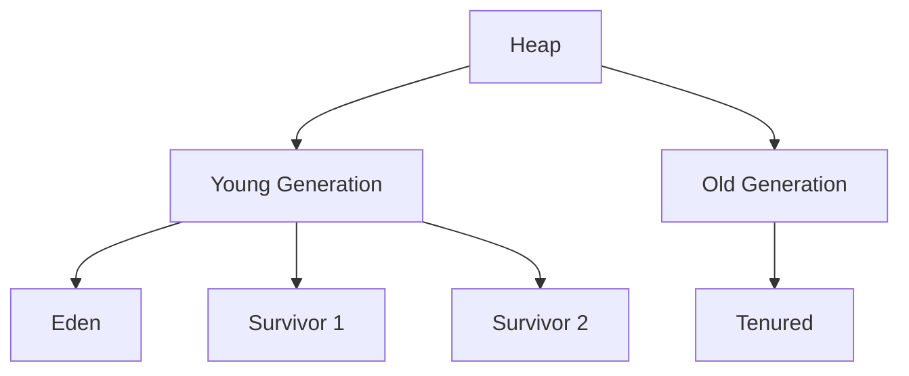

# Garbage Collection Algorithms

## Overview

Garbage Collection (GC) is the automatic memory management process in the JVM that reclaims heap memory occupied by objects no longer in use. Various algorithms optimize for different scenarios, balancing pause times, throughput, and memory efficiency.

## Detailed Explanation

Common GC algorithms:

- **Mark-Sweep**: Marks live objects, sweeps dead ones. Simple but causes fragmentation.

- **Mark-Compact**: Marks and compacts live objects to reduce fragmentation.

- **Copying**: Divides heap into from/to spaces, copies live objects.

- **Generational**: Divides heap into young/old generations, with different strategies.



| Algorithm | Pros | Cons | Use Case |
|-----------|------|------|----------|
| Serial GC | Simple, low overhead | Long pauses | Single-threaded apps |
| Parallel GC | High throughput | Longer pauses | Batch processing |
| CMS | Low pause times | CPU intensive | Web servers |
| G1 | Balanced, predictable pauses | Higher overhead | Large heaps |

## Real-world Examples & Use Cases

- **Web Apps**: G1 GC for low-latency e-commerce sites.

- **Big Data**: Parallel GC for high-throughput analytics.

- **Embedded**: Serial GC for resource-constrained devices.

## Code Examples

### Forcing GC (Not recommended)
```java
System.gc(); // Hint to JVM
```

### Monitoring GC
```java
Runtime runtime = Runtime.getRuntime();
long usedMemory = runtime.totalMemory() - runtime.freeMemory();
System.out.println("Used memory: " + usedMemory);
```

## Common Pitfalls & Edge Cases

- **Memory Leaks**: Retaining references unintentionally.

- **GC Pauses**: Can cause latency spikes.

- **Tuning**: Requires profiling for optimal settings.

## References

- [Oracle GC Tuning](https://docs.oracle.com/javase/8/docs/technotes/guides/vm/gctuning/)
- [Baeldung: Java GC](https://www.baeldung.com/java-garbage-collectors)

## Github-README Links & Related Topics

- [JVM Internals & Class Loading](jvm-internals-class-loading/)
- [Java Memory Management](java-memory-management/)
- [GC Tuning](gc-tuning/)