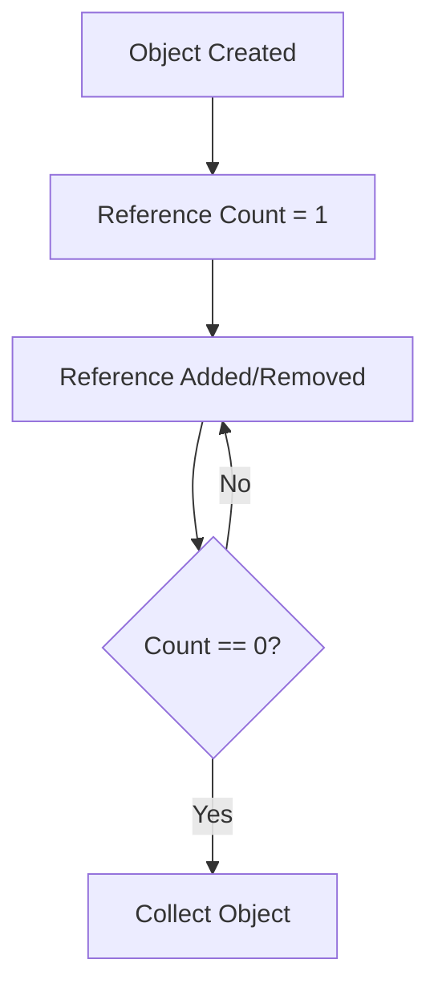
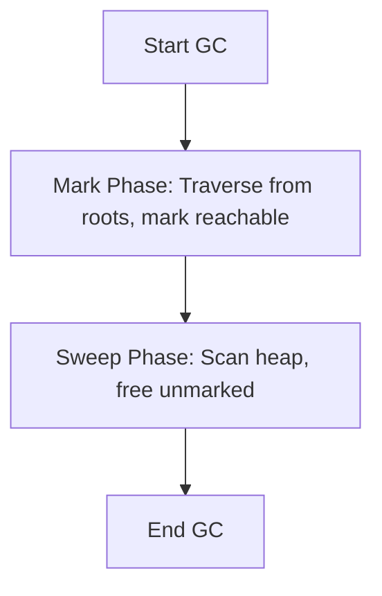
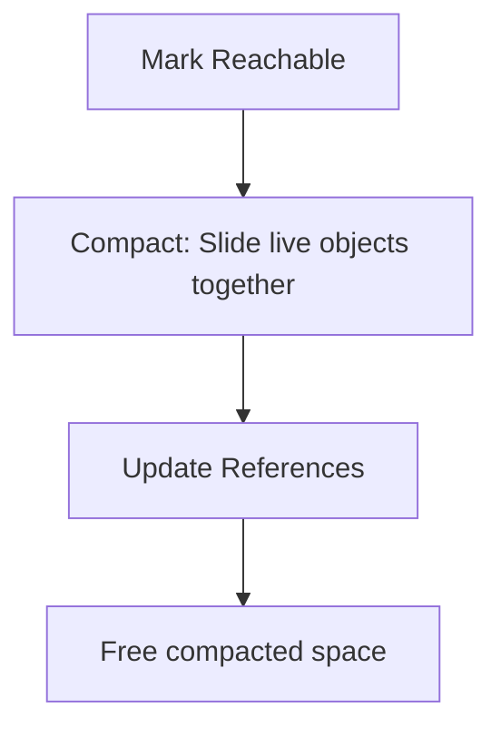
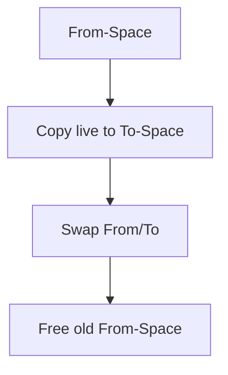

# Garbage Collection Algorithms

## Overview

Garbage Collection (GC) is a fundamental mechanism in automatic memory management systems, particularly in languages like Java, that automatically reclaims memory occupied by objects no longer in use. This prevents memory leaks and simplifies development by eliminating manual memory deallocation. Understanding GC algorithms is crucial for optimizing application performance, minimizing pause times, and ensuring efficient resource utilization in JVM-based systems.

## Detailed Explanation

### What is Garbage Collection?

GC identifies and frees memory held by unreachable objects—those not referenced by active parts of the program (roots like stack variables, static fields, and thread locals). The process involves marking reachable objects and reclaiming unreachable ones.

### JVM Memory Model

The JVM heap is divided into generations to exploit object lifecycle patterns:

- **Young Generation**: Short-lived objects
  - Eden: Initial allocation space
  - Survivor Spaces (S0, S1): Objects that survive minor GC
- **Old Generation (Tenured)**: Long-lived objects
- **Metaspace (Java 8+)**: Class metadata and statics

### Core GC Algorithms

#### 1. Reference Counting
Tracks references to each object. When count reaches zero, object is collected.



**Pros**: Simple, immediate collection.  
**Cons**: Cyclic references, overhead per reference operation.

#### 2. Mark-Sweep
Two-phase algorithm: mark reachable objects, then sweep unreachable ones.



**Pros**: Handles cycles, no object movement.  
**Cons**: Fragmentation, potential O(heap) sweep time.

#### 3. Mark-Compact
Extends Mark-Sweep by compacting live objects to eliminate fragmentation.



**Pros**: No fragmentation.  
**Cons**: Higher overhead due to compaction.

#### 4. Copying (Scavenge)
Divides heap into from/to spaces. Copies live objects to to-space, swaps roles.



**Pros**: Fast allocation, no fragmentation.  
**Cons**: 50% heap waste, copying cost.

#### 5. Generational GC
Combines algorithms across generations. Young: Copying; Old: Mark-Compact.

**Pros**: Exploits weak generational hypothesis (most objects die young).  
**Cons**: Complex tuning.

### Comparison of Algorithms

| Algorithm       | Pros                          | Cons                          | Best For                  |
|-----------------|-------------------------------|-------------------------------|---------------------------|
| Reference Counting | Immediate, simple            | Cyclic refs, ref overhead     | Real-time systems         |
| Mark-Sweep     | Handles cycles, no movement  | Fragmentation, sweep time     | Simple heaps              |
| Mark-Compact   | No fragmentation             | Compaction overhead           | Long-running apps         |
| Copying        | Fast alloc, no frag          | Space waste, copy cost        | Young generation          |
| Generational   | Efficient lifecycle handling | Tuning complexity             | General-purpose JVM       |

### Modern JVM GC Implementations

- **Serial GC**: Single-threaded, stop-the-world. Suitable for small apps.
- **Parallel GC**: Multi-threaded marking/sweeping for throughput.
- **CMS (Concurrent Mark Sweep)**: Concurrent marking, low pauses (deprecated Java 9+).
- **G1 GC**: Region-based, predictable pauses, concurrent.
- **ZGC/Shenandoah**: Concurrent, low-latency, large heaps (Java 11+).

## Journey / Sequence: Evolution of GC Algorithms

1. **1960s**: Reference counting in Lisp.
2. **1960s-70s**: Mark-Sweep in early Lisps.
3. **1980s**: Generational hypothesis, copying GC in Smalltalk.
4. **1990s**: JVM HotSpot, Serial/Parallel GC.
5. **2000s**: CMS for low pauses.
6. **2010s**: G1, ZGC for modern requirements.

## Real-world Examples & Use Cases

- **E-commerce Platforms**: G1 GC for predictable pauses during peak traffic.
- **Financial Systems**: Low-latency GC like ZGC for real-time trading.
- **Batch Processing**: Parallel GC for high-throughput data jobs.
- **Microservices**: Tuned CMS/G1 in containers with limited memory.
- **Gaming**: ZGC for minimal stutters in interactive apps.

## Code Examples

### Basic Memory Monitoring
```java
public class GCMonitor {
    public static void main(String[] args) {
        Runtime rt = Runtime.getRuntime();
        System.out.println("Total: " + rt.totalMemory() / 1024 / 1024 + "MB");
        System.out.println("Free: " + rt.freeMemory() / 1024 / 1024 + "MB");
        System.out.println("Used: " + (rt.totalMemory() - rt.freeMemory()) / 1024 / 1024 + "MB");
        
        // Suggest GC (use sparingly)
        System.gc();
        System.out.println("After GC Free: " + rt.freeMemory() / 1024 / 1024 + "MB");
    }
}
```

### Demonstrating Generational GC
```java
import java.util.ArrayList;
import java.util.List;

public class GenerationalGCExample {
    static class ShortLived {
        byte[] data = new byte[1024]; // 1KB
    }
    
    static class LongLived {
        byte[] data = new byte[1024 * 1024]; // 1MB
        List<ShortLived> refs = new ArrayList<>();
    }
    
    public static void main(String[] args) {
        List<LongLived> longLived = new ArrayList<>();
        
        for (int i = 0; i < 10; i++) {
            LongLived obj = new LongLived();
            longLived.add(obj);
            
            // Create short-lived objects
            for (int j = 0; j < 1000; j++) {
                obj.refs.add(new ShortLived());
            }
            
            // Clear short-lived refs to trigger minor GC
            obj.refs.clear();
        }
        
        System.out.println("Objects created, GC should promote long-lived to old gen");
    }
}
```

### Weak References for Cache
```java
import java.lang.ref.WeakReference;
import java.util.HashMap;
import java.util.Map;

public class WeakRefCache<K, V> {
    private Map<K, WeakReference<V>> cache = new HashMap<>();
    
    public void put(K key, V value) {
        cache.put(key, new WeakReference<>(value));
    }
    
    public V get(K key) {
        WeakReference<V> ref = cache.get(key);
        return ref != null ? ref.get() : null;
    }
    
    public static void main(String[] args) {
        WeakRefCache<String, byte[]> cache = new WeakRefCache<>();
        cache.put("data", new byte[1024 * 1024]); // 1MB
        
        System.out.println("Before GC: " + cache.get("data"));
        System.gc();
        System.out.println("After GC: " + cache.get("data")); // May be null
    }
}
```

## Common Pitfalls & Edge Cases

- **Memory Leaks**: Unintentional strong references preventing collection.
- **GC Pauses**: Long stop-the-world pauses in high-throughput systems.
- **Humongous Objects**: Large objects (>50% region) in G1 causing inefficiencies.
- **Premature Promotion**: Objects surviving too many minor GCs move to old gen early.
- **Tuning Overkill**: Over-optimizing without profiling data.

## Tools & Libraries

- **jstat**: JVM statistics monitoring.
- **jmap**: Heap dump and memory mapping.
- **VisualVM**: GUI for monitoring and profiling.
- **GCViewer**: Analyzes GC logs.
- **Async Profiler**: Low-overhead profiling.

## References

- [Oracle JVM GC Tuning](https://docs.oracle.com/en/java/javase/21/gctuning/)
- [OpenJDK GC Documentation](https://openjdk.org/groups/hotspot/docs/)
- [Wikipedia: Garbage Collection](https://en.wikipedia.org/wiki/Garbage_collection_(computer_science))
- [G1 GC Deep Dive](https://www.oracle.com/technetwork/articles/java/g1gc-1984535.html)
- [ZGC Overview](https://wiki.openjdk.org/display/zgc/Main)

## Github-README Links & Related Topics

- [Java Memory Management](java-memory-management/README.md)
- [GC Tuning](gc-tuning/README.md)
- [Java Multithreading and Concurrency](java-multithreading-and-concurrency/README.md)
- [JVM Internals](jvm-internals/README.md)